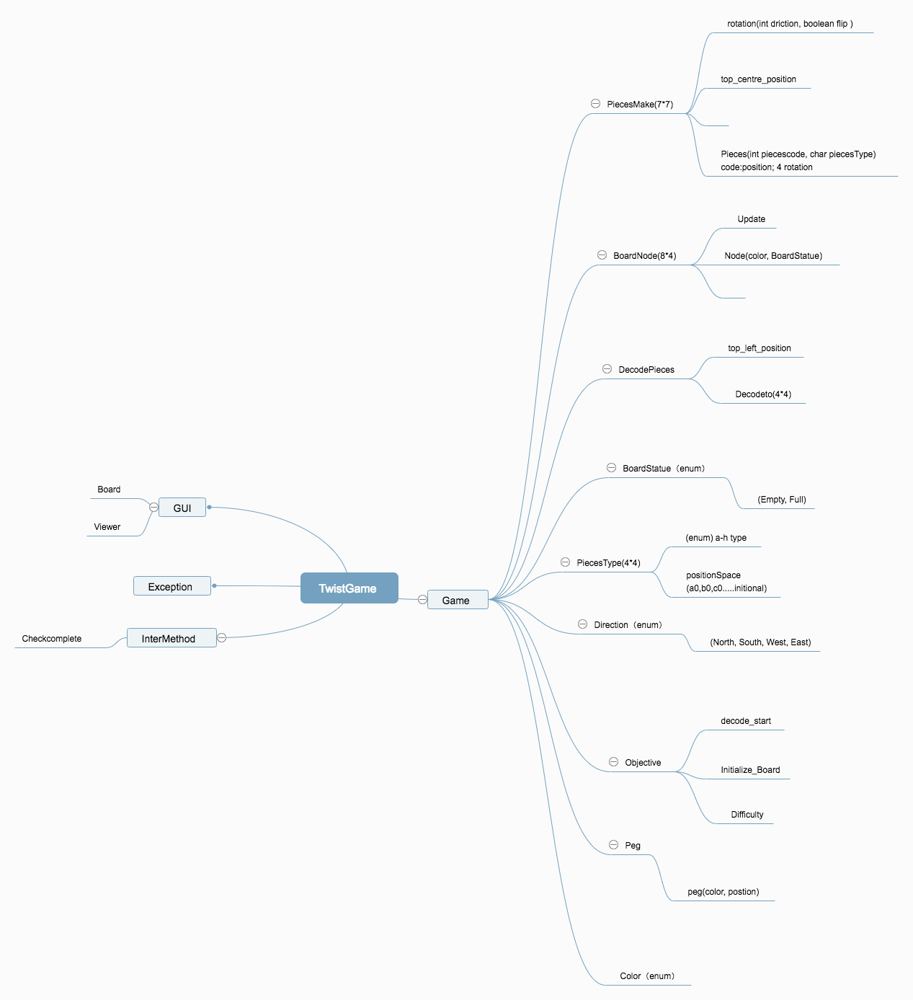

# Assignment Two Feedback

## Group members: u6456964,u6716878,u6171870

## Tutor Comment
Fantastic work everyone! 
This is an excellent submission that I struggle to find fault with. 

Your dancing links implementation is a great extension and makes for blistering fast 
hint calculation, well done! 

I will have to have a proper read of that source you provided later, it seems like 
a very useful algorithm to have handy. 

The process of converting the problem to a cover problem was interesting, I look forward
to the presentation. 

I can see you have used packages and good coherent classes to segregate your design nicely. 
This makes the code much more readable and maintainable, well done!

A few more comments during the logic heavy components of the code might be useful, but it is well
written regardless. 

Unfortunately I had to be consistent and deduct marks for not having your presentation named exactly
`presentation.pdf`. Be careful!

I am very impressed, keep up the great work everyone. 

-- Peter

## Mark

**10.75/11.0**

## Miscellaneous marks

| Level | Requirement | Result |
|:-:|---|:-:|
||All files correct                     | 0/.25 |
||Authorship clear for all classes      | .25/.25 |
||Appropriate use of git                | .5/.5  |
||Program runs from jar                 | .25/.25 |
|P|Appropriate use of OO features       | .25/.5  |
|P|Presentation pdf complete            | .25/.5  |
|CR|Program well designed               | .5/.5  |
|CR|Comments clear and sufficient       | .5/.5  |
|CR|Coding style good                   | .5/.5  |
|CR|Appropriate use of JUnit tests      | .5/.5  |
|D|Design and code of very high quality | .25/.25 |
|D|Demonstrates interesting extensions  | .25/.25 |
|D|Works well and easy to run           | .25/.25 |
|HD|Game is exceptional                 | .5/.5  |

**Total for miscellaneous marks:** 5.25/5.5

## Game marks (manual)

| Level | Requirement | Result |
|:-:|---|:-:|
|CR|Pieces snap into place           | .25/.25 |
|CR|Pieces can be rotated            | .25/.25 |
|CR|Pieces can be flipped            | .25/.25 |
|CR|Only valid placements allowed    | .25/.25 |
|D |Basic starting placements        | .25/.25 |
|HD|Hints                            | .25/.25 |
|HD|Interesting starting placements  | .25/.25 |

**Total for manual marks:** 1.75/1.75

## Test results

| Task | Test | Result | Marks |
|:-:|---|:-:|:-:|
| |Compiled|.25/.25|.25|
|2|PlacementWellFormed|5/5|.5|
|3|PlacementStringWellFormed|5/5|.5|
|5|PlacementStringValid|5/5|.5|
|6|ViablePlacements|5/5|1|
|9|Solutions|5/5|1|

**Total for tests:** 3.75/3.75

## Originality statements

#### Originality statement G
We declare that the work we have submitted for Stage G of this assignment and all stages before it is entirely our own work, with the following documented exceptions:

* The idea of using <Dancing link> to make the game run faster came from a discussion with <...> (noted in source code comments)

* The code in class <comp1110.ass2.Solution.Dancinglinks, comp1110.ass2.Solution.Node> is based on a solution we found when researching the problem (URL provided in source code comments)

* ....

Signed: Zhi Wang(u6171870);Xiang Li(u6716878);Ning Cai(u6456964)

#### Originality statement F
We declare that the work we have submitted for Stage F of this assignment and all stages before it is entirely our own work, with the following documented exceptions:

* The idea of using <comp1110.ass2.TwistGame.getNotUseNode,comp1110.ass2.TwistGame.getNotUsePieces>  came from  <ass1> 
* The code of <comp1110.ass2.gui.Board> came from  <comp1110.ass1.gui.Game>

Signed: Zhi Wang(u6171870);Xiang Li(u6716878);Ning Cai(u6456964)

#### Originality statements E
I declare that the work I have submitted for Stage E of this assignment and all stages before it is entirely my own work, with the
following documented exceptions:


Signed: Zhi Wang (u6171870)
I declare that the work I have submitted for Stage E of this assignment and all stages before it is entirely my own work, with the
following documented exceptions:

Signed: Zhi Wang (u6171870)I declare that the work I have submitted for Stage E of this assignment and all stages before it is entirely my own work, with the
following documented exceptions:


Signed: Zhi Wang (u6171870)

#### Originality statements D
I declare that the work I have submitted for Stage D of this assignment and all stages before it is entirely my own work, with the following documented exceptions:

* The idea of creating Class <Constant> came from  <comp1110.ass2.TestUtility>

* The code in class <TwistGame> uses an idea came from <comp1110.ass1>

* The idea of  <Vector.toArray> came from <https://docs.oracle.com/javase/8/docs/api/java/util/Vector.html>

* The idea of  <HashSet.clone> came from <https://docs.oracle.com/javase/8/docs/api/java/util/HashSet.html>

Signed: Xiang Li (u6716878)
I declare that the work I have submitted for Stage D of this assignment and all stages before it is entirely my own work, with the following documented exceptions:

* The idea of creating Class <Constant> came from  <comp1110.ass2.TestUtility>

* The code in class <TwistGame:BoardNode [] node、 piecesSet=new Vector<>();> uses an idea came from <comp1110.ass1>  
this vector can be altered by Hashset.  

* The idea of  <Vector.toArray> came from <https://docs.oracle.com/javase/8/docs/api/java/util/Vector.html>

* The idea of  <HashSet.clone> came from <https://docs.oracle.com/javase/8/docs/api/java/util/HashSet.html>

Signed: Xiang Li (u6716878)

#### Originality statement C
We declare that the work we have submitted for Stage C of this assignment and all stages before it is entirely our own work, with the following documented exceptions:

* The idea of using class<Viewer> to help us easily understand the procedure came from the demo of assignment1.

Signed: Zhi Wang(u6171870);Xiang Li(u6716878);Ning Cai(u6456964)
#### Originality statement B
We declare that the work we have submitted for Stage B of this assignment and all stages before it is entirely our own work, with the following documented exceptions:

* The idea of using class<pieces>,class<solution>,class<direction> to help us easily understand the procedure came from the demo of assignment1.


Signed: Zhi Wang(u6171870);Xiang Li(u6716878);Ning Cai(u6456964)

## Git Log
```
commit b856f30abf01a92971b86a3f34f80a8839a3ae5a
Author: Ning Cai <ning.cai@anu.edu.au>
Date:   Fri Oct 19 00:18:34 2018 +1100

    Upload New File

commit 137d33c49b318670d14c1ccb53a47a9dac596b56
Author: ZHI WANG <zhi.wang@anu.edu.au>
Date:   Fri Oct 19 00:11:15 2018 +1100

    Update G-contribution.md

commit 371662551302a089910fbf1a530e3538f9ee757a
Author: Babylonehy <276371998@qq.com>
Date:   Thu Oct 18 23:26:24 2018 +1100

    Rewrite Task9.

commit 825f96a422e20c90064fa4750b05321422c0d797
Author: Xiang Li <xiang.li2@anu.edu.au>
Date:   Thu Oct 18 21:43:22 2018 +1100

    Rebuild & hint bug fix.

commit 00b1233f5b88df2ef80122f4b19e5b06ceaf336f
Author: Stella <ning.cai@anu.edu.au>
Date:   Thu Oct 18 19:21:10 2018 +1100

    little change

commit cd7e9d5be49f930c69af52682420da248638360c
Merge: af21339 ca7d924
Author: Stella <ning.cai@anu.edu.au>
Date:   Thu Oct 18 19:14:59 2018 +1100

    Merge remote-tracking branch 'origin/master'
    
    # Conflicts:
    #       game.jar

commit af21339cfda1a0596d853d41575a627736eb9765
Author: Stella <ning.cai@anu.edu.au>
Date:   Thu Oct 18 19:13:40 2018 +1100

    little change

commit 36123620c59bdef0a53481c893a18b88616f6aaf
Author: Stella <ning.cai@anu.edu.au>
Date:   Thu Oct 18 19:11:58 2018 +1100

    little change

commit cdb928273bb5dda48368f92a8c0137bd17d05464
Author: Stella <ning.cai@anu.edu.au>
Date:   Thu Oct 18 19:09:37 2018 +1100

    little change

commit ca7d9242e72bc509c9b19e378d0a4e38a527e480
Author: Xiang Li <u6716878@anu.edu.au>
Date:   Thu Oct 18 17:40:14 2018 +1100

    Minor Fix.

commit 762a81bee1cf053461bada7e613c0e05a40897b2
Author: Xiang Li <u6716878@anu.edu.au>
Date:   Thu Oct 18 14:44:06 2018 +1100

    Minor fix.

commit 6189da143eb517e7b0eca846fcd1c144b12475be
Author: Xiang Li <xiang.li2@anu.edu.au>
Date:   Wed Oct 17 21:34:51 2018 +1100

    Minor fix.

commit 58690bf81076b6a5662cfd2def2bb04cc47124c4
Author: Xiang Li <xiang.li2@anu.edu.au>
Date:   Wed Oct 17 21:25:09 2018 +1100

    Update admin.

commit 30be1ccc93e06b7419b6a24e56f22f8d66cc1e0e
Author: Xiang Li <xiang.li2@anu.edu.au>
Date:   Thu Oct 18 07:34:09 2018 +1100

    Minor fix.

commit 447ed91b12f564f905cbf0dcb712ce3891911cfc
Author: Xiang Li <xiang.li2@anu.edu.au>
Date:   Thu Oct 18 06:32:32 2018 +1100

    Task11 done. But logical redundant.

commit ac30e0dfd9854eec6101e599b3189ca58adb0660
Author: Xiang Li <xiang.li2@anu.edu.au>
Date:   Thu Oct 18 01:59:32 2018 +1100

    All solution found.

commit d89d9d5d0b1966e3a6c0bee0d9cd58ec01c3fc70
Author: Xiang Li <xiang.li2@anu.edu.au>
Date:   Thu Oct 18 00:39:52 2018 +1100

    Dancing links.

commit 7185643658180014cf29b62eec2da28ca7750487
Author: Xiang Li <xiang.li2@anu.edu.au>
Date:   Wed Oct 17 23:07:12 2018 +1100

    Redesign placecode.

commit 9992501a53237504b31fd748dc48c06db64a76e3
Author: Xiang Li <xiang.li2@anu.edu.au>
Date:   Wed Oct 17 03:17:45 2018 +1100

    Rebuild Jar.

commit 2af8531c128cfbbf797a5e04f704e6192ee040f3
Author: Xiang Li <xiang.li2@anu.edu.au>
Date:   Wed Oct 17 03:14:40 2018 +1100

    Add references & Matrix.

commit 9cb6c9077a4d4600eef71339e44e292e02e4cbcb
Author: Xiang Li <xiang.li2@anu.edu.au>
Date:   Wed Oct 17 03:08:46 2018 +1100

    Redesign solution.

commit 87a755398515f22aa3ff0882c89693fee23fda18
Merge: 33eb6a7 96f3da4
Author: Xiang Li <u6716878@anu.edu.au>
Date:   Wed Oct 17 02:59:48 2018 +1100

    Merge branch 'master' of https://gitlab.cecs.anu.edu.au/u6456964/comp1110-ass2-thu18a

commit 33eb6a7f635303ce775cd55386613e62af611082
Author: Xiang Li <xiang.li2@anu.edu.au>
Date:   Wed Oct 17 02:55:50 2018 +1100

    Redesign solution & UI improve.

commit 96f3da497de1e3e13c4667bed007c69cbed02f4a
Merge: 7529ab8 8c5d847
Author: Babylonehy <276371998@qq.com>
Date:   Mon Oct 15 18:33:02 2018 +1100

    Merge branch 'master' of https://gitlab.cecs.anu.edu.au/u6456964/comp1110-ass2-thu18a

commit 7529ab89ff4656e149edfbddc2d8d252284f0778
Merge: 4c43763 dc7c6af
Author: Babylonehy <276371998@qq.com>
Date:   Mon Oct 15 18:01:25 2018 +1100

    Merge branch 'master' of https://gitlab.cecs.anu.edu.au/comp1110/comp1110-ass2

commit 8c5d84752cf8eb751ebb7cfd4a18b9d878c632b2
Author: Xiang Li <xiang.li2@anu.edu.au>
Date:   Sat Oct 13 19:58:53 2018 +1100

    Redesign solution.

commit 4c4376357061d97f6f84544885efcc11d34eeb24
Author: Xiang Li <xiang.li2@anu.edu.au>
Date:   Sat Oct 13 14:19:15 2018 +1100

    Menu V1.0.

commit 657f0a1ba5f70fe94ed94c31a435ab4e1ef61538
Author: Xiang Li <xiang.li2@anu.edu.au>
Date:   Sat Oct 13 14:17:42 2018 +1100

    Menu V1.0.

commit 98c1bfae490412867bfa01930fa615547380b934
Author: Babylonehy <276371998@qq.com>
Date:   Sat Oct 13 14:16:13 2018 +1100

    Menu V1.0.

commit 0b2fc2a6bcacfbda8d65e0f92b6e5df7bb3b93b3
Author: Stella <ning.cai@anu.edu.au>
Date:   Sat Oct 13 12:10:56 2018 +1100

    show up empty!!!!!!!!W(\_/)W

commit 5a28e2146ec0de357e6b5bcee9237664520954e9
Author: Stella <ning.cai@anu.edu.au>
Date:   Sat Oct 13 12:07:03 2018 +1100

    show up empty!!!!!!!!W(\_/)W

commit 103520a145a383406549eb888a6336db9675e607
Author: Stella <ning.cai@anu.edu.au>
Date:   Sat Oct 13 12:05:36 2018 +1100

    show up empty!!!!!!!!W(\_/)W

commit e1f814059ead1eafadd85e624e0ec9853a31418c
Author: Stella <ning.cai@anu.edu.au>
Date:   Fri Oct 12 13:53:41 2018 +1100

    net yet finished

commit b88923ab0556e37f413308d6f859853e0bdde534
Merge: 8d4faaf 24c24b5
Author: Stella <ning.cai@anu.edu.au>
Date:   Fri Oct 12 13:45:54 2018 +1100

    Merge remote-tracking branch 'origin/master'

commit 8d4faafbb99d333f2564816dbaba7ce3232ae0a4
Author: Stella <ning.cai@anu.edu.au>
Date:   Fri Oct 12 13:45:34 2018 +1100

    net yet finished

commit dc7c6afd3d03055f27d92a60b30357601816d4cb
Author: Steve Blackburn <steve.blackburn@anu.edu.au>
Date:   Thu Oct 11 22:18:22 2018 +1100

    Correct feature list for G

commit 24c24b5a26eb282564ba4250788053110b7945e1
Author: ZHI WANG <zhi.wang@anu.edu.au>
Date:   Thu Oct 4 18:43:21 2018 +1000

    Update  F-review-u6171870.md

commit 02cc98b5a00195095c462b0697d35a8fb05c8371
Author: ZHI WANG <zhi.wang@anu.edu.au>
Date:   Thu Oct 4 18:42:58 2018 +1000

    Update  F-review-u6171870.md

commit 927cc5f9a54e62dc8667500fbfd2a1fe2a5c8ddd
Author: ZHI WANG <zhi.wang@anu.edu.au>
Date:   Thu Oct 4 18:40:23 2018 +1000

    Update  F-review-u6171870.md

commit db925a9fd7a5124693f635904d1f7ce1d74cbb8b
Author: Ning Cai <ning.cai@anu.edu.au>
Date:   Thu Oct 4 18:40:08 2018 +1000

    Update F-review-u6456964.md

commit 987128e826608f3c2d958b5d5e4c9a86c53c1427
Author: Ning Cai <ning.cai@anu.edu.au>
Date:   Thu Oct 4 18:39:53 2018 +1000

    Update F-review-u6456964.md

commit f43caa65976929cf9b3692fc8a64bdf8b71c3c63
Author: Ning Cai <ning.cai@anu.edu.au>
Date:   Thu Oct 4 17:09:48 2018 +1000

    Update F-review-u6456964.md

commit 7db33486c9b5aa95028968202ce48797b17aa756
Author: Ning Cai <ning.cai@anu.edu.au>
Date:   Thu Oct 4 17:08:49 2018 +1000

    Update F-Viewer-u6456964

commit 4b19f211da9cb3365d0a8f53c1af37d1b164579a
Author: Ning Cai <ning.cai@anu.edu.au>
Date:   Thu Oct 4 17:08:02 2018 +1000

    update-viewer-u6456964

commit f375afd5deadcddf5456ebee224120d05f3c2052
Merge: 449eba5 1f322bb
Author: Stella <ning.cai@anu.edu.au>
Date:   Thu Oct 4 06:10:03 2018 +1000

    Merge remote-tracking branch 'origin/master'
    
    # Conflicts:
    #       tests/comp1110/ass2/GetNotUseNodeTest.java

commit 449eba523cd49ae67a5cba828ed91f49031527a1
Author: Stella <ning.cai@anu.edu.au>
Date:   Thu Oct 4 06:08:50 2018 +1000

    net yet finished

commit 4da6610a9dbd9f2558aa85f2b0b8114e6e7ff989
Author: Stella <ning.cai@anu.edu.au>
Date:   Thu Oct 4 06:03:23 2018 +1000

    net yet finished

commit ad6954b2e02d2465dc0336fb5f1db773a06b61c2
Author: Stella <ning.cai@anu.edu.au>
Date:   Thu Oct 4 06:02:39 2018 +1000

    net yet finished

commit 1f322bbe2046249313298927421f890a85df5e46
Author: Babylonehy <276371998@qq.com>
Date:   Thu Oct 4 01:47:13 2018 +1000

    Update F-contribution.md

commit 5c4e7459bfd977ce61d4835702e07f812b053070
Merge: e07c01c 1f912c7
Author: Babylonehy <276371998@qq.com>
Date:   Thu Oct 4 01:42:59 2018 +1000

    Merge remote-tracking branch 'origin/master'

commit e07c01ca747dfaf517cefe6c1b08a7ec2b8c6699
Author: Xiang Li <xiang.li2@anu.edu.au>
Date:   Thu Oct 4 01:42:44 2018 +1000

    Task8 & Task10 Finished.

commit 1f912c7686cbcc0305efd3de4c9b837b760c446d
Author: ZHI WANG <zhi.wang@anu.edu.au>
Date:   Wed Oct 3 22:29:46 2018 +1000

    Update F-contribution.md

commit 007d4f47086adfabb5cb37ed2534a1bb90154cda
Author: ZHI WANG <zhi.wang@anu.edu.au>
Date:   Wed Oct 3 22:29:07 2018 +1000

    Add new file

commit 079233decfb9cdd8b00b36349a7c5383b6cfbd80
Author: Xiang Li <xiang.li2@anu.edu.au>
Date:   Wed Oct 3 19:49:39 2018 +1000

    Update Stage F.

commit 19e25499648e217131e20ef2542dc25d2e2b50fe
Author: Xiang Li <xiang.li2@anu.edu.au>
Date:   Wed Oct 3 13:13:36 2018 +1000

    add comments.

commit 8154673f615e1362627e92e6f0cd08aa9cd2c116
Merge: 4b2202c cdf2376
Author: Xiang Li <xiang.li2@anu.edu.au>
Date:   Wed Oct 3 12:53:42 2018 +1000

    place_code Bugs fixed.

commit 4b2202c5d90ab00c02d62aa4539a49504ea3b0cb
Author: Xiang Li <u6716878@anu.edu.au>
Date:   Wed Oct 3 12:24:11 2018 +1000

    Just for pull.

commit 1e910afeb11c6961d3e999613f46cdf6ffc767b6
Author: Xiang Li <xiang.li2@anu.edu.au>
Date:   Wed Oct 3 12:23:38 2018 +1000

    Just for pull.

commit cdf2376eacf02a599b2e40b63c7762e97fb53f2c
Author: Xiang Li <xiang.li2@anu.edu.au>
Date:   Wed Oct 3 11:38:07 2018 +1000

    BUG fixed.

commit 5ee5f9c4cbb725b8a396104ab04418beca9100f3
Merge: 7943eef db3e9f8
Author: Babylonehy <30937892+Babylonehy@users.noreply.github.com>
Date:   Wed Oct 3 11:02:54 2018 +1000

    Merge branch 'master' of https://gitlab.cecs.anu.edu.au/u6456964/comp1110-ass2-thu18a

commit 7943eefac1dac4502f76e7d9f5a918375535fae4
Author: Xiang Li <xiang.li2@anu.edu.au>
Date:   Wed Oct 3 11:02:40 2018 +1000

    BUG fixed.

commit db3e9f884f5a18ae24ca95ecfc62cb1ba0bfe75c
Author: Xiang Li <xiang.li2@anu.edu.au>
Date:   Tue Oct 2 22:48:34 2018 +1000

    Update task.md task9.

commit e7ab8b706f78c62af0ef3b8abb8ab578ea86f6b3
Author: Xiang Li <xiang.li2@anu.edu.au>
Date:   Mon Oct 1 12:32:42 2018 +1000

    BUG fixed.

commit 2efa2fed59274995a9e70376e3f21fb22c2f6782
Merge: 347a72b be42c24
Author: jerem <u6171870@anu.edu.au>
Date:   Mon Oct 1 12:02:59 2018 +1000

    Merge remote-tracking branch 'origin/master'
    
    # Conflicts:
    #       game.jar
    #       src/comp1110/ass2/gui/Board.java

commit 347a72b1ea778a0a054316710a288ecaa35d1cf2
Author: jerem <u6171870@anu.edu.au>
Date:   Mon Oct 1 11:55:21 2018 +1000

    add hint function within task 10

commit d3d99e023447fb70704aad941f404295bc65ee60
Author: ZHI WANG <zhi.wang@anu.edu.au>
Date:   Mon Oct 1 11:50:54 2018 +1000

    add hint function within task 10

commit f7021e4b300d18fe3bb14f3dcf5b5e32d7be6874
Author: jerem <u6171870@anu.edu.au>
Date:   Mon Oct 1 10:19:36 2018 +1000

    finish task8

commit be42c246fef5c0cb4bde1f02d61f1f2c3b2ebbc1
Author: Xiang Li <xiang.li2@anu.edu.au>
Date:   Fri Sep 28 02:25:19 2018 +1000

    Ui improve.

commit 5b907379ef13cb2ac514183d4af9b0a1d7916d15
Author: Xiang Li <xiang.li2@anu.edu.au>
Date:   Thu Sep 27 23:21:21 2018 +1000

    Bug Fixed & Logical improve.

commit cf49f97d4543977c6f77df50b3d2c16ee89af947
Author: Xiang Li <xiang.li2@anu.edu.au>
Date:   Thu Sep 27 22:47:59 2018 +1000

    Bug Fixed & Logical improve.

commit 2e37daaf190d52635bd0d224815fbbb709f1251f
Author: ZHI WANG <zhi.wang@anu.edu.au>
Date:   Thu Sep 27 19:38:30 2018 +1000

    E-originality-u6171870.md

commit 3fd34bd01741ae9666714d28458cc5d0189ef252
Author: ZHI WANG <zhi.wang@anu.edu.au>
Date:   Thu Sep 27 19:36:41 2018 +1000

    Update E-originality-u6171870.md

commit 87ea9745a0fad85e051c5d2fa67374165c9d8a6f
Author: ZHI WANG <zhi.wang@anu.edu.au>
Date:   Thu Sep 27 19:35:37 2018 +1000

    Update E-originality-u6171870.md

commit f846f8d47f9af6e43a6428b6bf0165fa652f6519
Author: ZHI WANG <zhi.wang@anu.edu.au>
Date:   Thu Sep 27 19:34:45 2018 +1000

    Update E-originality-u6171870.md

commit 6a189edfe6131dda00a29b3de5583e4dd5fb8e76
Author: ZHI WANG <zhi.wang@anu.edu.au>
Date:   Thu Sep 27 19:34:29 2018 +1000

    Update E-originality-u1234567.md

commit 0324a7f84828aa0d504db5d39f403d14edae9fa3
Author: Stella Cai <ning.cai@anu.edu.au>
Date:   Thu Sep 27 18:59:28 2018 +1000

    change

commit ac2710082891618ca6ad81584317e9fdfe4014df
Merge: 747d093 6eca2f5
Author: Stella Cai <ning.cai@anu.edu.au>
Date:   Thu Sep 27 18:20:10 2018 +1000

    Merge branch 'master' of https://gitlab.cecs.anu.edu.au/u6456964/comp1110-ass2-thu18a
    
    # Conflicts:
    #       tests/comp1110/ass2/GetNotUseNodeTest.java
    #       tests/comp1110/ass2/PositionAndPlaceCodeTest.java

commit 747d093c25412a8af287648036efcec1e87dd207
Author: Stella Cai <ning.cai@anu.edu.au>
Date:   Thu Sep 27 18:14:06 2018 +1000

    ??????

commit 6eca2f51681cdac437d5d7546aa2638e7403a804
Author: Ning Cai <ning.cai@anu.edu.au>
Date:   Thu Sep 27 18:09:40 2018 +1000

    Update E-originality-u6456964.md

commit 442b44298ad6b9ba1919f6a0a78ec287f560fd02
Author: jerem <u6171870@anu.edu.au>
Date:   Thu Sep 27 17:58:42 2018 +1000

    update test

commit fb0e9970dbc3526ec14e1d62e786752fd028a53e
Merge: 563f109 7183e26
Author: Stella <ning.cai@anu.edu.au>
Date:   Thu Sep 27 17:47:41 2018 +1000

    Merge remote-tracking branch 'origin/master'
    
    # Conflicts:
    #       src/comp1110/ass2/TwistGame.java
    #       tests/comp1110/ass2/PositionAndPlaceCodeTest.java

commit 563f1099fa035f9189c2d4fec8655716edbee71e
Author: Stella <ning.cai@anu.edu.au>
Date:   Thu Sep 27 17:44:03 2018 +1000

    not really sure if it actually works

commit 7183e2683c46f9e5cff735d794a42fa75e54d315
Author: Xiang Li <xiang.li2@anu.edu.au>
Date:   Thu Sep 27 17:42:01 2018 +1000

    Bug fixed.

commit 9ffa39770cd2423f8e24e83fbf01c549d15bf7d6
Author: Stella <ning.cai@anu.edu.au>
Date:   Thu Sep 27 17:41:53 2018 +1000

    not really sure if it actually works

commit 88e6241dad3b9e566f7cca64486843d0761fe9b9
Merge: 6b86901 aea67d6
Author: Babylonehy <30937892+Babylonehy@users.noreply.github.com>
Date:   Thu Sep 27 17:37:21 2018 +1000

    Merge remote-tracking branch 'origin/master'
    
    # Conflicts:
    #       src/comp1110/ass2/TwistGame.java
    #       src/comp1110/ass2/gui/Board.java

commit 6b8690173b46d933d844204c570563685baa27b5
Author: Xiang Li <xiang.li2@anu.edu.au>
Date:   Thu Sep 27 17:30:57 2018 +1000

    Bug fixed.

commit aea67d6e92440bd1fd5949eec0ee13a501c259ac
Author: ZHI WANG <zhi.wang@anu.edu.au>
Date:   Thu Sep 27 15:27:57 2018 +1000

    write some tests and commit

commit 8c018c982e7a3afa38af9165840ad232867000ed
Merge: 53bf942 0365334
Author: jerem <u6171870@anu.edu.au>
Date:   Thu Sep 27 14:41:40 2018 +1000

    Merge branch 'master' of https://gitlab.cecs.anu.edu.au/u6456964/comp1110-ass2-thu18a

commit 53bf9428a8ae04f74bf9dcbedfdfb9087a0334db
Author: jerem <u6171870@anu.edu.au>
Date:   Thu Sep 27 14:41:13 2018 +1000

    Merge branch 'master' of https://gitlab.cecs.anu.edu.au/u6456964/comp1110-ass2-thu18a
    
    # Conflicts:
    #       src/comp1110/ass2/TwistGame.java

commit 8b849caada23c86f2fe288b2a9a1d36544338dd6
Author: Xiang Li <xiang.li2@anu.edu.au>
Date:   Thu Sep 27 14:36:24 2018 +1000

    Minor update.

commit 0365334149b0f8751c3a7cc83849c1df0dda1ca0
Author: Stella Cai <ning.cai@anu.edu.au>
Date:   Thu Sep 27 14:23:23 2018 +1000

    927.3

commit bdcd45d3dc2d5798a643c6f80968fd90f5fab3dd
Author: Stella Cai <ning.cai@anu.edu.au>
Date:   Thu Sep 27 14:21:30 2018 +1000

    927.2

commit a45d1f370445d886b3a42b0d65ca7d49e4f0e67e
Merge: 0a02afe 7e845e0
Author: Stella Cai <ning.cai@anu.edu.au>
Date:   Thu Sep 27 14:20:56 2018 +1000

    Merge branch 'master' of https://gitlab.cecs.anu.edu.au/u6456964/comp1110-ass2-thu18a

commit 7e845e0621a2c76b9a03206e2621a4bce1b9bf1b
Author: Stella <ning.cai@anu.edu.au>
Date:   Thu Sep 27 14:20:32 2018 +1000

    927

commit 0a02afed5532294a43d072e69998891a41f96139
Merge: 47da888 46c8ab0
Author: Stella Cai <ning.cai@anu.edu.au>
Date:   Thu Sep 27 14:19:38 2018 +1000

    Merge branch 'master' of https://gitlab.cecs.anu.edu.au/u6456964/comp1110-ass2-thu18a

commit 47da8885faf4ded17af361ee4ef29e819557ffdd
Merge: 2b7fc4e 4689702
Author: Stella Cai <ning.cai@anu.edu.au>
Date:   Thu Sep 27 14:12:42 2018 +1000

    merge

commit f7f7a9ea82035d7d4770a4c38ec8ca58ed85a6a5
Author: Xiang Li <xiang.li2@anu.edu.au>
Date:   Wed Sep 26 23:58:23 2018 +1000

    Bug fixed.

commit 5d0d5a8571bf4a8761f07a1acd05f9eecf66ef0c
Author: Xiang Li <xiang.li2@anu.edu.au>
Date:   Wed Sep 26 23:55:00 2018 +1000

    Add JavaFxTest. but not good.

commit d73a57645dfde304d7966fd36d73ddf3c21a3bf4
Author: Xiang Li <xiang.li2@anu.edu.au>
Date:   Wed Sep 26 22:29:24 2018 +1000

    Minior Fixed.

commit 32f5c42d771ab264aa31bb64fd8f9f8a2e5c92ed
Author: Xiang Li <xiang.li2@anu.edu.au>
Date:   Wed Sep 26 22:21:58 2018 +1000

    Update Task.md

commit 501b38f8ace9774d7d5c85a0858108c45505f2c2
Author: Xiang Li <xiang.li2@anu.edu.au>
Date:   Wed Sep 26 22:21:36 2018 +1000

    Update Task.md

commit f01346c297052fa3db10ee5286948323a52ead69
Author: Xiang Li <xiang.li2@anu.edu.au>
Date:   Wed Sep 26 22:07:00 2018 +1000

    First Version！Task7 finished.

commit f8db70965aef735041b6b3dcf9be19ca5b2caf09
Author: Xiang Li <xiang.li2@anu.edu.au>
Date:   Wed Sep 26 16:33:51 2018 +1000

    Minor fixed.

commit 496977575903ee620220173cf294708375d50aaa
Author: Xiang Li <xiang.li2@anu.edu.au>
Date:   Wed Sep 26 12:31:01 2018 +1000

    Minor fixed.

commit 9f716d3d96539d041af6fcebf35b8e60467a04d2
Author: Babylonehy <30937892+Babylonehy@users.noreply.github.com>
Date:   Wed Sep 26 00:46:43 2018 +1000

    Minor fixed.

commit 766cf2d34ea73900ba81d76f730998bf35431460
Author: Xiang Li <xiang.li2@anu.edu.au>
Date:   Tue Sep 25 23:37:17 2018 +1000

    Add commit & .xml

commit 105dc82f983bfc7e3f662be59d785b7128f6bce1
Author: Xiang Li <xiang.li2@anu.edu.au>
Date:   Tue Sep 25 23:07:26 2018 +1000

    Simple ViewerTest.

commit a769b677d4334d458515701b1b94535f30f413ca
Author: Xiang Li <xiang.li2@anu.edu.au>
Date:   Tue Sep 25 23:00:40 2018 +1000

    Simple ViewerTest.

commit 6539360e82e2090c8297e2a65912a04d55639bca
Merge: f756ef8 46c8ab0
Author: Stella <ning.cai@anu.edu.au>
Date:   Mon Sep 24 06:52:04 2018 +1000

    Merge branch 'master' of https://gitlab.cecs.anu.edu.au/u6456964/comp1110-ass2-thu18a

commit f756ef837b6b42332c912505d9c0ed3089533c8b
Author: Stella <ning.cai@anu.edu.au>
Date:   Mon Sep 24 06:51:53 2018 +1000

    ..

commit 1f8b23ba30977331b7ab8ee8b6799cc394206210
Author: Babylonehy <276371998@qq.com>
Date:   Sun Sep 23 22:24:41 2018 +1000

    Search optimize.

commit a931f788131fa1fb95b3b478d944f859b3fe4c93
Author: Xiang Li <xiang.li2@anu.edu.au>
Date:   Sun Sep 23 21:58:30 2018 +1000

    Search optimize.

commit 46c8ab0d833ee8a028a9e23933ce624f1af4c8a6
Author: Xiang Li <xiang.li2@anu.edu.au>
Date:   Sun Sep 23 18:44:43 2018 +1000

    Complete the Flip operation.

commit 82449f1a35f6d0a47b8a38683f02edb97bef72e4
Merge: f0307d9 4ea1c32
Author: Babylonehy <276371998@qq.com>
Date:   Sun Sep 23 14:27:33 2018 +1000

    Merge branch 'master' of https://gitlab.cecs.anu.edu.au/u6456964/comp1110-ass2-thu18a

commit f0307d928b51be73f1bbe38f6edd71826ada6a2b
Author: Xiang Li <xiang.li2@anu.edu.au>
Date:   Sun Sep 23 14:27:19 2018 +1000

    just for pull

commit 4ea1c323f1495064080503fba5f8e026823201e2
Author: ZHI WANG <zhi.wang@anu.edu.au>
Date:   Sun Sep 23 14:12:37 2018 +1000

    task 7 done! Can move pieces and pegs strictly to the area

commit 7a26e00433fc60df0af6c59dbe7cd2106c064867
Merge: a954747 36bc511
Author: Stella <ning.cai@anu.edu.au>
Date:   Sun Sep 23 07:19:50 2018 +1000

    Merge branch 'master' of https://gitlab.cecs.anu.edu.au/u6456964/comp1110-ass2-thu18a

commit a954747fc4af504d270a5aafe84ed181776e014c
Author: Stella <ning.cai@anu.edu.au>
Date:   Sun Sep 23 07:19:38 2018 +1000

    .

commit 8a83c1e3651158a9ce368ecb382f20f75223bb48
Merge: 3191506 36bc511
Author: jerem <u6171870@anu.edu.au>
Date:   Sat Sep 22 18:03:13 2018 +1000

    Merge branch 'master' of https://gitlab.cecs.anu.edu.au/u6456964/comp1110-ass2-thu18a

commit 31915060687488c90f74b7b7b900a291587fc187
Merge: e9b0a3e a3de807
Author: jerem <u6171870@anu.edu.au>
Date:   Sat Sep 22 18:02:53 2018 +1000

    Merge branch 'master' of https://gitlab.cecs.anu.edu.au/u6456964/comp1110-ass2-thu18a
    
    # Conflicts:
    #       src/comp1110/ass2/TwistGame.java

commit 36bc511eb92913baf8220eac897007709c90e658
Author: Xiang Li <xiang.li2@anu.edu.au>
Date:   Sat Sep 22 00:44:21 2018 +1000

    Update task.md

commit a022c319a993ebe70cb39c41612b6155c84dd35a
Author: Xiang Li <xiang.li2@anu.edu.au>
Date:   Sat Sep 22 00:28:30 2018 +1000

    Create some class of test,Update task.md

commit 0978e99d6a91a89240b4583f20632c6a30b00c7d
Author: Xiang Li <xiang.li2@anu.edu.au>
Date:   Fri Sep 21 23:55:05 2018 +1000

    Finished ReorderPiecesTest.

commit eadcc384412718c0ac8714bcec62245e0bf54fd7
Author: Xiang Li <xiang.li2@anu.edu.au>
Date:   Wed Sep 19 21:38:23 2018 +1000

    Task9 finished...But too slow....due to regex or not

commit 9c5d32e0bfc83dac411ffc85f3b63a11a7bd392d
Merge: 76a530e 45524c6
Author: Babylonehy <30937892+Babylonehy@users.noreply.github.com>
Date:   Mon Sep 17 16:28:19 2018 +1000

    Merge branch 'master' of https://gitlab.cecs.anu.edu.au/comp1110/comp1110-ass2

commit 45524c6847f69e649a991d15e71c9c9f13c1282b
Author: Steve Blackburn <steve.blackburn@anu.edu.au>
Date:   Fri Sep 14 13:44:35 2018 +1000

    Improved error message

commit 76a530e6bd3e131395a2e308ab9232baca8aa21b
Author: Babylonehy <30937892+Babylonehy@users.noreply.github.com>
Date:   Thu Sep 13 00:49:09 2018 +1000

    Update Stage D originality.

commit f1801fb8c59440517be0921885e6f2a7e692c6b2
Author: Xiang Li <xiang.li2@anu.edu.au>
Date:   Thu Sep 13 00:46:10 2018 +1000

    Add commits.

commit 517374d89c82e41c3748686358eeaf65beedf0ff
Author: Xiang Li <xiang.li2@anu.edu.au>
Date:   Thu Sep 13 00:28:15 2018 +1000

    Update task.md

commit 766df22c83cdd7df60241babecee96f6023f6f68
Author: Xiang Li <xiang.li2@anu.edu.au>
Date:   Thu Sep 13 00:27:29 2018 +1000

    Update task.md

commit c649411f07c559f0cf30d413ba4536580e2eedb4
Author: Xiang Li <xiang.li2@anu.edu.au>
Date:   Thu Sep 13 00:21:53 2018 +1000

    Update Stage D originality.

commit 6e2d34d8c21bcb994a52f1e84a43778466d5345f
Author: Xiang Li <xiang.li2@anu.edu.au>
Date:   Tue Sep 11 23:58:53 2018 +1000

    Delete redundant TODO.

commit 22a46265170d818ece2e638500a535ddcc2f380d
Author: Xiang Li <xiang.li2@anu.edu.au>
Date:   Tue Sep 11 23:47:19 2018 +1000

    Create Class <Constant> & Board inherit from Viewer & Delete redundant design&TODO.

commit 7a8424caefdd0585e69d4b80956286a70171e305
Author: Xiang Li <xiang.li2@anu.edu.au>
Date:   Tue Sep 11 23:39:35 2018 +1000

    Create Class <Constant> & Board inherit from Viewer.

commit 5d50061624eaad44baad39940cea862398300def
Author: Xiang Li <xiang.li2@anu.edu.au>
Date:   Tue Sep 11 23:22:09 2018 +1000

    Task6 Finished. But logical redundant.

commit f9e6f0d6aade8125962bfdeb327f9660780acb9c
Author: Babylonehy <30937892+Babylonehy@users.noreply.github.com>
Date:   Tue Sep 11 17:44:50 2018 +1000

    Bug fixed. Add Remove symmetry method.

commit dc416dc0549dbd97839e2a7fb5d253cb0af4cbc7
Merge: 5650df5 1f16cfe
Author: Babylonehy <30937892+Babylonehy@users.noreply.github.com>
Date:   Tue Sep 11 16:55:40 2018 +1000

    Merge branch 'master' of https://gitlab.cecs.anu.edu.au/comp1110/comp1110-ass2

commit 5650df5e150200594f947a6db15bc9ff33a4d93c
Author: Xiang Li <xiang.li2@anu.edu.au>
Date:   Tue Sep 11 16:55:30 2018 +1000

    Bug fixed. task6, Finished some methods.

commit 1f16cfeaa468e03fe67058c53af53c97dab20bb2
Author: Steve Blackburn <steve.blackburn@anu.edu.au>
Date:   Tue Sep 11 14:32:12 2018 +1000

    Further normalization

commit f9e67ea082a89320f58418fe0cd0932d7317f58c
Author: Steve Blackburn <steve.blackburn@anu.edu.au>
Date:   Tue Sep 11 08:13:31 2018 +1000

    Fix thanks to Yuan Chen

commit 7ef1607b0ca78703b1d744af024b69184d4d2937
Author: Xiang Li <xiang.li2@anu.edu.au>
Date:   Tue Sep 11 00:33:11 2018 +1000

    Prepare for task6, Finished some methods.

commit a195a987f953d4c6e3ab47a896448f2486b75b76
Author: Xiang Li <xiang.li2@anu.edu.au>
Date:   Tue Sep 11 00:03:59 2018 +1000

    Rewrite some Class and method & Task5 Finished.

commit 413b061593698a34aa2226250be4bbb29c875e6c
Author: Babylonehy <30937892+Babylonehy@users.noreply.github.com>
Date:   Mon Sep 10 16:34:40 2018 +1000

    Rewrite some Class & Delete some unnecessary design.

commit bfcdea3f005bd115b94d4cedb5df7d7d4871df82
Author: Xiang Li <xiang.li2@anu.edu.au>
Date:   Mon Sep 10 15:31:35 2018 +1000

    Rewrite the wrong Rotate Function & Update PiecesType Function.

commit e9b0a3eab7f462052b2b643e3e1e3be2149e8be0
Author: jerem <u6171870@anu.edu.au>
Date:   Mon Sep 10 14:10:08 2018 +1000

    Merge branch 'master' of https://gitlab.cecs.anu.edu.au/u6456964/comp1110-ass2-thu18a into ZhiWangExperiment
    
    # Conflicts:
    #       src/comp1110/ass2/TwistGame.java

commit a3de8074ee34c2321502aa6ce8ff12d0c88518ff
Author: Xiang Li <xiang.li2@anu.edu.au>
Date:   Sun Sep 9 23:04:42 2018 +1000

    Delete unnecessary design of PiecesType.

commit 6ef3b12d1df357e012818de85f5f62a27dad7b34
Merge: 3e0f2e3 463ef86
Author: Babylonehy <276371998@qq.com>
Date:   Sun Sep 9 22:44:24 2018 +1000

    Merge remote-tracking branch 'origin/master'

commit 3e0f2e3a3cc77da2d24420113d5f10a289355fe0
Merge: 1509669 7c9874a
Author: Babylonehy <276371998@qq.com>
Date:   Sun Sep 9 22:43:37 2018 +1000

    Merge branch 'master' of https://gitlab.cecs.anu.edu.au/comp1110/comp1110-ass2

commit 7c9874a187459efbed7ac38c899db997b202cb1f
Author: Steve Blackburn <steve.blackburn@anu.edu.au>
Date:   Sat Sep 8 18:25:33 2018 +1000

    Another fix thanks to Ethal Askander

commit a716274b4d0b0c081969383a06344a592eecfd0a
Author: Steve Blackburn <steve.blackburn@anu.edu.au>
Date:   Sat Sep 8 17:50:45 2018 +1000

    Fix thanks to Ethal Askander

commit 30a45ea00f7be68e617476ae06ff0c7089a8e44c
Author: Steve Blackburn <steve.blackburn@anu.edu.au>
Date:   Sat Sep 8 16:41:59 2018 +1000

    Another fix

commit c66679c5a54ec1dd199df9192056f8f8ee0d3b9c
Author: Steve Blackburn <steve.blackburn@anu.edu.au>
Date:   Sat Sep 8 16:25:22 2018 +1000

    Fix thanks to Yuan Chen and others

commit eb9f3d33827d587348962d7eb2d393532921b691
Author: Steve Blackburn <steve.blackburn@anu.edu.au>
Date:   Fri Sep 7 16:08:56 2018 +1000

    More fixes, thanks to Zunren

commit 0766d1f63cd48a75ac158774d3db06457f620293
Author: Steve Blackburn <steve.blackburn@anu.edu.au>
Date:   Fri Sep 7 11:30:36 2018 +1000

    Fix broken tests for task 6.  Thanks to Siyu Jiang

commit 463ef8675a615ccc33739c6817d79b6d733f8929
Author: Xiang Li <xiang.li2@anu.edu.au>
Date:   Thu Aug 30 18:37:04 2018 +1000

    Finished week6 originality and contibution.

commit 2b7fc4ea3ba2b602fd672842518dd2d90aa912f6
Author: Stella Cai <ning.cai@anu.edu.au>
Date:   Thu Aug 30 14:11:03 2018 +1000

    Stella Commit

commit 4689702e9b25a424604626fe235d7e6214e7239e
Merge: 2c29542 1509669
Author: Stella <ning.cai@anu.edu.au>
Date:   Thu Aug 30 11:30:50 2018 +1000

    Merge remote-tracking branch 'origin/master'
    
    # Conflicts:
    #       src/comp1110/ass2/Elements/PiecesType.java

commit 2c295429787dc5b5419c38f7dd27243f4ccb2769
Author: Stella <ning.cai@anu.edu.au>
Date:   Thu Aug 30 11:29:13 2018 +1000

    map second version

commit 1509669846b5cde93f9cac40cadee0908a4ef54c
Author: Babylonehy <30937892+Babylonehy@users.noreply.github.com>
Date:   Thu Aug 30 11:18:04 2018 +1000

    bug fixed, please continue finished distributed job!

commit ec7bb5f22a24f99d61932d35d512f3345be3b656
Merge: 561ac30 1f7cc16
Author: Babylonehy <30937892+Babylonehy@users.noreply.github.com>
Date:   Thu Aug 30 11:16:58 2018 +1000

    bug fixed, please continue finished distributed job!

commit 561ac3055f319e333d4e5a4d444616cfe9b87e81
Author: Babylonehy <30937892+Babylonehy@users.noreply.github.com>
Date:   Thu Aug 30 11:04:33 2018 +1000

    Just for pull

commit 1f7cc164ee6baa0c2c1f9e220274e333c3abf2f7
Author: jerem <u6171870@anu.edu.au>
Date:   Thu Aug 30 10:41:15 2018 +1000

    commit

commit 98114757409439fd3d41775cae19b65ed5e17d82
Merge: 83992cc 0129312
Author: jerem <u6171870@anu.edu.au>
Date:   Thu Aug 30 10:40:26 2018 +1000

    Merge branch 'master' of https://gitlab.cecs.anu.edu.au/u6456964/comp1110-ass2-thu18a into ZhiWangExperiment

commit 83992cc382c5fcb9035e89f7cbfe08d89220c1df
Author: jerem <u6171870@anu.edu.au>
Date:   Thu Aug 30 10:32:03 2018 +1000

    commit

commit 48a4b2dea7aa0661db15eb6b88c4c7488e77fa72
Author: jerem <u6171870@anu.edu.au>
Date:   Thu Aug 30 10:24:20 2018 +1000

    commit

commit 58d333cdb4975f17f06cb6fe1ba46abd97fd8070
Author: jerem <u6171870@anu.edu.au>
Date:   Thu Aug 30 10:23:27 2018 +1000

    commit

commit 64641691d3b0940af6ddeb713456fd513fcd30ee
Merge: 0cf9fc2 ff8dfeb
Author: jerem <u6171870@anu.edu.au>
Date:   Thu Aug 30 10:20:08 2018 +1000

    commit

commit 012931246111504f98c709a1ae29ef140b5fa73e
Author: Stella <ning.cai@anu.edu.au>
Date:   Thu Aug 30 02:27:14 2018 +1000

    map first version

commit 0cf9fc225568bbef847339049ac8a16cb92ad222
Author: jerem <u6171870@anu.edu.au>
Date:   Wed Aug 29 22:10:05 2018 +1000

    pull

commit ff8dfeb0039c6513cc38a34d165e1a573abb71d7
Merge: 88f7c33 b7ce8ac
Author: Stella <ning.cai@anu.edu.au>
Date:   Wed Aug 29 19:23:35 2018 +1000

    Merge remote-tracking branch 'origin/master'
    
    # Conflicts:
    #       src/comp1110/ass2/Elements/PiecesType.java

commit 88f7c336910d8a15c7b14bb8f7fb716bd49541c7
Author: Stella <ning.cai@anu.edu.au>
Date:   Wed Aug 29 19:21:48 2018 +1000

    rotate right and filp first version

commit b7ce8ac36c35955af6dc51a2d33ca6bb7c5cd653
Author: Babylonehy <276371998@qq.com>
Date:   Wed Aug 29 19:19:02 2018 +1000

    PiecesType add map.

commit 9f9c37f22cc9dd048317343739f4564fabe6324f
Merge: 7dafa64 ff0806c
Author: jerem <u6171870@anu.edu.au>
Date:   Wed Aug 29 14:34:19 2018 +1000

    pull

commit c18d6626ce3c41b8c465dcaa9c25bbaa3d1c3035
Author: Babylonehy <30937892+Babylonehy@users.noreply.github.com>
Date:   Wed Aug 29 14:24:38 2018 +1000

    Task4 bugs FIX.logic improve.

commit 2b90bf183dbfc94d48278d1ae991f8bda21d60da
Author: Babylonehy <30937892+Babylonehy@users.noreply.github.com>
Date:   Wed Aug 29 10:46:39 2018 +1000

    Task4 bugs FIX.logic improve.

commit 6cd4f907581c56e6390692d2b7cd671a5798b2e0
Author: Babylonehy <30937892+Babylonehy@users.noreply.github.com>
Date:   Wed Aug 29 10:42:16 2018 +1000

    Task4 bugs FIX.logic improve.

commit 241ec0d47eb385d431f556b05f81258a37bac59c
Author: Babylonehy <30937892+Babylonehy@users.noreply.github.com>
Date:   Wed Aug 29 10:33:31 2018 +1000

    Task4 finished.logic improve.

commit 7dafa64b423157f0b4d43b0e3a0efe81e43dde98
Author: jerem <u6171870@anu.edu.au>
Date:   Wed Aug 29 10:24:53 2018 +1000

    pull

commit ff0806cbb87ef2a30d97499810162ddc9b21bb22
Merge: b780a0e b82f764
Author: Stella <ning.cai@anu.edu.au>
Date:   Wed Aug 29 04:43:39 2018 +1000

    Merge remote-tracking branch 'origin/master'
    
    # Conflicts:
    #       src/comp1110/ass2/TwistGame.java
    #       src/gittest/Main.java

commit b780a0ee730e4e8d89fb351904d567252e73d301
Author: Stella <ning.cai@anu.edu.au>
Date:   Wed Aug 29 04:42:40 2018 +1000

    Pieces code first version, almost done.

commit b82f764201b87a5c4d37a7c909a152823b010efe
Author: Babylonehy <276371998@qq.com>
Date:   Tue Aug 28 22:22:53 2018 +1000

    Task4 Rotate unfinished. And logic should improve.

commit 91e6cc9497807e800fc17516d3d59660fd9fd384
Author: Babylonehy <276371998@qq.com>
Date:   Tue Aug 28 20:22:08 2018 +1000

    Task4 almost finished.

commit e6726949bda66c9f8f3026d2d327c49024e40bd1
Author: Babylonehy <276371998@qq.com>
Date:   Mon Aug 27 23:24:39 2018 +1000

    Finished Task2 & Task3.

commit 62497fd3a12d624d630a6e779a3903becf14bea0
Author: Stella <ning.cai@anu.edu.au>
Date:   Sun Aug 26 15:52:34 2018 +1000

    Task 3 second version.

commit 1e6c854f40a015d68cc9a3a80440f5bf442a6ac3
Merge: 80c0ad7 2a76142
Author: Stella <ning.cai@anu.edu.au>
Date:   Sun Aug 26 05:46:07 2018 +1000

    Merge remote-tracking branch 'origin/master'
    
    # Conflicts:
    #       src/comp1110/ass2/TwistGame.java

commit 80c0ad78ab40754d2a77299b91a6b03e3da8d870
Author: Stella <ning.cai@anu.edu.au>
Date:   Sun Aug 26 05:43:00 2018 +1000

    Task 3 first version.

commit 2a76142f8ec72013c062968362f0070d0600f66f
Author: ZHI WANG <zhi.wang@anu.edu.au>
Date:   Thu Aug 23 23:36:47 2018 +1000

    task2 finished and improved

commit b037c09a54433e2ccfbb44aad8bae3def275c731
Merge: 19bdae7 6edec0f
Author: jerem <u6171870@anu.edu.au>
Date:   Thu Aug 23 23:34:37 2018 +1000

    Merge branches 'ZhiWangExperiment' and 'master' of https://gitlab.cecs.anu.edu.au/u6456964/comp1110-ass2-thu18a into ZhiWangExperiment

commit 6edec0f079460cc0d5b0873e209f23e348be5247
Author: Babylonehy <276371998@qq.com>
Date:   Thu Aug 23 20:48:08 2018 +1000

    Update task week5.

commit cd9172215539cb1051e5f85d01f7aedde7d04d4c
Merge: 7406180 61b61d3
Author: u6716878 <u6716878@anu.edu.au>
Date:   Thu Aug 23 19:39:37 2018 +1000

    Merge branch 'master' of https://gitlab.cecs.anu.edu.au/u6456964/comp1110-ass2-thu18a

commit 7406180d1344ce1ccac5140335980c044a394c84
Author: u6716878 <u6716878@anu.edu.au>
Date:   Thu Aug 23 19:39:23 2018 +1000

    Update pieces and Board.

commit 19bdae7e7785f144ae15cff3415996c9ad198be8
Author: jerem <u6171870@anu.edu.au>
Date:   Thu Aug 23 19:34:38 2018 +1000

    changed B B

commit 61b61d3ff6a7df98399eb53ae220ca31f8f5166e
Author: Stella <ning.cai@anu.edu.au>
Date:   Thu Aug 23 19:34:08 2018 +1000

    Stella Commit

commit 62b0ae47407bfe9db605fafb16cfd6b8e6cb9a4e
Author: Stella Cai <ning.cai@anu.edu.au>
Date:   Thu Aug 23 19:33:41 2018 +1000

    Stella Commit

commit 9803aa287426bfc01d1c72b4b4c1547cd94d6e94
Author: ZHI WANG <zhi.wang@anu.edu.au>
Date:   Thu Aug 23 19:27:57 2018 +1000

    changed B

commit 39878fb13bc9424425d206cc49cdceea237d7ae1
Merge: 32f6b15 69e8d46
Author: u6716878 <u6716878@anu.edu.au>
Date:   Thu Aug 23 19:24:13 2018 +1000

    Merge remote-tracking branch 'origin/master'
    
    # Conflicts:
    #       src/comp1110/ass2/TwistGame.java

commit 32f6b15dc1cfb96bcea612bbbb4e296b45426de0
Author: u6716878 <u6716878@anu.edu.au>
Date:   Thu Aug 23 19:21:44 2018 +1000

    Update BoardNode and objective and module configuration

commit 69e8d46b7e33f00772b950819a82f96cceb24b4d
Merge: 6815a48 a35ca7b
Author: jerem <u6171870@anu.edu.au>
Date:   Thu Aug 23 19:18:51 2018 +1000

    Merge remote-tracking branch 'origin/master'

commit a35ca7bd005abb1c74a83155670ebb215e767226
Author: Stella Cai <ning.cai@anu.edu.au>
Date:   Thu Aug 23 19:16:30 2018 +1000

    gittest C Commit

commit 9355dd549d35fee2a0d94c4a5d22723ee10ce601
Author: Stella <ning.cai@anu.edu.au>
Date:   Thu Aug 23 19:16:02 2018 +1000

    gittest C Commit

commit 6815a48a8b3eade3ca93e74001f476fc45d17203
Author: jerem <u6171870@anu.edu.au>
Date:   Thu Aug 23 19:13:43 2018 +1000

    B

commit 64adbdd8735fc4c0c0ab6274fb8b5e55b8f95517
Author: u6716878 <u6716878@anu.edu.au>
Date:   Thu Aug 23 19:04:34 2018 +1000

    Update BoardNode and start Gittest.

commit 1da73d31955f1425f4c66686bdfab6c5fcb0ab9f
Author: ZHI WANG <zhi.wang@anu.edu.au>
Date:   Thu Aug 23 18:53:22 2018 +1000

    Update B-contribution.md

commit 9b7560d1de3aefab20b306aa128169eca3964e20
Author: ZHI WANG <zhi.wang@anu.edu.au>
Date:   Thu Aug 23 18:49:37 2018 +1000

    Update B-originality.md

commit 2085f299002bcd2faa9be6636ed1f16cf8e41e54
Author: Stella Cai <ning.cai@anu.edu.au>
Date:   Thu Aug 23 18:48:07 2018 +1000

    move the descriptions above method...

commit 0fdacef76c8ebbeb814042180a7e40a2665c3067
Merge: c9ea320 f5394e4
Author: Stella Cai <ning.cai@anu.edu.au>
Date:   Thu Aug 23 18:31:20 2018 +1000

    Merge remote-tracking branch 'origin/master'

commit c9ea320d0687dab9172314ed02e67178e03ed351
Author: Stella Cai <ning.cai@anu.edu.au>
Date:   Thu Aug 23 18:31:02 2018 +1000

    commit BoardNode,Object,Pieces (version for now)

commit f5394e4a446a6196b936a290f8f1efc0e2b503cc
Author: jerem <u6171870@anu.edu.au>
Date:   Thu Aug 23 18:14:54 2018 +1000

    update comments and finished task2

commit e5af9afdba1567e4a93f40bc86a3f3d933cfe773
Merge: e06c272 61caa2a
Author: jerem <u6171870@anu.edu.au>
Date:   Thu Aug 23 18:11:46 2018 +1000

    Merge branch 'master' of https://gitlab.cecs.anu.edu.au/u6456964/comp1110-ass2-thu18a

commit e06c272e98fad6568b71a6bef15cf2882a7e7a78
Author: jerem <u6171870@anu.edu.au>
Date:   Thu Aug 23 18:10:05 2018 +1000

    update comments and finished task2

commit 61caa2a25d42ce632b15196fa3ac5acc8febcb40
Author: Stella <ning.cai@anu.edu.au>
Date:   Thu Aug 23 17:56:22 2018 +1000

    commit??

commit 7cfc31a9026672952f41467462ea1b9ca13e0dac
Author: Stella <ning.cai@anu.edu.au>
Date:   Thu Aug 23 17:53:17 2018 +1000

    commit?

commit ccdfaa03f6a1002929e83b287ce83a7838883124
Author: Xiang Li <xiang.li2@anu.edu.au>
Date:   Thu Aug 23 17:15:30 2018 +1000

    Revert "object changes."
    
    This reverts commit bff77e60a2448ac1301222f954751df68faaf22a

commit 302d641518c829ae95c23a81431ad4ad98bf74bb
Author: Babylonehy <30937892+Babylonehy@users.noreply.github.com>
Date:   Thu Aug 23 17:08:00 2018 +1000

    Just for upstream.

commit a0d55053c8a213929640a25364ee50adef174514
Author: Babylonehy <30937892+Babylonehy@users.noreply.github.com>
Date:   Thu Aug 23 16:49:04 2018 +1000

    Just for upstream.

commit 77b9e67d3353ad7e1daa5d068d7d77397dd08ba3
Merge: e7d471a 13bc765
Author: Babylonehy <30937892+Babylonehy@users.noreply.github.com>
Date:   Thu Aug 23 16:42:45 2018 +1000

    Merge branch 'master' of https://gitlab.cecs.anu.edu.au/comp1110/comp1110-ass2

commit e7d471ac9bf98fc39392a35af5a8ef07d4fcdb97
Author: Babylonehy <30937892+Babylonehy@users.noreply.github.com>
Date:   Thu Aug 23 16:42:32 2018 +1000

    Just for upstream.

commit bf0be14f18bd0e95c067566ffecfcd38978fb791
Merge: 6a3e021 13fe5ca
Author: Stella <ning.cai@anu.edu.au>
Date:   Thu Aug 23 11:47:52 2018 +1000

    Merge branch 'master' of https://gitlab.cecs.anu.edu.au/u6456964/comp1110-ass2-thu18a

commit 6a3e0211993e145677a998e6df81853ba0990b8c
Author: Stella <ning.cai@anu.edu.au>
Date:   Thu Aug 23 11:30:04 2018 +1000

    objective changes.

commit bff77e60a2448ac1301222f954751df68faaf22a
Author: Stella <ning.cai@anu.edu.au>
Date:   Thu Aug 23 11:29:44 2018 +1000

    object changes.

commit 13bc76513d07fa0fbcd8eac41d0382385778a245
Author: Steve Blackburn <steve.blackburn@anu.edu.au>
Date:   Wed Aug 22 15:17:44 2018 +1000

    Change challenge to use minimal rotation, f2 rather than f4

commit 13fe5cae494e83643ac35b5f32f53b22f4b17336
Author: jerem <u6171870@anu.edu.au>
Date:   Wed Aug 22 14:48:21 2018 +1000

    update some comments

commit eabec81e3df1b70e6c1fe58e6340f021933a3b83
Merge: 45de4cb befc669
Author: jerem <u6171870@anu.edu.au>
Date:   Wed Aug 22 10:53:37 2018 +1000

    Merge remote-tracking branch 'origin/master'

commit befc66944712acd08652458d1c053143446721ef
Author: Stella <ning.cai@anu.edu.au>
Date:   Wed Aug 22 02:55:56 2018 +1000

    flipPieces description and a possible change of rotateRight

commit 45de4cb0c35e778f0be85578e937cfdc78543ec4
Author: jerem <u6171870@anu.edu.au>
Date:   Tue Aug 21 21:36:28 2018 +1000

    pull

commit 696847bf452c79608d0d3a355ad362dd1e0d5b0c
Author: Steve Blackburn <steve.blackburn@anu.edu.au>
Date:   Tue Aug 21 21:03:26 2018 +1000

    Fix bug noticed by Wu Qing

commit 49e301078370700eeeaa62489a4b6eaf0bbf775a
Author: Steve Blackburn <steve.blackburn@anu.edu.au>
Date:   Tue Aug 21 21:02:09 2018 +1000

    Fix ordering of placement strings, bug noticed by Wu Qing

commit 375795645b3a3802f70b39e9ea1c3e1cf8882962
Author: Steve Blackburn <steve.blackburn@anu.edu.au>
Date:   Tue Aug 21 20:54:44 2018 +1000

    Add missing piece, noticed by Wu Qing

commit 5c02552b593e1cea35566806e1d8b7f7a45acbd6
Author: Steve Blackburn <steve.blackburn@anu.edu.au>
Date:   Tue Aug 21 20:50:23 2018 +1000

    Fix first problem identified by Wu Qing

commit d6581bc241f753132188aa746450641d9f46f2f4
Merge: ec0dfea 0084ae1
Author: Stella <ning.cai@anu.edu.au>
Date:   Tue Aug 21 20:30:02 2018 +1000

    Merge branch 'master' of https://gitlab.cecs.anu.edu.au/u6456964/comp1110-ass2-thu18a

commit ec0dfea883f0c6716df443a867466cc7013a46bc
Author: Stella <ning.cai@anu.edu.au>
Date:   Tue Aug 21 20:29:54 2018 +1000

    Ning test commit

commit 0084ae1a68c5c623c2ffd51dad748247938a5978
Author: Babylonehy <30937892+Babylonehy@users.noreply.github.com>
Date:   Tue Aug 21 18:33:03 2018 +1000

    Update TODO task and add method/commit

commit 078dfd6bd0d8ae21a4b332edaccd5f11c0d76b73
Author: Babylonehy <30937892+Babylonehy@users.noreply.github.com>
Date:   Tue Aug 21 17:16:44 2018 +1000

    Update TODO task and add method/commit

commit 40cad9c962e622afc7fc347e29103bac50027a23
Author: Babylonehy <30937892+Babylonehy@users.noreply.github.com>
Date:   Tue Aug 21 15:46:18 2018 +1000

    Update class and add method/commit

commit 18b5a38e98a359a19fd682ee18c3915446bb02af
Merge: b59175b ec0d2e6
Author: Babylonehy <30937892+Babylonehy@users.noreply.github.com>
Date:   Tue Aug 21 13:19:39 2018 +1000

    Merge branch 'master' of https://gitlab.cecs.anu.edu.au/u6456964/comp1110-ass2-thu18a

commit b59175b7067a6bd64778a49633214d34b8aa95c6
Author: Babylonehy <30937892+Babylonehy@users.noreply.github.com>
Date:   Tue Aug 21 13:19:28 2018 +1000

    Just commit for pull.

commit 25fd0027719c42f7b4cae7091ec1437e5721fb16
Author: Steve Blackburn <steve.blackburn@anu.edu.au>
Date:   Tue Aug 21 12:15:20 2018 +1000

    Fix PlacementStringValidTest to call the correct method

commit ec0d2e65ebc860edb6a75df615a574dc441230c5
Author: Babylonehy <276371998@qq.com>
Date:   Tue Aug 21 00:09:32 2018 +1000

    Create package and class.

commit 184bb2d9f3bb0b4130e719c96e1f99ab94b630db
Author: Babylonehy <276371998@qq.com>
Date:   Tue Aug 21 00:08:01 2018 +1000

    Create package and class.

commit ab81eb5fe4a6cc008ba629fdebad21e385ebf7e4
Merge: 1515f95 fc0c7e3
Author: Babylonehy <276371998@qq.com>
Date:   Mon Aug 20 23:52:44 2018 +1000

    Merge remote-tracking branch 'origin/master'

commit 1515f95967ba71acc6ebd5a74f353d1d3a4b7d99
Merge: 76ca273 9eb5902
Author: Babylonehy <276371998@qq.com>
Date:   Mon Aug 20 23:50:54 2018 +1000

    Merge branch 'master' of https://gitlab.cecs.anu.edu.au/comp1110/comp1110-ass2

commit 9eb5902a2f98ed73d2482385287d006f3fceb357
Author: Steve Blackburn <steve.blackburn@anu.edu.au>
Date:   Mon Aug 20 22:25:42 2018 +1000

    Added new unit tests

commit 1b53bd87835bb359f648d158fc1e2bfe90559cc9
Author: Steve Blackburn <steve.blackburn@anu.edu.au>
Date:   Mon Aug 20 22:13:08 2018 +1000

    Clarifications

commit eec0771bfc7d592013244c728d213eb93737c661
Author: Steve Blackburn <steve.blackburn@anu.edu.au>
Date:   Mon Aug 20 22:11:26 2018 +1000

    Clarify points in README

commit fc0c7e3e8a289aae84d49febee818f4e2330be34
Author: Xiang Li <xiang.li2@anu.edu.au>
Date:   Mon Aug 20 17:43:39 2018 +1000

    Update TwistGameXmind, add some class and specifical some method.

commit 95dd2f9345a5454edcebd37ef094f30560ffd403
Author: Xiang Li <xiang.li2@anu.edu.au>
Date:   Mon Aug 20 17:42:27 2018 +1000

    Upload TwistGameXmind.

commit bf4490b757106edd6c6e0c409dd53a9bee187c7b
Author: Xiang Li <xiang.li2@anu.edu.au>
Date:   Sun Aug 19 18:21:10 2018 +1000

    Update Week4 Meeting Memo and TODO list.

commit 5999a32d647371b954ae98a2cc0a9015ee3c7c69
Author: Xiang Li <xiang.li2@anu.edu.au>
Date:   Sun Aug 19 18:20:20 2018 +1000

    Update Week4 Meeting Memo and TODO list.

commit 738cd52f109248a9c2815175b9d22425badcf8e1
Author: Xiang Li <xiang.li2@anu.edu.au>
Date:   Sun Aug 19 17:59:18 2018 +1000

    Update Week4 Memo TwistGameXmind.

commit 110e56a84a85b2c78d508e00bddb423541446a7b
Author: Xiang Li <xiang.li2@anu.edu.au>
Date:   Sun Aug 19 17:57:50 2018 +1000

    Upload Week4 Meeting Memo TwistGameXmind

commit 265f49ca9ef5ea16b3c864bc96a95191d3e61bca
Author: Xiang Li <xiang.li2@anu.edu.au>
Date:   Sun Aug 19 17:56:54 2018 +1000

    Add MeetingMemo directory

commit cb805f8157c3b149619ae3c6271a01454f37fb01
Author: Xiang Li <xiang.li2@anu.edu.au>
Date:   Sun Aug 19 17:56:19 2018 +1000

    Delete TwistGame.png

commit a9c3c82b7fcc52eb12822ca2ca5b860dcf6185aa
Author: Xiang Li <xiang.li2@anu.edu.au>
Date:   Sun Aug 19 17:55:19 2018 +1000

    Upload Week4 meeting memo

commit cd5c628f8219d379016791c54170f63cf6dc592c
Author: Xiang Li <xiang.li2@anu.edu.au>
Date:   Sun Aug 19 17:53:23 2018 +1000

    Update Week4 meeting memo.

commit 76ca273e6d6a1fcd723a460c362d20a20f8c9b26
Author: Babylonehy <30937892+Babylonehy@users.noreply.github.com>
Date:   Fri Aug 17 11:32:04 2018 +1000

    Delete A .md file.

commit d7c46a686322a300459d1836a502a955f3b80ca5
Author: Xiang Li <xiang.li2@anu.edu.au>
Date:   Fri Aug 17 11:26:47 2018 +1000

    Update week4 meeting massage about TODO list.

commit 1f9af67c6157699f48e800aa46e1717b53c29df8
Author: Xiang Li <xiang.li2@anu.edu.au>
Date:   Fri Aug 17 11:19:02 2018 +1000

    Update week4 meeting massage about TODO list.

commit 13a3137f3b74e36ab7ed10fdb2b3f0eee0137eea
Author: Xiang Li <xiang.li2@anu.edu.au>
Date:   Fri Aug 17 11:16:32 2018 +1000

    Update week4 meeting massage about TODO list.

commit c574e3d1c067e456a6d70818f59ef6ec7112b3e1
Author: Xiang Li <xiang.li2@anu.edu.au>
Date:   Thu Aug 16 22:16:14 2018 +1000

    Update week4 meeting message!

commit 275361a71665f15fe6ade9b370b97e532f2b1e23
Author: Xiang Li <xiang.li2@anu.edu.au>
Date:   Thu Aug 16 22:14:13 2018 +1000

    Update Week4 Meeting Message.

commit 62e1a205e755a47e7157a87b8019cd751756cbd1
Author: Xiang Li <xiang.li2@anu.edu.au>
Date:   Thu Aug 16 22:08:22 2018 +1000

     Update weekly meeting message.

commit 153e3eb32f67c126ad63abf7aac37aafcdd712a9
Author: Steve Blackburn <steve.blackburn@anu.edu.au>
Date:   Thu Aug 16 21:29:51 2018 +1000

    Correction

commit af14c3b2a1fd2ef8e70dd5a78d43733685b716ad
Author: Xiang Li <xiang.li2@anu.edu.au>
Date:   Thu Aug 16 19:52:00 2018 +1000

    Update meeting context.

commit 78785d6e7a07fc657fef5e1df982322f44279cc4
Author: Xiang Li <xiang.li2@anu.edu.au>
Date:   Thu Aug 16 19:49:59 2018 +1000

    Update Roles and meeting time.

commit 473e11d81b9855995aa7d52968a15141b131ee95
Author: Xiang Li <xiang.li2@anu.edu.au>
Date:   Thu Aug 16 19:46:31 2018 +1000

    Update the meeting time.

commit 67d42b704904933a283c2da274bd08586a81a654
Author: Ning Cai <ning.cai@anu.edu.au>
Date:   Thu Aug 16 19:26:44 2018 +1000

    Update tasks.md

commit 69bdedd51831fd60268b32a4950550ec6f1387d6
Author: Steve Blackburn <steve.blackburn@anu.edu.au>
Date:   Wed Aug 15 13:32:47 2018 +1000

    Make key methods public

commit 5b0d8ed5eb9af66482b185724eb9461ba9114d3a
Author: Steve Blackburn <steve.blackburn@anu.edu.au>
Date:   Wed Aug 15 13:32:17 2018 +1000

    Center pegs nicely

commit f7811be68e2a89cc9f62f5a7717980c39a0da574
Author: Steve Blackburn <steve.blackburn@anu.edu.au>
Date:   Mon Aug 13 22:57:32 2018 +1000

    Initial import
```
## Changes
``` diff
Only in ../master/comp1110-ass2/.idea: .name
Only in comp1110-ass2/.idea: artifacts
Only in comp1110-ass2/.idea: comp1110-ass2-thu18a.iml
Only in ../master/comp1110-ass2/.idea: comp1110-ass2.iml
Only in comp1110-ass2/.idea: inspectionProfiles
diff -ru -x .git ../master/comp1110-ass2/.idea/misc.xml comp1110-ass2/.idea/misc.xml
--- ../master/comp1110-ass2/.idea/misc.xml	2018-10-19 19:04:21.510579930 +1100
+++ comp1110-ass2/.idea/misc.xml	2018-10-19 19:21:25.629540596 +1100
@@ -1,5 +1,8 @@
 <?xml version="1.0" encoding="UTF-8"?>
 <project version="4">
+  <component name="JavaScriptSettings">
+    <option name="languageLevel" value="ES6" />
+  </component>
   <component name="ProjectRootManager" version="2" languageLevel="JDK_1_8" default="false" project-jdk-name="1.8" project-jdk-type="JavaSDK">
     <output url="file://$PROJECT_DIR$/out" />
   </component>
diff -ru -x .git ../master/comp1110-ass2/.idea/modules.xml comp1110-ass2/.idea/modules.xml
--- ../master/comp1110-ass2/.idea/modules.xml	2018-10-19 19:04:21.510579930 +1100
+++ comp1110-ass2/.idea/modules.xml	2018-10-19 19:21:25.629540596 +1100
@@ -2,7 +2,7 @@
 <project version="4">
   <component name="ProjectModuleManager">
     <modules>
-      <module fileurl="file://$PROJECT_DIR$/.idea/comp1110-ass2.iml" filepath="$PROJECT_DIR$/.idea/comp1110-ass2.iml" />
+      <module fileurl="file://$PROJECT_DIR$/.idea/comp1110-ass2-thu18a.iml" filepath="$PROJECT_DIR$/.idea/comp1110-ass2-thu18a.iml" />
     </modules>
   </component>
-</project>
+</project>
\ No newline at end of file
Only in comp1110-ass2/.idea/runConfigurations: SelfT1_ViewerTest.xml
Only in comp1110-ass2/.idea/runConfigurations: SelfT2_ReorderPiecesTest.xml
diff -ru -x .git ../master/comp1110-ass2/.idea/runConfigurations/T2_PlacementWellFormedTest.xml comp1110-ass2/.idea/runConfigurations/T2_PlacementWellFormedTest.xml
--- ../master/comp1110-ass2/.idea/runConfigurations/T2_PlacementWellFormedTest.xml	2018-10-19 19:04:21.510579930 +1100
+++ comp1110-ass2/.idea/runConfigurations/T2_PlacementWellFormedTest.xml	2018-10-19 19:21:25.629540596 +1100
@@ -1,6 +1,6 @@
 <component name="ProjectRunConfigurationManager">
   <configuration default="false" name="T2 PlacementWellFormedTest" type="JUnit" factoryName="JUnit">
-    <module name="comp1110-ass2" />
+    <module name="comp1110-ass2-thu18a" />
     <extension name="coverage">
       <pattern>
         <option name="PATTERN" value="comp1110.ass2.*" />
diff -ru -x .git ../master/comp1110-ass2/.idea/runConfigurations/T3_PlacementStringWellFormedTest.xml comp1110-ass2/.idea/runConfigurations/T3_PlacementStringWellFormedTest.xml
--- ../master/comp1110-ass2/.idea/runConfigurations/T3_PlacementStringWellFormedTest.xml	2018-10-19 19:04:21.510579930 +1100
+++ comp1110-ass2/.idea/runConfigurations/T3_PlacementStringWellFormedTest.xml	2018-10-19 19:21:25.629540596 +1100
@@ -1,14 +1,14 @@
 <component name="ProjectRunConfigurationManager">
   <configuration default="false" name="T3 PlacementStringWellFormedTest" type="JUnit" factoryName="JUnit">
-    <module name="comp1110-ass2" />
+    <module name="comp1110-ass2-thu18a" />
     <extension name="coverage">
       <pattern>
         <option name="PATTERN" value="comp1110.ass2.*" />
         <option name="ENABLED" value="true" />
       </pattern>
     </extension>
-    <option name="ALTERNATIVE_JRE_PATH_ENABLED" value="false" />
-    <option name="ALTERNATIVE_JRE_PATH" />
+    <option name="ALTERNATIVE_JRE_PATH_ENABLED" value="true" />
+    <option name="ALTERNATIVE_JRE_PATH" value="1.8" />
     <option name="PACKAGE_NAME" value="comp1110.ass2" />
     <option name="MAIN_CLASS_NAME" value="comp1110.ass2.PlacementStringWellFormedTest" />
     <option name="METHOD_NAME" value="" />
diff -ru -x .git ../master/comp1110-ass2/.idea/runConfigurations/T5_PlacementStringValidTest.xml comp1110-ass2/.idea/runConfigurations/T5_PlacementStringValidTest.xml
--- ../master/comp1110-ass2/.idea/runConfigurations/T5_PlacementStringValidTest.xml	2018-10-19 19:04:21.510579930 +1100
+++ comp1110-ass2/.idea/runConfigurations/T5_PlacementStringValidTest.xml	2018-10-19 19:21:25.629540596 +1100
@@ -1,6 +1,6 @@
 <component name="ProjectRunConfigurationManager">
   <configuration default="false" name="T5 PlacementStringValidTest" type="JUnit" factoryName="JUnit">
-    <module name="comp1110-ass2" />
+    <module name="comp1110-ass2-thu18a" />
     <extension name="coverage">
       <pattern>
         <option name="PATTERN" value="comp1110.ass2.*" />
diff -ru -x .git ../master/comp1110-ass2/.idea/runConfigurations/T6_ViablePlacementsTest.xml comp1110-ass2/.idea/runConfigurations/T6_ViablePlacementsTest.xml
--- ../master/comp1110-ass2/.idea/runConfigurations/T6_ViablePlacementsTest.xml	2018-10-19 19:04:21.510579930 +1100
+++ comp1110-ass2/.idea/runConfigurations/T6_ViablePlacementsTest.xml	2018-10-19 19:21:25.629540596 +1100
@@ -1,6 +1,6 @@
 <component name="ProjectRunConfigurationManager">
   <configuration default="false" name="T6 ViablePlacementsTest" type="JUnit" factoryName="JUnit">
-    <module name="comp1110-ass2" />
+    <module name="comp1110-ass2-thu18a" />
     <extension name="coverage">
       <pattern>
         <option name="PATTERN" value="comp1110.ass2.*" />
diff -ru -x .git ../master/comp1110-ass2/.idea/runConfigurations/T9_SolutionsTest.xml comp1110-ass2/.idea/runConfigurations/T9_SolutionsTest.xml
--- ../master/comp1110-ass2/.idea/runConfigurations/T9_SolutionsTest.xml	2018-10-19 19:04:21.510579930 +1100
+++ comp1110-ass2/.idea/runConfigurations/T9_SolutionsTest.xml	2018-10-19 19:21:25.629540596 +1100
@@ -1,6 +1,6 @@
 <component name="ProjectRunConfigurationManager">
   <configuration default="false" name="T9 SolutionsTest" type="JUnit" factoryName="JUnit">
-    <module name="comp1110-ass2" />
+    <module name="comp1110-ass2-thu18a" />
     <extension name="coverage">
       <pattern>
         <option name="PATTERN" value="comp1110.ass2.*" />
Only in comp1110-ass2/.idea: workspace-Lyn.xml
Only in comp1110-ass2: COMP1110-ass2-thu18a-presentationslides.pdf
Only in comp1110-ass2/admin:  F-review-u6171870.md
diff -ru -x .git ../master/comp1110-ass2/admin/B-contribution.md comp1110-ass2/admin/B-contribution.md
--- ../master/comp1110-ass2/admin/B-contribution.md	2018-10-19 19:04:21.510579930 +1100
+++ comp1110-ass2/admin/B-contribution.md	2018-10-19 19:21:25.641540820 +1100
@@ -1,7 +1,7 @@
 We declare that the work toward our submission of Stage B was distributed among the group members as follows:
 
-* u2345678 30
-* u3456789 40
-* u0234567 30
+* u6171870 30
+* u6716878 40
+* u6456964 30
 
-Signed: Mary Jones (u2345678), Bob Smith (u3456789), and Sue Black (u0234567)
+Signed: Zhi Wang(u6171870);Xiang Li(u6716878);Ning Cai(u6456964)
diff -ru -x .git ../master/comp1110-ass2/admin/B-originality.md comp1110-ass2/admin/B-originality.md
--- ../master/comp1110-ass2/admin/B-originality.md	2018-10-19 19:04:21.510579930 +1100
+++ comp1110-ass2/admin/B-originality.md	2018-10-19 19:21:25.641540820 +1100
@@ -1,9 +1,6 @@
 We declare that the work we have submitted for Stage B of this assignment and all stages before it is entirely our own work, with the following documented exceptions:
 
-* The idea of using <...> to make the game run faster came from a discussion with <...> (noted in source code comments)
+* The idea of using class<pieces>,class<solution>,class<direction> to help us easily understand the procedure came from the demo of assignment1.
 
-* The code in class <...> is based on a solution we found when researching the problem (URL provided in source code comments)
 
-*  ....
-
-Signed: Mary Jones (u2345678), Bob Smith (u3456789), and Sue Black (u0123456)
+Signed: Zhi Wang(u6171870);Xiang Li(u6716878);Ning Cai(u6456964)
diff -ru -x .git ../master/comp1110-ass2/admin/C-contribution.md comp1110-ass2/admin/C-contribution.md
--- ../master/comp1110-ass2/admin/C-contribution.md	2018-10-19 19:04:21.510579930 +1100
+++ comp1110-ass2/admin/C-contribution.md	2018-10-19 19:21:25.641540820 +1100
@@ -1,7 +1,7 @@
 We declare that the work toward our submission of Stage C was distributed among the group members as follows:
 
-* u2345678 30
-* u3456789 40
-* u0234567 30
+* u6171870 25
+* u6716878 50
+* u6456964 25
 
-Signed: Mary Jones (u2345678), Bob Smith (u3456789), and Sue Black (u0234567)
+Signed: Zhi Wang(u6171870);Xiang Li(u6716878);Ning Cai(u6456964)
diff -ru -x .git ../master/comp1110-ass2/admin/C-originality.md comp1110-ass2/admin/C-originality.md
--- ../master/comp1110-ass2/admin/C-originality.md	2018-10-19 19:04:21.510579930 +1100
+++ comp1110-ass2/admin/C-originality.md	2018-10-19 19:21:25.641540820 +1100
@@ -1,9 +1,5 @@
 We declare that the work we have submitted for Stage C of this assignment and all stages before it is entirely our own work, with the following documented exceptions:
 
-* The idea of using <...> to make the game run faster came from a discussion with <...> (noted in source code comments)
+* The idea of using class<Viewer> to help us easily understand the procedure came from the demo of assignment1.
 
-* The code in class <...> is based on a solution we found when researching the problem (URL provided in source code comments)
-
-*  ....
-
-Signed: Mary Jones (u2345678), Bob Smith (u3456789), and Sue Black (u0123456)
+Signed: Zhi Wang(u6171870);Xiang Li(u6716878);Ning Cai(u6456964)
\ No newline at end of file
diff -ru -x .git ../master/comp1110-ass2/admin/D-originality-u1234567.md comp1110-ass2/admin/D-originality-u1234567.md
--- ../master/comp1110-ass2/admin/D-originality-u1234567.md	2018-10-19 19:04:21.510579930 +1100
+++ comp1110-ass2/admin/D-originality-u1234567.md	2018-10-19 19:21:25.641540820 +1100
@@ -1,7 +1,11 @@
 I declare that the work I have submitted for Stage D of this assignment and all stages before it is entirely my own work, with the following documented exceptions:
 
-* The idea of <...> came from a discussion with <...>
+* The idea of creating Class <Constant> came from  <comp1110.ass2.TestUtility>
 
-* The code in class <...> uses an idea suggested by <...>
+* The code in class <TwistGame> uses an idea came from <comp1110.ass1>
 
-Signed: Mary Jones (u23445678)
+* The idea of  <Vector.toArray> came from <https://docs.oracle.com/javase/8/docs/api/java/util/Vector.html>
+
+* The idea of  <HashSet.clone> came from <https://docs.oracle.com/javase/8/docs/api/java/util/HashSet.html>
+
+Signed: Xiang Li (u6716878)
Only in comp1110-ass2/admin: D-originality-u6716878.md
diff -ru -x .git ../master/comp1110-ass2/admin/E-originality-u1234567.md comp1110-ass2/admin/E-originality-u1234567.md
--- ../master/comp1110-ass2/admin/E-originality-u1234567.md	2018-10-19 19:04:21.510579930 +1100
+++ comp1110-ass2/admin/E-originality-u1234567.md	2018-10-19 19:21:25.641540820 +1100
@@ -1,8 +1,5 @@
 I declare that the work I have submitted for Stage E of this assignment and all stages before it is entirely my own work, with the
 following documented exceptions:
 
-* The idea of <...> came from a discussion with <...>
 
-* The code in class <...> uses an idea suggested by <...>
-
-Signed: Mary Jones (u23445678)
+Signed: Zhi Wang (u6171870)
Only in comp1110-ass2/admin: E-originality-u6171870.md
Only in comp1110-ass2/admin: E-originality-u6716878.md
diff -ru -x .git ../master/comp1110-ass2/admin/F-contribution.md comp1110-ass2/admin/F-contribution.md
--- ../master/comp1110-ass2/admin/F-contribution.md	2018-10-19 19:04:21.510579930 +1100
+++ comp1110-ass2/admin/F-contribution.md	2018-10-19 19:21:25.641540820 +1100
@@ -1,8 +1,8 @@
 We declare that the work toward our submission of Stage F was distributed among the group members as follows:
 
-* u2345678 30
-* u3456789 40
-* u0123456 30
+* u6171870 30
+* u6716878 50
+* u6456964 20
 
-Signed: Mary Jones (u2345678), Bob Smith (u3456789), and Sue Black (u0123456)
+Signed: Zhi Wang(u6171870);Xiang Li(u6716878);Ning Cai(u6456964)
 
diff -ru -x .git ../master/comp1110-ass2/admin/F-originality.md comp1110-ass2/admin/F-originality.md
--- ../master/comp1110-ass2/admin/F-originality.md	2018-10-19 19:04:21.510579930 +1100
+++ comp1110-ass2/admin/F-originality.md	2018-10-19 19:21:25.641540820 +1100
@@ -1,9 +1,6 @@
 We declare that the work we have submitted for Stage F of this assignment and all stages before it is entirely our own work, with the following documented exceptions:
 
-* The idea of using <...> to make the game run faster came from a discussion with <...> (noted in source code comments)
+* The idea of using <comp1110.ass2.TwistGame.getNotUseNode,comp1110.ass2.TwistGame.getNotUsePieces>  came from  <ass1> 
+* The code of <comp1110.ass2.gui.Board> came from  <comp1110.ass1.gui.Game>
 
-* The code in class <...> is based on a solution we found when researching the problem (URL provided in source code comments)
-
-* ....
-
-Signed: Mary Jones (u2345678), Bob Smith (u3456789), and Sue Black (u0123456)
+Signed: Zhi Wang(u6171870);Xiang Li(u6716878);Ning Cai(u6456964)
Only in comp1110-ass2/admin: F-review-u6171870.md
Only in comp1110-ass2/admin: F-review-u6456964.md
Only in comp1110-ass2/admin: F-review-u6716878.md
Only in comp1110-ass2/admin: G-best-u6716878.md
diff -ru -x .git ../master/comp1110-ass2/admin/G-contribution.md comp1110-ass2/admin/G-contribution.md
--- ../master/comp1110-ass2/admin/G-contribution.md	2018-10-19 19:04:21.510579930 +1100
+++ comp1110-ass2/admin/G-contribution.md	2018-10-19 19:21:25.641540820 +1100
@@ -1,8 +1,8 @@
 We declare that the work toward our submission of Stage G was distributed among the group members as follows:
 
-* u2345678 30
-* u3456789 40
-* u0123456 30
+* u6171870 25
+* u6716878 55
+* u6456964 20
 
-Signed: Mary Jones (u2345678), Bob Smith (u3456789), and Sue Black (u0123456)
+Signed: Zhi Wang(u6171870);Xiang Li(u6716878);Ning Cai(u6456964)
 
diff -ru -x .git ../master/comp1110-ass2/admin/G-features.md comp1110-ass2/admin/G-features.md
--- ../master/comp1110-ass2/admin/G-features.md	2018-10-19 19:04:21.510579930 +1100
+++ comp1110-ass2/admin/G-features.md	2018-10-19 19:21:25.641540820 +1100
@@ -9,5 +9,9 @@
  - Generates basic starting piece placements (Task 8)
  - Implements hints (Task 10)
  - Implements interesting starting placements (Task 11)
+ 
+ 
 
 additional features...
+ - Using Dancing Links generate ***191744*** exact cover placements.(only take 3 seconds)
+ - Difficulty setting.(Easy(More pieces, more pegs),Middle(Normal pieces and peg), Hard(only peg))
diff -ru -x .git ../master/comp1110-ass2/admin/G-originality.md comp1110-ass2/admin/G-originality.md
--- ../master/comp1110-ass2/admin/G-originality.md	2018-10-19 19:04:21.510579930 +1100
+++ comp1110-ass2/admin/G-originality.md	2018-10-19 19:21:25.641540820 +1100
@@ -1,9 +1,9 @@
 We declare that the work we have submitted for Stage G of this assignment and all stages before it is entirely our own work, with the following documented exceptions:
 
-* The idea of using <...> to make the game run faster came from a discussion with <...> (noted in source code comments)
+* The idea of using <Dancing link> to make the game run faster came from a discussion with <...> (noted in source code comments)
 
-* The code in class <...> is based on a solution we found when researching the problem (URL provided in source code comments)
+* The code in class <comp1110.ass2.Solution.Dancinglinks, comp1110.ass2.Solution.Node> is based on a solution we found when researching the problem (URL provided in source code comments)
 
 * ....
 
-Signed: Mary Jones (u2345678), Bob Smith (u3456789), and Sue Black (u0123456)
+Signed: Zhi Wang(u6171870);Xiang Li(u6716878);Ning Cai(u6456964)
diff -ru -x .git ../master/comp1110-ass2/admin/H-contribution.md comp1110-ass2/admin/H-contribution.md
--- ../master/comp1110-ass2/admin/H-contribution.md	2018-10-19 19:04:21.510579930 +1100
+++ comp1110-ass2/admin/H-contribution.md	2018-10-19 19:21:25.641540820 +1100
@@ -1,7 +1,7 @@
 We declare that the work toward our submission of Stage H was distributed among the group members as follows:
 
 * u2345678 30
-* u3456789 40
+* u3456789 50
 * u0123456 30
 
 Signed: Mary Jones (u2345678), Bob Smith (u3456789), and Sue Black (u0123456)
Only in comp1110-ass2/admin: MeetingMemo
diff -ru -x .git ../master/comp1110-ass2/admin/tasks.md comp1110-ass2/admin/tasks.md
--- ../master/comp1110-ass2/admin/tasks.md	2018-10-19 19:04:21.514580002 +1100
+++ comp1110-ass2/admin/tasks.md	2018-10-19 19:21:25.645540895 +1100
@@ -1,32 +1,87 @@
 # COMP1110 Assignment 2 Group Tasks
+Roles:  
+Zhi Wang(u6171870);   
+Xiang Li(u6716878);  
+Ning Cai(u6456964)(admin);   
 
 For each task or sub-task, record who is responsible, the deadline, and any dependencies.
 Use the entries below as an example.
 
 ## Week 4
 
-Everyone: create application skeleton - meeting 14:00 17 Aug
+#### Week4 Meeting Message:
 
-## Week 5
+Room: 3.36   
+Building: Hancock Library (Level 3, Hancock West)   
+Time: Sunday, 19 August 2018: 15:00 - 17:00   
+
+#### Prepare For Week4 meeting:
+**The topic of  meeting is :**
+1.  Discuss the Class which may be used in the game.
+2.  Discuss the main method of each Class.
+3.  Prepare for lab4(teamwork)
+4.  Assign work to everyone.
+
+**TODO list**:
+1. Reading the description of ass2.
+2. Prepare your version of this game, Include Class and main methods. (Don't do this in meeting time！ Please finished this task before the meeting!)  You can refer to the design of ass1.
+3. Watch the [How to video](https://cs.anu.edu.au/courses/comp1110/help/mp4/gitexercise.mp4), know how to use Gitlab to help our group work.
+4. Preview Task2-5, propose some solutions about this taskThis is important for us to understand our work.
+
+#### Week4 Meeting Memo:
+  
+
+**TODO list**
+1. Based on this version above, provide more detailed design about Class or Method.
+You can edit [this version](http://naotu.baidu.com/file/edcd1e638b97dddadaf72d6ad2e4e33c?token=4905a6679e76fb0c) online. 
+2. Propose your TwistGameXmind version;
+3. Decide which can be retained and which should add.
+4. Final design Version.
 
-Zhang San: Task 3 isPiecePlacementWellFormed - 21 Aug
+Hope we can get  Final Version tomorrow(Mon 20/8/2018) night. We can discuss the specifical online-meeting time in Wechat.
 
-Jane Bloggs: Task 4 getNeighbours - 23 Aug
+**Task Distribution**  
 
-Erika Mustermann: Task 6 getViablePiecePlacements - 24 Aug (depends on Task 3)
 
-## Week 6
+## Week 5
+Stage C  
+Finish task2-task5.  
+
 
-...
+## Week 6
+Task2-Task4 done. 2018-08-28  
+Prepare for mid-exam, Free time.  
 
 ## Mid-Semester Break
+Stage D  
+Ning Cai & Zhi Wang : UI (JavaFx)  
+Xiang Li: Logical   
+Xiang Li: Finished Task5&6 2018-09-12  
 
 ## Week 7
+Stage E  
+Xiang Li finished task9 2018-09-20  
+Xiang Li Finished ReorderPiecesTest 2018-09-22  
 
 ## Week 8
+**Task Distribution**  
+Ning Cai & Zhi Wang: PositionAndPlaceCodeTest(Test:comp1110.ass2.TwistGame.positionToPlaceCode & comp1110.ass2.TwistGame.charPairToPosition),  
+GetNotUsePiecesTest(Test: comp1110.ass2.TwistGame.getNotUsePieces),GetNotUseNodeTest(Test:comp1110.ass2.TwistGame.getNotUseNode)  
+Dealine:2018-09-24 24:00  
+*****(Please complete push before deadline to get enough time for other members to complete this tasks.)*****  
+Xiang Li: Add other test & Task7 & Finished function about next step hints.     
+Deadline:2018-09-25 24:00   
+*****(Please feel free to ask any questions and share your progress. Hope we have good job.)*****
 
-## Week 9
+Zhi Wang: completed the simple operation section in the Class of viewer. But invalid for this game. 2018-09-23  
+Xiang Li: completed the basics of the game（Task7 done） and the game was ready to play. 2018-09-26
 
+## Week 9
+Zhi Wang：Task8，10 almost finished, But still have BUG.
+Ning Cai: JavaFx menu for gamestart.  
+Xiang Li: Redesign UI and Optimize Logical. fix Task8,10.  
 ## Week 10
-
+Break
 ## Week 11
+Zhi Wang & Ning Cai：Presentation 
+Xiang Li: Fix Menu & fix Task8,10, Finished Task11. 
\ No newline at end of file
Only in comp1110-ass2/assets: BKG2.gif
Only in comp1110-ass2/assets: Penumbra-HalfSerif-Std_35114.ttf
Only in comp1110-ass2/assets: Pianoboy.mp3
Only in comp1110-ass2/assets: background1.jpg
Only in comp1110-ass2/assets: background2.jpg
Only in comp1110-ass2/assets: background3.jpg
Only in comp1110-ass2: feedback.md
Only in comp1110-ass2: game.jar
Only in comp1110-ass2/src: META-INF
Only in comp1110-ass2/src/comp1110/ass2: Elements
Only in comp1110-ass2/src/comp1110/ass2: Game
Only in comp1110-ass2/src/comp1110/ass2: Solution
Only in comp1110-ass2/src/comp1110/ass2: TwistGame.class
diff -ru -x .git ../master/comp1110-ass2/src/comp1110/ass2/TwistGame.java comp1110-ass2/src/comp1110/ass2/TwistGame.java
--- ../master/comp1110-ass2/src/comp1110/ass2/TwistGame.java	2018-10-19 19:04:21.542580509 +1100
+++ comp1110-ass2/src/comp1110/ass2/TwistGame.java	2018-10-19 19:21:25.777543357 +1100
@@ -1,102 +1,690 @@
 package comp1110.ass2;
 
-import java.util.Set;
+import comp1110.ass2.Elements.Color;
+import comp1110.ass2.Elements.Peg;
+import comp1110.ass2.Game.BoardNode;
+import comp1110.ass2.Game.Pieces;
+
+import java.util.*;
+import java.util.regex.Matcher;
+import java.util.regex.Pattern;
+
+import static comp1110.ass2.Elements.BoardStatus.Full;
+import static comp1110.ass2.Elements.BoardStatus.IamPeg;
+import static comp1110.ass2.Game.Constant.*;
+import static comp1110.ass2.Solution.Solution.clearpeg;
+import static comp1110.ass2.Solution.Solution.getsolution;
 
 /**
  * This class provides the text interface for the Twist Game
  * <p>
  * The game is based directly on Smart Games' IQ-Twist game
  * (http://www.smartgames.eu/en/smartgames/iq-twist)
+ * isPlacementWellFormed(String piecePlacement) by Jerem
+ * The rest of code by Sean.
  */
+
 public class TwistGame {
+    private static final int nodecount = 32;
+    static BoardNode[] node;
+    static Vector<Pieces> piecesSet = new Vector<>();
+
+    /**
+     * Determine whether a piece or peg placement is well-formed according to the following:
+     * - it consists of exactly four characters
+     * - the first character is in the range a .. l (pieces and pegs)
+     * - the second character is in the range 1 .. 8 (columns)
+     * - the third character is in the range A .. D (rows)
+     * - the fourth character is in the range 0 .. 7 (if a piece) or is 0 (if a peg)
+     *
+     * @param piecePlacement A string describing a single piece or peg placement
+     * @return True if the placement is well-formed
+     */
+
+    public static boolean isPlacementWellFormed(String piecePlacement) {
+
+        int l = piecePlacement.length();
+        int a = 0;
+
+        if (l % 4 != 0) {
+            return false;
+        } else {
+            a = l / 4;
+        }
+
+        if (a == 0) {
+            return false;
+        }
+        if (piecePlacement == null) {
+            return false;
+        }
+
+        int[] char1, char2, char3, char4;
+        char1 = new int[8];
+        char2 = new int[8];
+        char3 = new int[8];
+        char4 = new int[8];
+
+        for (int i = 0; i < a; i++) {
+            char1[i] = piecePlacement.charAt(4 * i);
+            char2[i] = piecePlacement.charAt(4 * i + 1);
+            char3[i] = piecePlacement.charAt(4 * i + 2);
+            char4[i] = piecePlacement.charAt(4 * i + 3);
+        }
+        for (int i = 0; i < a; i++) {
+
+            if (char1[i] > 'h' && char1[i] <= 'l') {
+                if (char4[i] != '0') {
+                    return false;
+                }
+            }
+            if (char1[i] < 'a' || char1[i] > 'l') {
+                return false;
+            }
+            if (char2[i] < '1' || char2[i] > '8') {
+                return false;
+            }
+            if (char3[i] < 'A' || char3[i] > 'D') {
+                return false;
+            }
+            if (char4[i] < '0' || char4[i] > '7') {
+                return false;
+            }
+
+        }
+        return true;
+        // FIXME Task 2: determine whether a piece or peg placement is well-formed
+
+//        Pattern p=Pattern.compile("[a-h][1-8][A-D][0-7]$|[i-l][1-8][A-D]0$");
+//        Matcher m=p.matcher(piecePlacement);
+//        while (m.find()){
+//            return true;
+//        }
+//        return false;
+    }
+
+    /**
+     * Determine whether a placement string is well-formed:
+     * - it consists of exactly N four-character piece placements (where N = 1 .. 15);
+     * - each piece or peg placement is well-formed
+     * - each piece or peg placement occurs in the correct alphabetical order (duplicate pegs can be in either order)
+     * - no piece or red peg appears mor
+     * e than once in the placement
+     * - no green, blue or yellow peg appears more than twice in the placement
+     *
+     * @param placement A string describing a placement of one or more pieces and pegs
+     * @return True if the placement is well-formed
+     */
+    public static boolean isPlacementStringWellFormed(String placement) {
+
+        Vector position = new Vector();
+        String temp = "";
+        String single = "";
+        int count = 1;
+
+        char before = (char) 30;
+
+        if (placement.length() % 4 != 0 || placement.length() == 0) {
+            return false;
+        } else {
+            char[] placementChar = placement.toCharArray();
+            for (int i = 0; i < placementChar.length; i = i + 4) {
+                single = String.valueOf(placementChar[i]) + String.valueOf(placementChar[i + 1]) +
+                        String.valueOf(placementChar[i + 2]) + String.valueOf(placementChar[i + 3]);
+                if (isPlacementWellFormed(single)) {
+
+                    if (before <= placementChar[i]) {
+                        if (before == placementChar[i]) {
+                            count++;
+                            before = placementChar[i];
+                            if (count >= 3) {
+                                return false;
+                            }
+                        } else {
+                            before = placementChar[i];
+                            count = 1;
+                        }
+
+                    } else {
+                        return false;
+                    }
+
+                    temp = String.valueOf(placementChar[i]) + String.valueOf(placementChar[i + 1]) + String.valueOf(placementChar[i + 2]);
+
+                    if (position.contains(temp)) {
+                        return false;
+                    } else {
+                        position.add(temp);
+                    }
+                } else {
+                    return false;
+                }
+
+            }
+            return true;
+        }
+
+        // FIXME Task 3: determine whether a placement is well-formed
+    }
+
+    /**
+     * @param placement
+     * @return
+     */
+    public static char[][] decodeTotype_position(String placement) {
+
+        // assert isPlacementStringWellFormed(placement);
+
+        char[] placementChar = placement.toCharArray();
+        int paircount = 4;
+        char[][] decode = new char[placement.length() / paircount][paircount];
+        for (int i = 0; i < placementChar.length; i = i + paircount) {
+
+            for (int j = 0; j < paircount; j++) {
+                decode[i / 4][j] = placementChar[i + j];
+            }
+        }
+
+        return decode;
+    }
+
+
+    public static boolean isPeg(char peg) {
+        if (peg >= 'i' && peg <= 'l') {
+            return true;
+        }
+        return false;
+    }
+
+    /**
+     * Determine whether a placement string is valid.  To be valid, the placement
+     * string must be well-formed and each piece placement must be a valid placement
+     * according to the rules of the game.
+     * - pieces must be entirely on the board
+     * - pieces must not overlap each other
+     * - pieces may only overlap pegs when the a) peg is of the same color and b) the
+     * point of overlap in the piece is a hole.
+     *
+     * @param placement A placement sequence string
+     * @return True if the placement sequence is valid
+     */
+
+    public static boolean isPlacementStringValid(String placement) {
+
+        // System.out.println('\n'+"--"+placement+"--");
+        char[][] decode = decodeTotype_position(placement);
+
+        //Fixme this satement should be deleted......
+
+        node = new BoardNode[nodecount];
+        piecesSet.clear();
+
+        for (int i = 0; i < decode.length; i++) {
+            char type = decode[i][0];
+            int x = decode[i][1] - '1';
+            char y = decode[i][2];
+
+            int rotation = decode[i][3] - '0';
+            int position = charPairToPosition(x, y);
+
+            if (isPeg(type)) {
+                //If position is empty, peg can be put on the board.
+                if (node[position] == null) {
+                    node[position] = new BoardNode(new Peg(type), position);
+                }
+                //If position has been occupied, peg can not be put on the board.
+                if (node[position].getStatus() == Full) {
+                    return false;
+                }
+                //If position is hole, peg may be put on the board.
+                else {
+                    BoardNode temp = new BoardNode(new Peg(type), position);
+                    if (temp.getColor() != node[position].getColor()) {
+                        return false;
+                    }
+                }
+            } else {
+                String piecesId = type + "" + rotation + "";
+                piecesSet.add(new Pieces(piecesId));
+
+                if (PutonBoard(position, piecesSet.lastElement().getWidth(), piecesSet.lastElement().getHeight())) {
+
+                    if (updateBoard(piecesSet.lastElement().DecodetoBoardposition(position), piecesSet.lastElement().getColor()) == false) {
+                        return false;
+                    }
+                } else {
+                    //System.out.println(piecesSet.lastElement().getPiecesId()+" Bad put!");
+                    return false;
+                }
+            }
+
+
+        }
+
+        return true;
+        // FIXME Task 5: determine whether a placement string is valid
+
+    }
+
+    /**
+     * @param x
+     * @param y
+     * @return Board position
+     */
+    public static int charPairToPosition(int x, char y) {
+        assert onBoard(x, y);
+        //   //System.out.println((x+1)+""+y+" position:"+((y-'A')*8+x));
+        return (y - 'A') * 8 + x;
+    }
+
+    /**
+     * Position decode to a string of position.
+     * For example: 0->'1A', 31->'8D'
+     *
+     * @param position
+     * @return a string of position
+     */
+    public static String positionToPlaceCode(int position) {
+        int x = position % 8 + 1;
+        char y = (char) (Integer.valueOf('A') + position / 8);
+        String positionresult = x + "" + y + "";
+        return positionresult;
+    }
+
+    /**
+     * Determine if the position is on the board or not
+     *
+     * @param x
+     * @param y
+     * @return onBoard or not
+     */
+
+    public static boolean onBoard(int x, char y) {
+        if (y >= 'A' && y <= 'D' && x >= 0 && x <= 7) {
+            return true;
+        }
+        //System.out.println(x+" "+y+" Off Board.");
+        return false;
+    }
+
+    /**
+     * Determine if the position is out of board or not
+     *
+     * @param left_top_postion
+     * @param x                Width
+     * @param y                Height
+     * @return
+     */
+    public static boolean PutonBoard(int left_top_postion, int x, int y) {
+
+        x = left_top_postion % 8 + x - 1;
+        y = (int) left_top_postion / 8 + y - 1;
+
+        if (x > 7) {
+            //System.out.println(positionToPlaceCode(left_top_postion)+" "+x+">7 X Off Board.");
+            return false;
+        }
+        if (y > 3) {
+            //System.out.println(positionToPlaceCode(left_top_postion)+" "+y+">3 Y Off Board.");
+            return false;
+        }
+
+        return true;
+    }
+
+    /**
+     * Put pieces to Board and Update status of node.
+     *
+     * @param m
+     * @param color
+     * @return
+     */
+    public static boolean updateBoard(Map<Integer, Integer> m, Color color) {
+
+        for (int key : m.keySet()) {
+            int status = m.get(key);
+            if (status == 0) {
+                continue;
+            }
+            if (node[key] == null) {
+                node[key] = new BoardNode(key, status, color);
+                // System.out.println(key + " update successfully.");
+            } else {
+                if (node[key].getStatus() != null && node[key].getStatus() != IamPeg) {
+                    //System.out.println(positionToPlaceCode(key)+" ("+key +") has been occupied.");
+                    return false;
+                } else {
+                    if (node[key].getColor() != null && node[key].getColor() != color) {
+                        //System.out.println(positionToPlaceCode(key)+" ("+key +") color wrong.");
+                        return false;
+                    } else if (node[key].getStatus() == IamPeg && status == 1) {
+                        //System.out.println(positionToPlaceCode(key)+" ("+key +") not hole but put on peg.");
+                        return false;
+                    } else {
+                        node[key] = new BoardNode(key, status, color);
+                        //System.out.println(positionToPlaceCode(key)+" ("+key +") update successfully.");
+                    }
+                }
+
+            }
+        }
+        return true;
+    }
+
+    /**
+     * Nodes can be used.Specify a piecesId and get the possible placement.
+     * Placement is not necessarily legal.
+     *
+     * @return a set [] include nodes can be used
+     * (not only the null node , but also some full node because top_left can be 0)
+     */
+    public static Set<String> getNotUseNode(String piecesId) {
+        Set<String> use = new HashSet<>();
+        Pieces temp = new Pieces(piecesId);
+        int FirstRowEmpty = temp.getFirstRowEmpty();
+        for (int i = 0; i < node.length; i++) {
+            if (node[i] == null || node[i].getStatus() == IamPeg) {
+                // System.out.println(i+" "+positionToPlaceCode(i));
+                use.add(positionToPlaceCode(i));
+
+                if (i % 8 > 0) {
+                    // System.out.println((i-1)+" "+positionToPlaceCode(i-1));
+                    use.add(positionToPlaceCode(i - 1));
+                    if (FirstRowEmpty > 1 && i % 8 > 1) {
+                        //  System.out.println((i-2)+" "+positionToPlaceCode(i-2));
+                        use.add(positionToPlaceCode(i - 2));
+                    }
+                }
+
+
+            }
+        }
+
+        //System.out.println("Can used Position:"+'\n'+use.toString());
+        return use;
+    }
+
+
+    /**
+     * Pieces can be used
+     *
+     * @return a char [] include pieces can be used
+     */
+    public static Character[] getNotUsePieces() {
+        Vector<Character> use = new Vector<>();
+        for (char each : pieces) {
+            boolean flag = true;
+            for (int i = 0; i < piecesSet.size(); i++) {
+                if (piecesSet.elementAt(i).getType() == each) {
+                    flag = false;
+                    break;
+                }
+            }
+
+            if (flag) {
+                //System.out.println("Not used pieces:"+each);
+                use.add(each);
+            }
+
+        }
+        Character[] result = use.toArray(new Character[use.size()]);
+        return result;
+    }
+
+
+    /**
+     * Given a string describing a placement of pieces and pegs, return a set
+     * of all possible next viable piece placements.   To be viable, a piece
+     * placement must be a valid placement of a single piece.  The piece must
+     * not have already been placed (ie not already in the placement string),
+     * and its placement must be valid.   If there are no valid piece placements
+     * for the given placement string, return null.
+     * <p>
+     * When symmetric placements of the same piece are viable, only the placement
+     * with the lowest rotation should be included in the set.
+     *
+     * @param placement A valid placement string (comprised of peg and piece placements)
+     * @return An set of viable piece placements, or null if there are none.
+     */
+
+
+    public static Set<String> getViablePiecePlacements(String placement) {
+        // assert isPlacementStringValid(placement);
+
+        Set<String> Allset = new HashSet();
+
+        isPlacementStringValid(placement);
+
+        Character[] canUsePieces = getNotUsePieces();
+
+        for (char type : canUsePieces) {
+            for (int i = 0; i < 8; i++) {
+                String PiecesId = type + "" + i + "";
+                Set<String> canUseNode = getNotUseNode(PiecesId);
+                for (String position : canUseNode) {
+                    String tryPieces = type + "" + position + "" + i + "";
+                    String tryPut = placement + tryPieces;
+                    //System.out.print('\n'+"----"+"try:"+tryPieces+"----");
+                    if (isPlacementStringValid(tryPut)) {
+                        Allset.add(tryPieces);
+                        //System.out.println(tryPieces+" is OK try.");
+                    } else {
+                        //System.out.println(tryPieces+" is Bad try.");
+                    }
+
+                }
+            }
+        }
+
+        //System.out.println(placement+'\n'+"Next placement:"+Allset.toString());
+        Allset = RemoveSymmetry((HashSet<String>) Allset);
+        //System.out.println(placement+'\n'+"Next placement:"+Allset.toString());
+        if (Allset.isEmpty()) {
+            return null;
+        }
+
+        return Allset;
+
+        // FIXME Task 6: determine the set of valid next piece placements
+    }
+
+    /**
+     * Remove the symmetry blocks that may exist in set.
+     *
+     * @param set
+     * @return a set that have been removed Symmetry Pieces.
+     */
+
+    public static Set<String> RemoveSymmetry(HashSet<String> set) {
+
+        //Remove Strict Symmetry.
+        HashSet<String> setTemp = new HashSet<>();
+        setTemp = (HashSet<String>) set.clone();
+        for (String each : setTemp) {
+            char[] Char_each = each.toCharArray();
+            String id = Char_each[0] + "" + Char_each[3] + "";
+
+            for (String symmetry : StrictSymmetry) {
+                String temp = symmetry;
+                if (id.equals(temp)) {
+                    // System.out.print(each+",");
+                    set.remove(each);
+                }
+            }
+        }
+
+        //Remove Weak Symmetry.
+        for (String each : setTemp) {
+            char[] Char_each = each.toCharArray();
+            String id = Char_each[0] + "" + Char_each[3] + "";
+
+            for (String key : WeakSymmetry.keySet()) {
+                //  //System.out.println(key+": "+WeakSymmetry.get(key));
+                String temp = WeakSymmetry.get(key);
+                if (id.equals(temp)) {
+                    char[] weak = key.toCharArray();
+                    String place = weak[0] + "" + Char_each[1] + "" + Char_each[2] + "" + weak[1] + "";
+                    if (setTemp.contains(place)) {
+                        //System.out.print(each+",");
+                        set.remove(each);
+                    }
+                }
+            }
+        }
+        // System.out.println();
+        // System.out.println("Before Remove:" +setTemp.toString() );
+        // System.out.println("After Remove: "+set.toString());
+        return set;
+    }
+
+    /**
+     * Return an array of all unique solutions for a given starting placement.
+     * <p>
+     * Each solution should be a 32-character string giving the placement sequence
+     * of all eight pieces, given the starting placement.
+     * <p>
+     * The set of solutions should not include any symmetric piece placements.
+     * <p>
+     * In the IQ-Twist game, valid challenges can have only one solution, but
+     * other starting placements that are not valid challenges may have more
+     * than one solution.  The most obvious example is the unconstrained board,
+     * which has very many solutions.
+     *
+     * @param placement A valid piece placement string.
+     * @return An array of strings, each 32-characters long, describing a unique
+     * unordered solution to the game given the starting point provided by placement.
+     */
+    public static String[] getSolutions(String placement) {
+
+        ArrayList<String> result = new ArrayList<>();
+        String peg=placement.replace(clearpeg(placement),"");
+        String[] s=getsolution(clearpeg(placement));
+        for (String peices:s){
+            if (isPlacementStringValid(peices+peg)){
+                result.add(peices);
+            }
+        }
+
+        System.out.println(result.toString());
+
+        return RemoveSymmetryPlacement(result);
+
+        // FIXME Task 9: determine all solutions to the game, given a particular starting placement
+    }
+
+    /**
+     *
+     * @param result
+     * @return
+     */
+    private static String[] RemoveSymmetryPlacement(ArrayList<String> result){
+        ArrayList<String> rt= (ArrayList<String>) result.clone();
+        for (String weak:WeakSymmetry.keySet()){
+
+            for (int i = 0; i <result.size() ; i++) {
+                String temp=result.get(i);
+                String piece= String.valueOf(WeakSymmetry.get(weak).charAt(0));
+                String rotate=String.valueOf(WeakSymmetry.get(weak).charAt(1));
+                String position=temp.substring(temp.indexOf(piece)+1,temp.indexOf(piece)+3);
+                //Find WeakSymmetry
+                if (temp.contains(piece+position+rotate)){
+                    for (int j = 0; j < result.size(); j++) {
+
+                        String temp2=result.get(j);
+                        String piece2= String.valueOf(weak.charAt(0));
+                        String rotate2=String.valueOf(weak.charAt(1));
+                        String position2=temp2.substring(temp2.indexOf(piece)+1,temp2.indexOf(piece)+3);
+                        //Find WeakSymmetry key contained in solution or not
+                        if (temp2.contains(piece2+position2+rotate2)){
+                            for (int k = 0; k <rt.size() ; k++) {
+                                // Remove WeakSymmetry
+                                if (rt.get(k).equals(temp)) {
+                                    rt.remove(k);
+                                    break;
+                                }
+                            }
+                        }
+                    }
+                }
+            }
+        }
+        String[] rtn = (String[]) rt.toArray(new String[0]);
+
+        return rtn;
+    }
+
+    /**
+     * This method is used to reorder scrambled code. Returns a new coded and ordered string.
+     * Every four words in the input string meet the requirements of "[a-h][1-8][A-D][0-7]",
+     * and the returned string is sorted by [a-h] with the first letter of four characters.
+     * If there are pegs in the input string, the output string will be stripped of all peg encoding.
+     * If only peg is entered, "" is returned.
+     *
+     * @param placement a Valid scrambled string
+     * @return The ordered pieces string
+     */
+    static String ReorderPieces(String placement) {
+        Vector result = new Vector();
+        Pattern p = Pattern.compile("[a-h][1-8][A-D][0-7]");
+        Matcher m = p.matcher(placement);
+        //Fixme regex too slow.....
+        while (m.find()) {
+            result.add(m.group());
+        }
+        String[] s = (String[]) result.toArray(new String[0]);
+
+        List<String> list = (List<String>) Arrays.asList(s);
+        Collections.sort(list);
+        String newstring = "";
+        for (String each : list) {
+            newstring += each;
+        }
+        return newstring;
+    }
+
+    public static String Reorder(String placement) {
+        char[] placements = placement.toCharArray();
+        String[] s = new String[placement.length() / 4];
+        List<String> list = new ArrayList<>();
+
+        for (int i = 0; i < placements.length; i += 4) {
+            String temp = placements[i] + "" + placements[i + 1] + "" + placements[i + 2] + "" + placements[i + 3] + "";
+            list.add(temp);
+        }
+        Collections.sort(list);
+        String newstring = "";
+        for (String each : list) {
+            newstring += each;
+        }
+        return newstring;
+    }
+
+
+    static boolean checkStringFinal(Vector<Vector> steps) {
+        for (int i = 0; i < steps.lastElement().size(); i++) {
+            if (checkString(steps.lastElement().get(i).toString()) == false) {
+                return true;
+            }
+        }
+        return false;
+    }
+
+    public static boolean checkString(String placement) {
+        int i = 0;
+        for (char each : pieces) {
+            if (placement.contains(each + "")) {
+                i++;
+            } else {
+                return false;
+            }
+        }
+        if (i != pieces.length) {
+            return false;
+        }
+        return true;
+    }
+
+    public static void main(String[] args) {
 
-  /**
-   * Determine whether a piece or peg placement is well-formed according to the following:
-   * - it consists of exactly four characters
-   * - the first character is in the range a .. l (pieces and pegs)
-   * - the second character is in the range 1 .. 8 (columns)
-   * - the third character is in the range A .. D (rows)
-   * - the fourth character is in the range 0 .. 7 (if a piece) or is 0 (if a peg)
-   *
-   * @param piecePlacement A string describing a single piece or peg placement
-   * @return True if the placement is well-formed
-   */
-  public static boolean isPlacementWellFormed(String piecePlacement) {
-    // FIXME Task 2: determine whether a piece or peg placement is well-formed
-    return false;
-  }
-
-  /**
-   * Determine whether a placement string is well-formed:
-   * - it consists of exactly N four-character piece placements (where N = 1 .. 15);
-   * - each piece or peg placement is well-formed
-   * - each piece or peg placement occurs in the correct alphabetical order (duplicate pegs can be in either order)
-   * - no piece or red peg appears more than once in the placement
-   * - no green, blue or yellow peg appears more than twice in the placement
-   *
-   * @param placement A string describing a placement of one or more pieces and pegs
-   * @return True if the placement is well-formed
-   */
-  public static boolean isPlacementStringWellFormed(String placement) {
-    // FIXME Task 3: determine whether a placement is well-formed
-    return false;
-  }
-
-  /**
-   * Determine whether a placement string is valid.  To be valid, the placement
-   * string must be well-formed and each piece placement must be a valid placement
-   * according to the rules of the game.
-   * - pieces must be entirely on the board
-   * - pieces must not overlap each other
-   * - pieces may only overlap pegs when the a) peg is of the same color and b) the
-   *   point of overlap in the piece is a hole.
-   *
-   * @param placement A placement sequence string
-   * @return True if the placement sequence is valid
-   */
-  public static boolean isPlacementStringValid(String placement) {
-    // FIXME Task 5: determine whether a placement string is valid
-    return false;
-  }
-
-  /**
-   * Given a string describing a placement of pieces and pegs, return a set
-   * of all possible next viable piece placements.   To be viable, a piece
-   * placement must be a valid placement of a single piece.  The piece must
-   * not have already been placed (ie not already in the placement string),
-   * and its placement must be valid.   If there are no valid piece placements
-   * for the given placement string, return null.
-   *
-   * When symmetric placements of the same piece are viable, only the placement
-   * with the lowest rotation should be included in the set.
-   *
-   * @param placement A valid placement string (comprised of peg and piece placements)
-   * @return An set of viable piece placements, or null if there are none.
-   */
-  public static Set<String> getViablePiecePlacements(String placement) {
-    // FIXME Task 6: determine the set of valid next piece placements
-    return null;
-  }
-
-  /**
-   * Return an array of all unique solutions for a given starting placement.
-   *
-   * Each solution should be a 32-character string giving the placement sequence
-   * of all eight pieces, given the starting placement.
-   *
-   * The set of solutions should not include any symmetric piece placements.
-   *
-   * In the IQ-Twist game, valid challenges can have only one solution, but
-   * other starting placements that are not valid challenges may have more
-   * than one solution.  The most obvious example is the unconstrained board,
-   * which has very many solutions.
-   *
-   * @param placement A valid piece placement string.
-   * @return An array of strings, each 32-characters long, describing a unique
-   * unordered solution to the game given the starting point provided by placement.
-   */
-  public static String[] getSolutions(String placement) {
-    // FIXME Task 9: determine all solutions to the game, given a particular starting placement
-    return null;
-  }
+    }
 }
Only in comp1110-ass2/src/comp1110/ass2/gui: Board$1.class
Only in comp1110-ass2/src/comp1110/ass2/gui: Board$2.class
Only in comp1110-ass2/src/comp1110/ass2/gui: Board$3.class
Only in comp1110-ass2/src/comp1110/ass2/gui: Board$DraggablePieces.class
Only in comp1110-ass2/src/comp1110/ass2/gui: Board$Peg.class
Only in comp1110-ass2/src/comp1110/ass2/gui: Board$Pieces.class
Only in comp1110-ass2/src/comp1110/ass2/gui: Board.class
diff -ru -x .git ../master/comp1110-ass2/src/comp1110/ass2/gui/Board.java comp1110-ass2/src/comp1110/ass2/gui/Board.java
--- ../master/comp1110-ass2/src/comp1110/ass2/gui/Board.java	2018-10-19 19:04:21.542580509 +1100
+++ comp1110-ass2/src/comp1110/ass2/gui/Board.java	2018-10-19 19:21:25.777543357 +1100
@@ -1,22 +1,1111 @@
 package comp1110.ass2.gui;
 
+import comp1110.ass2.Elements.BoardStatus;
+import comp1110.ass2.Game.BoardNode;
+import comp1110.ass2.Game.Constant;
+import comp1110.ass2.Game.Pieces;
+import comp1110.ass2.TwistGame;
 import javafx.application.Application;
+import javafx.collections.FXCollections;
+import javafx.event.ActionEvent;
+import javafx.event.EventHandler;
+import javafx.scene.Group;
+import javafx.scene.Node;
+import javafx.scene.Scene;
+import javafx.scene.control.*;
+import javafx.scene.image.Image;
+import javafx.scene.image.ImageView;
+import javafx.scene.input.KeyCode;
+import javafx.scene.input.MouseButton;
+import javafx.scene.input.MouseEvent;
+import javafx.scene.layout.HBox;
+import javafx.scene.media.AudioClip;
+import javafx.scene.paint.Color;
+import javafx.scene.text.Font;
+import javafx.scene.text.FontWeight;
+import javafx.scene.text.Text;
+import javafx.scene.text.TextAlignment;
 import javafx.stage.Stage;
 
-public class Board extends Application {
-    private static final int BOARD_WIDTH = 933;
-    private static final int BOARD_HEIGHT = 700;
+import java.io.*;
+import java.util.*;
+import java.util.regex.Matcher;
+import java.util.regex.Pattern;
+
+import static comp1110.ass2.Elements.Color.Red;
+import static comp1110.ass2.Elements.Peg.Colortopeg;
+import static comp1110.ass2.Game.Constant.pegs;
+import static comp1110.ass2.Game.Constant.pieces;
+import static comp1110.ass2.Solution.Solution.clearpeg;
+import static comp1110.ass2.Solution.Solution.getsolution;
+import static comp1110.ass2.TwistGame.*;
+
+/**
+ * Main game GUI.
+ * Last modify: 2018-10-03 16:56:59 Sean
+ * setHintHandler()，makeStartingPlecament() by Jerem
+ * The rest of code by Sean
+ */
+
+public class Board extends Application implements Runnable {
+
+    /* board layout */
+    private static final int MARGIN_Y = 60;
+    private static final int SQUARE_SIZE = 60;
+    private static final int VIEWER_WIDTH = 933;
+    private static final int VIEWER_HEIGHT = 700;
+    private static final int BOAED_FitWidth = 9 * SQUARE_SIZE;
+    private static final int BOAED_FitHeight = 5 * SQUARE_SIZE;
+    private static final int BOARD_X = 180;
+    private static final double PEG_X = BOARD_X + SQUARE_SIZE * 1.5;
+
+    private static final String URI_BASE = "assets/";
+    private static final String BASEBOARD_URI = Board.class.getResource(URI_BASE + "board.png").toString();
+    private ImageView complete= new ImageView(new Image(getClass().getResource(URI_BASE +"complete.jpg").toExternalForm()));
+
+    private final Group root = new Group();
+    private final Group controls = new Group();
+
+
+    /* board*/
+    private final Group board = new Group();
+
+    /* peg */
+    private final Group peg = new Group();
+
+    /* pieces */
+    private final Group piece = new Group();
+
+    /*message*/
+    private final Text Text = new Text();
+
+    private Pieces startPieces[] = new Pieces[8];
+    private Peg startPegs[] = new Peg[7];
+    private Pieces hintPiece=null;
+    private String[] solution=null;
+
+    /* marker for unplaced tiles */
+    public static final int NOT_PLACED = 255;
+    public static final int Percsion = SQUARE_SIZE;
+
+    public static String BoardStr = "";
+    public static boolean Finished = false;
+
+    /* music*/
+    private AudioClip snap = new AudioClip(getClass().getResource(URI_BASE + "ouoh-error.mp3").toString());
+
+    Scene scene = new Scene(root, VIEWER_WIDTH, VIEWER_HEIGHT);
+
+    /*TOP difficult and time*/
+    Text timer = new Text();
+    Text difficulty = new Text();
+    ChoiceBox<String> difficultyBox;
+
+    /*Thread*/
+    private Thread thread;
+    private boolean stop;
+    private long startTime;
+    private long curTime;
+
+    /*Task11 solution*/
+    private ArrayList<String> Solution=new ArrayList<>();
+    private static String ans="";
+
+
+    private void initTimer() {
+        stop = false;
+        startTime = System.currentTimeMillis();
+        timer.setX(VIEWER_WIDTH-100);
+        timer.setY(40);
+        timer.setFill(Color.BLACK);
+        thread = new Thread() {
+            public void run() {
+                while (!stop) {
+                    curTime = System.currentTimeMillis();
+                    int interval = (int) ((curTime - startTime) / 1000);
+                    int hour = interval / 3600;
+                    int minute = (interval / 60) % 60;
+                    int second = interval % 60;
+                    timer.setText(String.format("%02d:%02d:%02d", hour, minute, second));
+                    try {
+                        Thread.sleep(1000);
+                    } catch (InterruptedException e) {
+                        e.printStackTrace();
+                    }
+                }
+                timer.setFill(Color.RED);
+            }
+        };
+        thread.setDaemon(true);
+        thread.start();
+    }
+
+    /**
+     *
+     * @return
+     */
+    private String getDifficulty() {
+
+        difficulty.setText(difficultyBox.getValue());
+
+        difficulty.setX(VIEWER_WIDTH-100);
+        difficulty.setY(20);
+        difficulty.setLineSpacing(10);
+        difficulty.setTextAlignment(TextAlignment.CENTER);
+        return difficultyBox.getValue();
+    }
+    /**
+     *
+     */
+    private void makeInfo(){
+        HBox hb = new HBox();
+        difficultyBox= new ChoiceBox<String>(FXCollections.observableArrayList(
+                "Easy", "Middle", "Hard")
+        );
+        difficultyBox.setTooltip(new Tooltip("Select the difficulty"));
+        difficultyBox.setValue("Easy");
+        difficultyBox.setLayoutX(80);
+        difficultyBox.setLayoutY(40);
+        root.getChildren().add(difficultyBox);
+
+    }
+
+    /**
+     * Create the message to be displayed when the player Text.
+     */
+
+    private void makeText(String out, int size) {
+        Text.setText(out);
+        Text.setFill(Color.YELLOW);
+        Text.setCache(true);
+        Text.setFont(Font.font("Arial", FontWeight.EXTRA_BOLD, size));
+        Text.setLayoutX(BOARD_X+1.5*SQUARE_SIZE);
+        Text.setLayoutY(MARGIN_Y+3*SQUARE_SIZE);
+        Text.setTextAlignment(TextAlignment.CENTER);
+        if (!root.getChildren().contains(Text)) {
+            root.getChildren().add(Text);
+        }
+    }
+
+    /**
+     * Show the  Text message
+     */
+    private void showText() {
+        Text.toFront();
+        Text.setOpacity(1);
+    }
+
+    /**
+     * Hide the Text message
+     */
+    private void hideText() {
+        Text.toBack();
+        Text.setOpacity(0);
+    }
+
+    /**
+     * Draw a placement in the window, removing any previously drawn one
+     *
+     * @param placement A valid placement string
+     */
+    void makePlacement(String placement) {
+        if (isPlacementStringValid(placement) && BoardStr.length() < 1) {
+            hideText();
+            BoardStr = placement;
+            System.out.println("BoardStr:["+placement+"]");
+            char[][] decode = decodeTotype_position(placement);
+            for (int i = 0; i < decode.length; i++) {
+                int x = (decode[i][1] - '1' + 1);
+                int y = (decode[i][2] - 'A' + 1);
+                if (isPeg(decode[i][0])) {
+                    int index = getGroupIndex(decode[i][0]);
+                    Peg Peg_change = new Peg(decode[i][0], x, y);
+                    for (Node each : peg.getChildren()) {
+                        if (each.getId().substring(0, 1).equals(decode[i][0])) {
+                            if (each.getId().length() == 2) {
+                                peg.getChildren().remove(each);
+                                peg.getChildren().add(Peg_change);
+                            } else {
+
+                            }
+                        }
+
+                    }
+                    peg.getChildren().set(index, Peg_change);
+                } else {
+                    int Z = decode[i][3] - '0';
+                    Pieces Piece_change = new Pieces(decode[i][0], x, y, Z,false);
+                    piece.getChildren().set(decode[i][0] - 'a', Piece_change);
+                }
+
+            }
+        } else {
+            makeText("Invalid Start \n (Please Reset Before Start, If anything on board.)", 18);
+
+            showText();
+        }
+    }
+
+
+    /**
+     * Create a basic text field for input and a refresh button.
+     */
+    private void makeControls() throws Exception {
+        Button button = new Button("Start");
+        Button button2 = new Button("Restart");
+        button.setOnAction(new EventHandler<ActionEvent>() {
+            @Override
+            public void handle(ActionEvent e) {
+
+                makePlacement(makeStartingPlecament(getDifficulty()));
+                initTimer();
+            }
+        });
+        button2.setOnAction(new EventHandler<ActionEvent>() {
+            @Override
+            public void handle(ActionEvent e) {
+                try {
+                    reset();
+                } catch (Exception e1) {
+                    e1.printStackTrace();
+                }
+            }
+        });
+        HBox hb = new HBox();
+        hb.getChildren().addAll(button, button2);
+        hb.setSpacing(10);
+        hb.setLayoutX(VIEWER_WIDTH / 2.5);
+        hb.setLayoutY(VIEWER_HEIGHT - 30);
+        controls.getChildren().add(hb);
+    }
+
+    /**
+     * A inner class that represent nodes including pieces and pegs used in game
+     */
+    class DraggablePieces extends ImageView {
+        int rotation = 0;
+        char type;
+        double mouseX, mouseY;
+        double width, height;
+        double homeX, homeY;
+        int status;
+        int z = 0;
+        boolean fixedStatus = false;
+        String position = "";
+
+        DraggablePieces() {
+            /* event handlers */
+            toFront();
+            //System.out.println("finished:" + Finished);
+            setOnMousePressed(event -> {// mouse press indicates begin of drag
+                toFront();
+                if (event.getButton().equals(MouseButton.PRIMARY)) {
+                    setOpacity(0.7);
+                    mouseX = event.getSceneX();
+                    mouseY = event.getSceneY();
+                    codePieces();
+                }
+            });
+
+            setOnScroll(event -> {// scroll to change orientation
+                if (status == NOT_PLACED && Finished == false) {
+                    rotate();
+                    //System.out.println(getLayoutX()+" "+getLayoutY()+" "+width+" "+height);
+                    codePieces();
+                    event.consume();
+                }
+            });
+
+            //Flip
+            setOnMouseClicked(event -> {
+                if (event.getButton().equals(MouseButton.PRIMARY) && event.getEventType().equals(MouseEvent.MOUSE_CLICKED) && status == NOT_PLACED) {
+                    setScaleY(-1 * getScaleY());
+                    codePieces();
+                }
+                if (event.getButton().equals(MouseButton.SECONDARY) && event.getEventType().equals(MouseEvent.MOUSE_CLICKED)) {
+                    snapToHome();
+                }
+                event.consume();
+            });
+
+            setOnMouseDragged(event -> {      // mouse is being dragged
+                toFront();
+                if (event.getButton().equals(MouseButton.PRIMARY) && fixedStatus == false && Finished == false) {
+                    double movementX = event.getSceneX() - mouseX;
+                    double movementY = event.getSceneY() - mouseY;
+                    setLayoutX(getLayoutX() + movementX);
+                    setLayoutY(getLayoutY() + movementY);
+                    mouseX = event.getSceneX();
+                    mouseY = event.getSceneY();
+                    event.consume();
+                }
+            });
+
+            setOnMouseReleased(event -> {     // drag is complete
+                setOpacity(1);
+                RightBottomCode("");
+                snapToGrid();
+            });
+        }
+
+        private void rotate() {
+            toFront();
+            double current_rotate = getRotate();
+            double rotation = current_rotate + 90 % 360;
+            setRotate(rotation);
+            z = (int) ((getRotate() % 360) / 90 + (getScaleY() == 1 ? 0 : 1) * 4);
+            if ((z % 4) % 2 == 1) {
+                width = getFitHeight();
+                height = getFitWidth();
+            } else {
+                width = getFitWidth();
+                height = getFitHeight();
+            }
+            this.rotation++;
+            // System.out.println(type+" Flip:"+getScaleY()+" R:"+getRotate()%360);
+        }
+
+        private String codePieces() {
+            z = (int) ((getRotate() % 360) / 90 + (getScaleY() == 1 ? 0 : 1) * 4);
+            String piecesId = type + "" + z;
+            if (fixedStatus == false) {
+                setId(piecesId);
+            }
+            RightBottomCode(getId());
+            System.out.println(getId());
+            return piecesId;
+        }
+
+        /**
+         * @return true if the mask is on the board
+         */
+        private boolean onBoard() {
+            double x;
+            double y;
+            x = getLayoutX();
+            y = getLayoutY();
+            double max = Math.max(width, height);
+            double min = Math.min(width, height);
+            if ((z % 4) % 2 != 0) {
+                x = x + (max - min) / 2.0;
+                y = y - (max - min) / 2.0;
+            }
+
+//            System.out.println("W:"+width+" H:"+height);
+//            System.out.println("TL:"+x+" "+y+PointOnBoard(x,y));
+//            System.out.println("TR:"+(x+width)+" "+y+PointOnBoard(x+width,y));
+//            System.out.println("DL:"+x+" "+(y+height)+PointOnBoard(x,y+height));
+//            System.out.println("DR:"+(x+width)+" "+(y+height)+PointOnBoard(x+width,y+height));
+
+            return PointOnBoard(x, y) && PointOnBoard(x + width, y + height)
+                    && PointOnBoard(x + width, y) && PointOnBoard(x, y + height);
+
+        }
+
+
+        /**
+         * @return true if the mask is on the board
+         */
+        private boolean PointOnBoard(double x, double y) {
+            double xmin = BOARD_X + SQUARE_SIZE - 2 * Percsion;
+            double xmax = BOARD_X + BOAED_FitWidth + 2 * Percsion;
+            double ymin = MARGIN_Y + SQUARE_SIZE - 2 * Percsion;
+            double ymax = MARGIN_Y + BOAED_FitHeight + 2 * Percsion;
+            //System.out.println((xmin)+" "+(xmax)+" "+(ymin)+" "+(ymax));
+            return x >= xmin && x <= xmax && y >= ymin && y <= ymax;
+        }
+
+        private boolean PiecesOffBoard() {
+            double maxwidth = Math.max(height, width);
+//            System.out.println("TL:"+!PointOnBoard(getLayoutX(),getLayoutY()));
+//            System.out.println("DR:"+!PointOnBoard(getLayoutX()+width,getLayoutY()+height));
+//            System.out.println("TR:"+!PointOnBoard(getLayoutX()+width,getLayoutY()));
+//            System.out.println("DL+"+!PointOnBoard(getLayoutX(),getLayoutY()+height));
+            return !PointOnBoard(getLayoutX(), getLayoutY()) && !PointOnBoard(getLayoutX() + width, getLayoutY() + height)
+                    && !PointOnBoard(getLayoutX() + width, getLayoutY()) && !PointOnBoard(getLayoutX(), getLayoutY() + height);
+        }
+
+        /**
+         * Snap the tile to the nearest grid position (if it is over the grid)
+         */
+        private void snapToGrid() {
+            if (onBoard()) {
+                //  System.out.println("On Board!");
+                long row, coloumn;
+                double x = getLayoutX();
+                double y = getLayoutY();
+                double max = Math.max(width, height);
+                double min = Math.min(width, height);
+                if ((z % 4) % 2 != 0) {
+                    x = x + (max - min) / 2.0;
+                    y = y - (max - min) / 2.0;
+                }
+                coloumn = Math.round ((x - 240) / 60);
+                row =  Math.round((y - 120) / 60);
+
+                x = BOARD_X + SQUARE_SIZE + SQUARE_SIZE * coloumn;
+                y = MARGIN_Y + SQUARE_SIZE + SQUARE_SIZE * row;
+                //System.out.println("TopLeft:"+x+" "+y);
+                if (row < 4 && coloumn < 8&&row>=0&&coloumn>=0) {
+                    //System.out.println(row+" "+coloumn);
+                   String placeStep = type + positionToPlaceCode((int) (row * 8 + coloumn)) + z;
+                    // System.out.println(generateBoardStr(placeStep));
+                    if (generateBoardStr(placeStep)) {
+                        if ((z % 4) % 2 != 0) {
+                            x = x - (max - min) / 2.0;
+                            y = y + (max - min) / 2.0;
+                        }
+                        setLayoutX(x);
+                        setLayoutY(y);
+                        status = 0;
+                        setId(placeStep);
+
+                        checkComplete();
+                    } else {
+                        snap.play();
+                        snapToHome();
+                    }
+
+                }
+
+            } else {
+
+                snapToHome();
+            }
+        }
+
+        /**
+         * Snap the mask to its home position (if it is not on the grid)
+         */
+        private void snapToHome() {
+            // System.out.println(homeX+" "+homeY);
+            if (!PiecesOffBoard() && fixedStatus == false) {
+                setLayoutX(homeX);
+                setLayoutY(homeY);
+                setRotate(0);
+                setId(type + "" + "0");
+                status = NOT_PLACED;
+            }
+        }
+    }
+
+
+    /**
+     * A inner class that represent pieces used in game
+     */
+    class Pieces extends DraggablePieces {
+        char pieces;
+
+        Pieces(char pieces) {
+            if (pieces >= 'a' && pieces <= 'h') {
+                setId(String.valueOf(pieces));
+                Image img = new Image(Viewer.class.getResource(URI_BASE + pieces + ".png").toString());
+                setImage(img);
+                this.pieces = pieces;
+                this.type = pieces;
+                setFitHeight((img.getHeight() / 100) * SQUARE_SIZE);
+                setFitWidth(img.getWidth() / 100 * SQUARE_SIZE);
+                width = getFitWidth();
+                height = getFitHeight();
+                setLayoutX(SQUARE_SIZE * 4 * (pieces - 'a'));
+
+                if (SQUARE_SIZE * 4 * (pieces - 'a') + img.getWidth() / 100 * SQUARE_SIZE > VIEWER_WIDTH) {
+                    setLayoutX(SQUARE_SIZE * 4 * (pieces - 'a' - 4));
+                    setLayoutY(BOAED_FitHeight + SQUARE_SIZE * 3.5);
+                } else {
+                    setLayoutY(BOAED_FitHeight + SQUARE_SIZE * 1.5);
+                }
+
+            } else {
+                System.out.println("Bad pieces: \"" + pieces + "\'");
+            }
+            homeX = getLayoutX();
+            homeY = getLayoutY();
+            status = NOT_PLACED;
+            setId(pieces + "0");
+        }
+
+        Pieces(char pieces, int x, int y, int z,boolean hint) {
+            if (pieces >= 'a' && pieces <= 'h' ) {
+               // setId(String.valueOf(pieces));
+                Image img = new Image(Viewer.class.getResource(URI_BASE + pieces + ".png").toString());
+                setImage(img);
+                int X = BOARD_X + SQUARE_SIZE * x;
+                int Y = MARGIN_Y + SQUARE_SIZE * y;
+                x = x - 1;
+                y = y - 1;
+                if (z >= 4) {
+                    setScaleY(-1);
+                }
+                setRotate((z % 4) * 90);
+
+                this.pieces = pieces;
+                double height = img.getHeight() / 100 * SQUARE_SIZE;
+                double weight = img.getWidth() / 100 * SQUARE_SIZE;
+                setFitHeight(height);
+                setFitWidth(weight);
+                if ((z % 4) % 2 != 0) {
+                    X = X - (int) (weight - height) / 2;
+                    Y = Y + (int) (weight - height) / 2;
+                }
+                setLayoutX(X);
+                setLayoutY(Y);
+                String placeCode= pieces +""+positionToPlaceCode(8 * y + x)+""+ z;
+                if (!hint){
+                    setId(placeCode);
+                    System.out.println(getId());
+                }
+                else {
+                    setId("hints"+""+placeCode);
+                }
+
+                type = pieces;
+                fixedStatus = true;
+            }
+        }
+
+        public char getPieces() {
+            return pieces;
+        }
+
+    }
+
+    /**
+     * A inner class that represent pegs used in game
+     */
+    @Override
+
+    public void run() {
+        try {
+            new Board().start(new Stage());
+        } catch (Exception e) {
+            e.printStackTrace();
+        }
+    }
+    class Peg extends ImageView {
+        char peg;
+
+        Peg(char peg, int index) throws IllegalAccessException {
+            if (peg >= 'i' && peg <= 'l') {
+                setId(String.valueOf(peg));
+                setImage(new Image(Viewer.class.getResource(URI_BASE + peg + ".png").toString()));
+                this.peg = peg;
+
+                setFitHeight(SQUARE_SIZE);
+                setFitWidth(SQUARE_SIZE);
+                setLayoutX(PEG_X + index * SQUARE_SIZE);
+                setId(peg + "0");
+
+            } else {
+                throw new IllegalAccessException("Bad peg: \"" + peg + "\'");
+            }
+
+        }
+
+        Peg(char peg, int x, int y) {
+            if (peg >= 'i' && peg <= 'l') {
+                int X = BOARD_X + SQUARE_SIZE * x;
+                int Y = MARGIN_Y + SQUARE_SIZE * y;
+                setId(String.valueOf(peg));
+                setImage(new Image(Viewer.class.getResource(URI_BASE + peg + ".png").toString()));
+                this.peg = peg;
+                setFitHeight(SQUARE_SIZE);
+                setFitWidth(SQUARE_SIZE);
+                setLayoutX(X);
+                setLayoutY(Y);
+                x--;
+                y--;
+                setId(peg + positionToPlaceCode(8 * y + x) + "0");
+            }
+
+        }
+
+
+    }
+
+    public void checkComplete() {
+        if (checkString(BoardStr)) {
+            Finished = true;
+            makeText("Well Done!", 48);
+            showText();
+            stop=Finished;
+            ShowComplete(1);
+        }
+    }
+
+    public boolean generateBoardStr(String place) {
+        String temp = "";
+        for (Node each : piece.getChildren()) {
+            if (each.getId().length() == 4) {
+                temp += each.getId();
+                // System.out.println(each.getId());
+            }
+
+        }
+        for (Node each : peg.getChildren()) {
+            if (each.getId().length() == 4) {
+                temp += each.getId();
+                //System.out.println(each.getId());
+            }
+        }
+        temp += place;
+        if (isPlacementStringValid(temp)) {
+            BoardStr = temp;
+            System.out.println("BoardStr:["+BoardStr+"]");
+            return true;
+        } else {
+            return false;
+        }
+    }
+
+    /**
+     * Set up the group that represents the places that make the board
+     */
+    private void makeBoard() {
+        board.getChildren().clear();
+
+        ImageView baseboard = new ImageView();
+        baseboard.setImage(new Image(BASEBOARD_URI));
+        baseboard.setFitWidth(BOAED_FitWidth);
+        baseboard.setFitHeight(BOAED_FitHeight);
+        baseboard.setLayoutX(BOARD_X);
+        baseboard.setLayoutY(MARGIN_Y);
+        board.getChildren().add(baseboard);
+    }
+
+    /**
+     * clear the board.
+     * @throws Exception
+     */
+    private void reset() throws Exception {
+        BoardStr = "";
+        Finished = false;
+        hintPiece=null;
+        solution=null;
+        hideText();
+        ShowComplete(0);
+        makeStart(pegs, pieces);
+        stop=true;
+    }
+
+    /**
+     * isPegOnBoard or not
+     */
+    private boolean isPegOnBoard(double x, double y) {
+        if (x >= BOARD_X + SQUARE_SIZE && x <= BOARD_X + BOAED_FitWidth && y >= MARGIN_Y + SQUARE_SIZE && y <= MARGIN_Y + BOAED_FitHeight) {
+            return true;
+        } else {
+            return false;
+        }
+    }
+
+    private int getGroupIndex(char m) {
+        int index = 0;
+        index = m - 'i';
+        switch (m) {
+            case 'k':
+                index = index + 1;
+                break;
+            case 'l':
+                index = index + 2;
+                break;
+            default:
+                break;
+        }
+
+        double x = peg.getChildren().get(index).getLayoutX();
+        double y = peg.getChildren().get(index).getLayoutY();
+        if (isPegOnBoard(x, y)) {
+            return index + 1;
+        } else {
+            return index;
+        }
+    }
+
+    /**
+     * Set up the group that represents the places when start
+     */
+    private void makeStart(char[] pegs, char[] pieces) throws Exception {
+
+        peg.getChildren().clear();
+        piece.getChildren().clear();
+        int i = 0;
+        for (char each : pegs) {
+            startPegs[i] = new Peg(each, i);
+            peg.getChildren().add(startPegs[i]);
+            peg.getChildren().get(peg.getChildren().size() - 1).setId(String.valueOf(startPegs[i].getId()));
+            i++;
+        }
+        int j = 0;
+        for (char each : pieces) {
+            startPieces[j] = new Pieces(each);
+            piece.getChildren().add(startPieces[j]);
+            piece.getChildren().get(j).setId(String.valueOf(startPieces[j].getId()));
+            j++;
+        }
+
+    }
+    private int pieceCount(String placement){
+        int count=0;
+        for (int i = 0; i < placement.length()/4; i++) {
+            for (char each: pieces){
+                if (placement.substring(i*4,i*4+1).equals(each+"")){
+                    count++;
+                    break;
+                }
+            }
+        }
+        return count;
+    }
+    private void addBackground() {
+        ImageView imageView = new ImageView(new Image(getClass().getResource(URI_BASE + "BKG.jpg").toExternalForm()));
+        root.getChildren().add(imageView);
+        root.toBack();
+    }
+
+    /**
+     * If the game Complete, show the picture.
+     * 1 is finished, other number is not.
+     * @param off
+     */
+     private void ShowComplete(int off){
+         complete.setX(BOARD_X+2*SQUARE_SIZE);
+         complete.setY(MARGIN_Y+SQUARE_SIZE);
+         if (off==1){
+                 complete.toFront();
+                 complete.setOpacity(1);
+         }
+         else {
+             complete.toBack();
+             complete.setOpacity(0);
+         }
+     }
+
+    /**
+     * show pieces ID on the rightBottom.
+     * @param s piecesID(4 or 2 char)
+     */
+
+    private void RightBottomCode(String s) {
+        Label label1 = new Label(s);
+        HBox hb = new HBox();
+        hb.getChildren().addAll(label1);
+        hb.setSpacing(10);
+        hb.setLayoutX(VIEWER_WIDTH - 35);
+        hb.setLayoutY(VIEWER_HEIGHT - 30);
+        hb.setId("hb");
+        for (Node each : controls.getChildren()) {
+            if (each.getId() == hb.getId()) {
+                controls.getChildren().remove(each);
+                break;
+            }
+        }
+        controls.getChildren().add(hb);
+
+    }
+
+    /**
+     * hints control.
+     * @param scene
+     */
+    private void setHintHandler(Scene scene) {
+
+        scene.setOnKeyPressed(event -> {
+            // make hint when press slash
+            if (event.getCode() == KeyCode.SLASH && hintPiece==null) {
+              //  String hint = makeHints(BoardStr);
+                String hint=makeSimpleHints(BoardStr);
+                //System.out.println("Press /");
+                if (hint!=null){
+                    System.out.println("Hint: "+hint);
+                    hintPiece = new Pieces(hint.charAt(0), hint.charAt(1)- '1' + 1, hint.charAt(2)- 'A' + 1, hint.charAt(3)- '1'+1, true);
+                    hintPiece.setOpacity(0.4);
+                    piece.getChildren().add(hintPiece);
+                }
+                else {
+                    makeText("No hint for Wrong placement! \n (No hint must due to previous Wrong placement)",18);
+                    showText();
+                }
+            }
+        });
+        scene.setOnKeyReleased(event -> {
+            // make hint when press slash
+            //System.out.println("Released /");
+            hideText();
+            if (event.getCode() == KeyCode.SLASH) {
+                if (hintPiece != null) {
+                    piece.getChildren().remove(hintPiece);
+                    hintPiece=null;
+                }
+            }
+        });
+    }
+
+
 
     // FIXME Task 7: Implement a basic playable Twist Game in JavaFX that only allows pieces to be placed in valid places
 
-    // FIXME Task 8: Implement starting placements
+    private String makeStartingPlecament(String level) {
+
+//        String startingDictionary[] = {"a1B5b2C0c5A2d7B7e5B0f1A6g3A7h5D0i1B0j7A0j7B0k1A0k2B0l3B0l4C0",
+//                "a1C6b6A6c2D0d7B1e1A3f2A2g4B2h4A2i7B0j3D0j7D0k3A0l6A0",
+//                "a7A7b6A7c1A3d2A6e2C3f3C4g4A7h6D0i6B0j2B0j1C0k3C0l4B0l5C0",
+//                "a4C4b2C4c1B2d7B1e1C6f6A0g4A5h1A0j3B0j7D0k1C0k1D0l6B0l1A0",
+//                "a6A0b4A2c3A3d1A3e1C4f4B3g6B2h5D0i5A0j2B0j3C0k2C0k2D0l8C0l8D0"};
+        String result ="";
+        String pegcode="";
+        String piecescode="";
+
+        Random rd = new Random();
+        result = generateStartplacement();
+        int index;
+        int indexp;
+        switch (level){
+            case "Easy":
+               index=rd.nextInt(5)+3;
+               indexp=rd.nextInt(8);
+                pegcode=result.substring(32,32+index*4);
+                piecescode=result.substring(indexp*4,indexp*4+4*3);
+                break;
+            case "Middle":
+                index=rd.nextInt(4)+2;
+                indexp=rd.nextInt(8);
+                pegcode=result.substring(32,32+index*4);
+                piecescode=result.substring(indexp*4,indexp*4+4*2);
+                break;
+            case "Hard":
+                index=rd.nextInt(1)+2;
+                indexp=rd.nextInt(8);
+                pegcode=result.substring(32,32+index*4);
+                break;
+
+        }
+
+        //result=result.substring(32,result.length());
+        int startPos, endPos;
+        startPos = rd.nextInt(result.length() - 4);
+        startPos -= startPos % 4;
+        // Get the end subString postion bigger than 0 and smaller than the length of chosen placement.
+        endPos = startPos + (rd.nextInt((result.length() -1 - startPos) / 4)) * 4;
+        //System.out.println("result.length() = " + result.length());
+        result = result.substring(startPos, endPos);
+        //System.out.println("startPos + \" \" + endPos+\" \" = " + startPos + " " + endPos);
+
+        result=piecescode+pegcode;
+        System.out.println(result);
+        return result;
+        // FIXME Task 8: Implement starting placements
+    }
+    private String makeSimpleHints(String placement){
+        System.out.println(Reorder(clearpeg(placement)));
+        placement=clearpeg(placement);
+        String temp=ans.substring(0,ans.length());
+        int len=temp.length();
+        temp=clearpeg(temp);
+        for (int i = 0; i < placement.length()/4; i++) {
+            System.out.println(placement.substring(4*i,4*i+4));
+            char p=placement.charAt(i*4);
+            int index=temp.indexOf(p);
+            String re=temp.substring(index,index+4);
+            temp=temp.replace(re,"");
+//            if (!ans.contains(re) && re!=""){
+//                System.out.println("Hints dlx");
+//                return makeHints(placement);
+//            }
+        }
+
+        System.out.println(temp);
+        if (len>temp.length()){
+            return temp.substring(0,4);
+        }
+
+        return null;
+    }
+
+
+    private String makeHints(String placement) {
+        //System.out.println("Hint from "+placement);
+        if (pieceCount(placement)>0) {
+            // Get solutions for current placement.
+            String[] results;
+            if (solution==null){
+                solution= getsolution((placement));
+            }
+            results=solution;
+
+            // return null if game has been finished
+            if (results == null | results.length == 0)
+            {
+                System.out.println("No solution: "+placement);
+                return null;
+            }
+            else {
+                System.out.println("Got solution.");
+            }
+
+            String result = results[0];
+            ans=result;
+            //System.out.println(placement+" Solution:"+result);
+            for (int i = 0; i < placement.length()/4; i++) {
+                System.out.println(placement.substring(4*i,4*i+4));
+                char p=placement.charAt(i*4);
+                System.out.println("p"+p);
+                int index=result.indexOf(p);
+                String re=result.substring(index,index+4);
+                System.out.println("re"+re);
+                result=result.replace(re,"");
+                if (!ans.contains(re) ){
+                    System.out.println("Hints dlx");
+                    return makeHints(placement);
+                }
+                //FIXME bug When player don't follow the start placement
+            }
+            result=result.substring(0,4);
+
+            return result;
+        }
+        else {
+            return null;
+        }
+        // FIXME Task 10: Implement hints
+    }
+
+
 
-    // FIXME Task 10: Implement hints
 
     // FIXME Task 11: Generate interesting starting placements
+    private void readSolution(String filename) throws FileNotFoundException {
+        try {
+        String pathname = filename;
+        File file = new File(pathname);
+        InputStreamReader reader = new InputStreamReader(new FileInputStream(file));
+        BufferedReader br = new BufferedReader(reader);
+        String line = "";
+        line = br.readLine();
+        while (line != null) {
+            Solution.add(br.readLine());
+            line = br.readLine();
+        }
+        }
+        catch (Exception e){
+            e.printStackTrace();
+        }
+
+    }
+
+    private String generateStartplacement(){
+        //Random get a solution
+        Collections.shuffle(Solution);
+        System.out.println(Solution.get(0));
+        String placement=Solution.get(0);
+        HashMap<String, String> peg=new HashMap<>();
+        BoardNode[] nodes = new BoardNode[32];
+        char[][] decode = decodeTotype_position(placement);
+
+        for (int i = 0; i < decode.length; i++) {
+            char type = decode[i][0];
+            int x = decode[i][1] - '1';
+            char y = decode[i][2];
+
+            int rotation = decode[i][3] - '0';
+            int position = charPairToPosition(x, y);
+            String piecesId = type + "" + rotation + "";
+            comp1110.ass2.Game.Pieces p = new comp1110.ass2.Game.Pieces(piecesId);
+            //nodes update
+            Map<Integer, Integer> m = p.DecodetoBoardposition(position);
+
+            for (int key : m.keySet()) {
+                int status = m.get(key);
+                if (status == 0) {
+                    continue;
+                }
+                if (nodes[key] == null) {
+                    nodes[key] = new BoardNode(key, status,p.getColor());
+                    // System.out.println(key + " update successfully.");
+                }
+            }
+        }
+
+        for (int i = 0; i <nodes.length ; i++) {
+            if (nodes[i].getStatus()== BoardStatus.Hole){
+                peg.put(positionToPlaceCode(i),String.valueOf(Colortopeg(nodes[i].getColor())));
+            }
+        }
+        System.out.println(peg.toString());
+        int red=1;
+        int bule=2;
+        int green=2;
+        int yellow=2;
+
+        for (String each: peg.keySet()) {
+            if (peg.get(each).equals("i")&&red!=0){
+                placement+="i"+each+"0";
+                red--;
+            }
+            if (peg.get(each).equals("j")&&bule!=0){
+                placement+="j"+each+"0";
+                bule--;
+            }
+            if (peg.get(each).equals("k")&&green!=0){
+                placement+="k"+each+"0";
+                green--;
+            }
+            if (peg.get(each).equals("l")&&yellow!=0){
+                placement+="l"+each+"0";
+                yellow--;
+            }
+        }
+
+        placement=Reorder(placement);
+        ans=placement;
+        System.out.println(placement);
+        return placement;
+    }
+
+    private void instructions(){
+        Text instructions=new Text();
+        instructions.setFill(Color.BLUE);
+        instructions.setCache(true);
+        instructions.setFont(Font.font(String.valueOf(Font.getDefault()),12));
+        instructions.setLayoutX(SQUARE_SIZE/4);
+        instructions.setLayoutY(3*SQUARE_SIZE);
+        instructions.setTextAlignment(TextAlignment.LEFT);
+        instructions.setText("Instructions:\n" +
+                "[Mouse left]： Drag\n"+"[Mouse right]： Undo\n"+"[Scroll wheel]： Rotate\n"+
+                "[Press Mouse left]： Flip\n"+"[Press \\]： Hint\n"+"------------\n"+
+                "Overlap Hints means \nyou have wrong placement Piece");
+        instructions.toFront();
+
+        root.getChildren().add(instructions);
+    }
 
     @Override
     public void start(Stage primaryStage) throws Exception {
+        readSolution("./src/comp1110/ass2/Solution/Output/Solution.txt");
+        primaryStage.setTitle("TwistGame");
+        primaryStage.getIcons().add(new Image(getClass().getResource(URI_BASE + "Icon.jpg").toExternalForm()));
+        addBackground();
+        root.getChildren().add(board);
+        root.getChildren().add(controls);
+        root.getChildren().add(peg);
+        root.getChildren().add(piece);
+
+        root.getChildren().add(complete);
+        root.getChildren().add(timer);
+        root.getChildren().add(difficulty);
+
+        ShowComplete(0);
+        makeControls();
+        makeBoard();
+        makeStart(pegs, Constant.pieces);
+        makeInfo();
+        getDifficulty();
+        instructions();
+
 
+        primaryStage.setResizable(false);
+        setHintHandler(scene);
+        primaryStage.setScene(scene);
+        primaryStage.show();
     }
 }
Only in comp1110-ass2/src/comp1110/ass2/gui: Info.fxml
Only in comp1110-ass2/src/comp1110/ass2/gui: Menu.class
Only in comp1110-ass2/src/comp1110/ass2/gui: Menu.fxml
Only in comp1110-ass2/src/comp1110/ass2/gui: Menu.java
Only in comp1110-ass2/src/comp1110/ass2/gui: Viewer$1.class
Only in comp1110-ass2/src/comp1110/ass2/gui: Viewer$2.class
Only in comp1110-ass2/src/comp1110/ass2/gui: Viewer$Nodes.class
Only in comp1110-ass2/src/comp1110/ass2/gui: Viewer$Peg.class
Only in comp1110-ass2/src/comp1110/ass2/gui: Viewer$Pieces.class
Only in comp1110-ass2/src/comp1110/ass2/gui: Viewer.class
diff -ru -x .git ../master/comp1110-ass2/src/comp1110/ass2/gui/Viewer.java comp1110-ass2/src/comp1110/ass2/gui/Viewer.java
--- ../master/comp1110-ass2/src/comp1110/ass2/gui/Viewer.java	2018-10-19 19:04:21.542580509 +1100
+++ comp1110-ass2/src/comp1110/ass2/gui/Viewer.java	2018-10-19 19:21:25.777543357 +1100
@@ -1,55 +1,149 @@
 package comp1110.ass2.gui;
 
+import comp1110.ass2.Game.Constant;
 import javafx.application.Application;
 import javafx.event.ActionEvent;
 import javafx.event.EventHandler;
 import javafx.scene.Group;
+import javafx.scene.Node;
 import javafx.scene.Scene;
 import javafx.scene.control.Button;
 import javafx.scene.control.Label;
 import javafx.scene.control.TextField;
+import javafx.scene.image.Image;
+import javafx.scene.image.ImageView;
+import javafx.scene.input.MouseButton;
+import javafx.scene.input.MouseEvent;
 import javafx.scene.layout.HBox;
+import javafx.scene.paint.Color;
+import javafx.scene.text.Font;
+import javafx.scene.text.FontWeight;
+import javafx.scene.text.Text;
+import javafx.scene.text.TextAlignment;
 import javafx.stage.Stage;
 
+import static comp1110.ass2.Game.Constant.pegs;
+import static comp1110.ass2.Game.Constant.pieces;
+import static comp1110.ass2.TwistGame.*;
+
 /**
  * A very simple viewer for piece placements in the twist game.
- *
+ * <p>
  * NOTE: This class is separate from your main game class.  This
  * class does not play a game, it just illustrates various piece
  * placements.
+ * Inner class <Nodes> by Jerem
+ * The rest of code by Sean
  */
 public class Viewer extends Application {
 
     /* board layout */
+    private static final int MARGIN_Y = 60;
     private static final int SQUARE_SIZE = 60;
-    private static final int VIEWER_WIDTH = 750;
-    private static final int VIEWER_HEIGHT = 500;
+    private static final int VIEWER_WIDTH = 955;
+    private static final int VIEWER_HEIGHT = 720;
+    private static final int BOAED_FitWidth = 9 * SQUARE_SIZE;
+    private static final int BOAED_FitHeight = 5 * SQUARE_SIZE;
+    private static final int BOARD_X = 180;
+    private static final double PEG_X = BOARD_X + SQUARE_SIZE * 1.5;
 
     private static final String URI_BASE = "assets/";
+    private static final String BASEBOARD_URI = Viewer.class.getResource(URI_BASE + "board.png").toString();
+
 
     private final Group root = new Group();
     private final Group controls = new Group();
     TextField textField;
 
+    /* board*/
+    private final Group board = new Group();
+
+    /* peg */
+    private final Group peg = new Group();
+
+    /* pieces */
+    private final Group piece = new Group();
+
+    /*message*/
+    private final Text Text = new Text("Wrong Input!");
+
+    private Pieces startPieces[] = new Pieces[8];
+
+    Scene scene = new Scene(root, VIEWER_WIDTH, VIEWER_HEIGHT);
+    /**
+     * Create the message to be displayed when the player Text.
+     */
+
+    private void makeText() {
+        Text.setFill(Color.RED);
+        Text.setCache(true);
+        Text.setFont(Font.font("Arial", FontWeight.EXTRA_BOLD, 12));
+        Text.setLayoutX(30);
+        Text.setLayoutY(VIEWER_HEIGHT - 20);
+        Text.setTextAlignment(TextAlignment.CENTER);
+        root.getChildren().add(Text);
+    }
+
+    /**
+     * Show the  Text message
+     */
+    private void showText() {
+        Text.toFront();
+        Text.setOpacity(1);
+    }
+
+    /**
+     * Hide the Text message
+     */
+    private void hideText() {
+        Text.toBack();
+        Text.setOpacity(0);
+    }
+
 
     /**
      * Draw a placement in the window, removing any previously drawn one
      *
-     * @param placement  A valid placement string
+     * @param placement A valid placement string
      */
-    void makePlacement(String placement) {
+    public void makePlacement(String placement) {
+        if (isPlacementStringValid(placement)) {
+            hideText();
+            System .out.println(placement);
+            char[][] decode = decodeTotype_position(placement);
+
+            for (int i = 0; i < decode.length; i++) {
+                int x=(decode[i][1] - '1' + 1);
+                int y=(decode[i][2] - 'A' + 1);
+                if (isPeg(decode[i][0])) {
+                    int index = getGroupIndex(decode[i][0]);
+                    Peg Peg_change = new Peg(decode[i][0], x, y);
+                    peg.getChildren().set(index, Peg_change);
+                } else {
+                    int Z = decode[i][3] - '0';
+                    Pieces Piece_change = new Pieces(decode[i][0], x, y, Z);
+                    piece.getChildren().set(decode[i][0] - 'a', Piece_change);
+                }
+
+            }
+        } else {
+            makeText();
+            showText();
+        }
         // FIXME Task 4: implement the simple placement viewer
     }
 
 
+
     /**
      * Create a basic text field for input and a refresh button.
      */
-    private void makeControls() {
+    private void makeControls() throws Exception {
         Label label1 = new Label("Placement:");
-        textField = new TextField ();
+        textField = new TextField();
         textField.setPrefWidth(300);
         Button button = new Button("Refresh");
+        Button button2 = new Button("Clear");
         button.setOnAction(new EventHandler<ActionEvent>() {
             @Override
             public void handle(ActionEvent e) {
@@ -57,24 +151,372 @@
                 textField.clear();
             }
         });
+        button2.setOnAction(new EventHandler<ActionEvent>() {
+            @Override
+            public void handle(ActionEvent e) {
+                try {
+                    reset();
+                } catch (Exception e1) {
+                    e1.printStackTrace();
+                }
+            }
+        });
         HBox hb = new HBox();
-        hb.getChildren().addAll(label1, textField, button);
+        hb.getChildren().addAll(label1, textField, button, button2);
         hb.setSpacing(10);
-        hb.setLayoutX(130);
-        hb.setLayoutY(VIEWER_HEIGHT - 50);
+        hb.setLayoutX(VIEWER_WIDTH / 3.5);
+        hb.setLayoutY(VIEWER_HEIGHT - 30);
         controls.getChildren().add(hb);
     }
 
+    /**
+     * A inner class that represent nodes including pieces and pegs used in game
+     */
+    class Nodes extends ImageView {
+        int rotation = 0;
+        int peg_index = -1;
+        char type = 'z';
+        double mouse_x, mouse_y;
+        int width, height;
+
+        Nodes() {
+            setOnMousePressed(event -> {
+                setOpacity(0.7);
+                mouse_x = event.getSceneX();
+                mouse_y = event.getSceneY();
+            });
+            setOnMouseDragged(event -> {
+                toFront();
+                double increasing_x, increasing_y, increased_x, increased_y;
+                increasing_x = event.getSceneX() - mouse_x;
+                increasing_y = event.getSceneY() - mouse_y;
+                increased_x = getLayoutX() + increasing_x;
+                increased_y = getLayoutY() + increasing_y;
+                setLayoutX(increased_x);
+                setLayoutY(increased_y);
+                mouse_x = event.getSceneX();
+                mouse_y = event.getSceneY();
+                event.consume();
+            });
+            setOnMouseReleased(event -> {
+                int z=(int) getRotate()/90+(getScaleY()==1?0:1)*4;
+                setOpacity(1);
+                System.out.println(this.type+" Flip:"+getScaleY()+" X:"+getLayoutX()+",Y:"+getLayoutY());
+                double raw, coloumn;
+                coloumn = (int)(getLayoutX() - 240) / 60;
+                raw = (int)(getLayoutY() - 120) / 60;
+                if (getLayoutX() > 80 && getLayoutX() < 700 && getLayoutY() > 90 && getLayoutY() < 340) {
+                    if (true) {
+                        setLayoutX(BOARD_X + 58 + SQUARE_SIZE * (int) coloumn);
+                        setLayoutY(BOARD_X / 2 + 30 + SQUARE_SIZE * (int) raw);
+                        if (this.type == 'a' || this.type == 'b' || this.type == 'c' || this.type == 'd' || this.type == 'f') {
+                            if (rotation == 1 || rotation == 3) {
+                                setLayoutX(BOARD_X + 28 + SQUARE_SIZE * (int) coloumn);
+                                setLayoutY(BOARD_X / 2 + 60 + SQUARE_SIZE * (int) raw);
+                            }
+                        }
+                    }
+                } else if (width != 0) {
+                    for (Pieces each : startPieces) {
+                        if (getLayoutX() > mouse_x && getLayoutX() < mouse_x + each.getFitWidth()
+                                && getLayoutY() > mouse_y && getLayoutY() < mouse_y + each.getFitHeight()) {
+                            if (SQUARE_SIZE * 4 * (type - 'a') + 200 / 100 * SQUARE_SIZE > VIEWER_WIDTH) {
+                                setLayoutX(SQUARE_SIZE * 4 * (type - 'a' - 4));
+                                setLayoutY(BOAED_FitHeight + SQUARE_SIZE * 3);
+                            } else {
+                                setLayoutX(SQUARE_SIZE * 4 * (type - 97));
+                                setLayoutY(BOAED_FitHeight + SQUARE_SIZE);
+                            }
+                            if (type >= 'i') {
+                                setLayoutY(0);
+                                setLayoutX(PEG_X + peg_index * SQUARE_SIZE);
+                            }
+                        }
+                    }
+                } else {
+                    if (SQUARE_SIZE * 4 * (type - 'a') + 200 / 100 * SQUARE_SIZE > VIEWER_WIDTH) {
+                        setLayoutX(SQUARE_SIZE * 4 * (type - 'a' - 4));
+                        setLayoutY(BOAED_FitHeight + SQUARE_SIZE * 3);
+                    } else {
+                        setLayoutX(SQUARE_SIZE * 4 * (type - 97));
+                        setLayoutY(BOAED_FitHeight + SQUARE_SIZE);
+                    }
+                    if (type >= 'i') {
+                        setLayoutY(0);
+                        setLayoutX(PEG_X + peg_index * SQUARE_SIZE);
+                    }
+                }
+                System.out.println(raw+","+coloumn);
+            });
+
+
+
+            setOnScroll(event -> {
+                double current_rotate = getRotate();
+                double rotation = current_rotate + 90 % 360;
+                setRotate(rotation);
+                this.rotation++;
+                System.out.println(type+" Flip:"+getScaleY()+" R:"+getRotate()%360);
+                event.consume();
+            });
+
+            //Flip
+            setOnMouseClicked(event->{
+                if (event.getButton().equals( MouseButton.MIDDLE)&& event.getEventType().equals(MouseEvent.MOUSE_CLICKED)){
+                        setScaleY(-1*getScaleY());
+                }
+            });
+    }
+    }
+    /**
+     * A inner class that represent pieces used in game
+     */
+    class Pieces extends Nodes {
+        char pieces;
+
+        Pieces(char pieces) {
+            if (pieces >= 'a' && pieces <= 'h') {
+                setId(String.valueOf(pieces));
+                Image img = new Image(Viewer.class.getResource(URI_BASE + pieces + ".png").toString());
+                setImage(img);
+                this.pieces = pieces;
+                this.type = pieces;
+                setFitHeight((img.getHeight() / 100) * SQUARE_SIZE);
+                setFitWidth(img.getWidth() / 100 * SQUARE_SIZE);
+                width = (int) getFitWidth();
+                height =(int) getFitHeight();
+                setLayoutX(SQUARE_SIZE * 4 * (pieces - 'a'));
+
+                if (SQUARE_SIZE * 4 * (pieces - 'a') + img.getWidth() / 100 * SQUARE_SIZE > VIEWER_WIDTH) {
+                    setLayoutX(SQUARE_SIZE * 4 * (pieces - 'a' - 4));
+                    setLayoutY(BOAED_FitHeight + SQUARE_SIZE * 3.5);
+                } else {
+                    setLayoutY(BOAED_FitHeight + SQUARE_SIZE*1.5);
+                }
+
+            } else {
+                System.out.println("Bad pieces: \"" + pieces + "\'");
+            }
+            setId(pieces+"0");
+        }
+
+        Pieces(char pieces, int x, int y, int z) {
+            if (pieces >= 'a' && pieces <= 'h') {
+                setId(String.valueOf(pieces));
+                Image img = new Image(Viewer.class.getResource(URI_BASE + pieces + ".png").toString());
+                setImage(img);
+                int X = BOARD_X + SQUARE_SIZE * x;
+                int Y = MARGIN_Y + SQUARE_SIZE * y;
+                x=x-1;
+                y=y-1;
+                if (z >= 4) {
+                    setScaleY(-1);
+                }
+                setRotate((z % 4) * 90);
+
+                this.pieces = pieces;
+                double height = img.getHeight() / 100 * SQUARE_SIZE;
+                double weight = img.getWidth() / 100 * SQUARE_SIZE;
+                setFitHeight(height);
+                setFitWidth(weight);
+                if ((z % 4) % 2 != 0) {
+                    X = X - (int) (weight - height) / 2;
+                    Y = Y + (int) (weight - height) / 2;
+                }
+                setLayoutX(X);
+                setLayoutY(Y);
+                setId(pieces+""+positionToPlaceCode(8*y+x)+""+z);
+                //System.out.println(getLayoutX() + " " + getLayoutY());
+            }
+        }
+        public char getPieces() {
+            return pieces;
+        }
+
+    }
+
+    /**
+     * A inner class that represent pegs used in game
+     */
+    class Peg extends ImageView {
+        char peg;
+
+        Peg(char peg, int index) throws IllegalAccessException {
+            if (peg >= 'i' && peg <= 'l') {
+                setId(String.valueOf(peg));
+                setImage(new Image(Viewer.class.getResource(URI_BASE + peg + ".png").toString()));
+                this.peg = peg;
+
+                setFitHeight(SQUARE_SIZE);
+                setFitWidth(SQUARE_SIZE);
+                setLayoutX(PEG_X + index * SQUARE_SIZE);
+                setId(peg+"0");
+
+            } else {
+                throw new IllegalAccessException("Bad peg: \"" + peg + "\'");
+            }
+
+        }
+
+        Peg(char peg, int x, int y) {
+            if (peg >= 'i' && peg <= 'l') {
+                int X = BOARD_X + SQUARE_SIZE * x;
+                int Y = MARGIN_Y + SQUARE_SIZE * y;
+                setId(String.valueOf(peg));
+                setImage(new Image(Viewer.class.getResource(URI_BASE + peg + ".png").toString()));
+                this.peg = peg;
+                setFitHeight(SQUARE_SIZE);
+                setFitWidth(SQUARE_SIZE);
+                setLayoutX(X);
+                setLayoutY(Y);
+                x--;
+                y--;
+                setId(peg+positionToPlaceCode(8*y+x)+"0");
+            }
+
+        }
+
+
+    }
+
+    /**
+     * Generates the string for the current board.
+     * @return A string
+     */
+    public String generateBoardStr(){
+        String temp="";
+        for (Node each:piece.getChildren()) {
+            if (each.getId().length()==4){
+                temp+=each.getId();
+                // System.out.println(each.getId());
+            }
+
+        }
+        for (Node each:peg.getChildren()) {
+            if (each.getId().length()==4){
+                temp+=each.getId();
+                //System.out.println(each.getId());
+            }
+        }
+        return temp;
+    }
+
+
+    /**
+     * Set up the group that represents the places that make the board
+     */
+    private void makeBoard() {
+        board.getChildren().clear();
+
+        ImageView baseboard = new ImageView();
+        baseboard.setImage(new Image(BASEBOARD_URI));
+        baseboard.setFitWidth(BOAED_FitWidth);
+        baseboard.setFitHeight(BOAED_FitHeight);
+        baseboard.setLayoutX(BOARD_X);
+        baseboard.setLayoutY(MARGIN_Y);
+        board.getChildren().add(baseboard);
+
+        board.toBack();
+    }
+
+    private void reset() throws Exception {
+
+        makeStart(pegs, pieces);
+    }
+
+    /**
+     * isPegOnBoard or not
+     */
+    private boolean isPegOnBoard(double x, double y) {
+        if (x >= BOARD_X + SQUARE_SIZE && x <= BOARD_X + BOAED_FitWidth && y >= MARGIN_Y + SQUARE_SIZE && y <= MARGIN_Y + BOAED_FitHeight) {
+            return true;
+        } else {
+            return false;
+        }
+    }
+
+    private int getGroupIndex(char m) {
+        int index = 0;
+        index = m - 'i';
+        switch (m) {
+            case 'k':
+                index = index + 1;
+                break;
+            case 'l':
+                index = index + 2;
+                break;
+            default:
+                break;
+        }
+
+        double x = peg.getChildren().get(index).getLayoutX();
+        double y = peg.getChildren().get(index).getLayoutY();
+        if (isPegOnBoard(x, y)) {
+            return index + 1;
+        } else {
+            return index;
+        }
+    }
+
+    /**
+     * Set up the group that represents the places when start
+     */
+    private void makeStart(char[] pegs, char[] pieces) throws Exception {
+
+        peg.getChildren().clear();
+        piece.getChildren().clear();
+        int i = 0;
+        for (char each : pegs) {
+            Peg startPeg = new Peg(each, i);
+            i++;
+            peg.getChildren().add(startPeg);
+            peg.getChildren().get(peg.getChildren().size()-1).setId(String.valueOf(startPeg.getId()));
+        }
+        int j = 0;
+        for (char each : pieces) {
+            startPieces[j] = new Pieces(each);
+            piece.getChildren().add(startPieces[j]);
+            piece.getChildren().get(j).setId(String.valueOf(startPieces[j].getId()));
+            j++;
+        }
+    }
+
     @Override
     public void start(Stage primaryStage) throws Exception {
         primaryStage.setTitle("TwistGame Viewer");
-        Scene scene = new Scene(root, VIEWER_WIDTH, VIEWER_HEIGHT);
 
+        root.getChildren().add(board);
         root.getChildren().add(controls);
+        root.getChildren().add(peg);
+        root.getChildren().add(piece);
 
         makeControls();
-
+        makeBoard();
+        makeStart(pegs, Constant.pieces);
+        System.out.println(generateBoardStr());
+        primaryStage.setResizable(false);
         primaryStage.setScene(scene);
         primaryStage.show();
     }
+
+
+    /**
+     * The following 4 function is used for testing and is not allowed to change.
+     */
+
+    public Scene getScene() {
+        return scene;
+    }
+
+    public Group getPeg() {
+        return peg;
+    }
+
+    public Group getBoard() {
+        return board;
+    }
+
+    public Group getPiece() throws Exception {
+        return piece;
+    }
 }
Only in comp1110-ass2/src/comp1110/ass2/gui/assets: BKG.jpg
Only in comp1110-ass2/src/comp1110/ass2/gui/assets: Icon.jpg
Only in comp1110-ass2/src/comp1110/ass2/gui/assets: Penumbra-HalfSerif-Std_35114.ttf
Only in comp1110-ass2/src/comp1110/ass2/gui/assets: Pianoboy.mp3
Only in comp1110-ass2/src/comp1110/ass2/gui/assets: board.png
Only in comp1110-ass2/src/comp1110/ass2/gui/assets: board.psd
Only in comp1110-ass2/src/comp1110/ass2/gui/assets: complete.jpg
Only in comp1110-ass2/src/comp1110/ass2/gui/assets: iqtwist.png
Only in comp1110-ass2/src/comp1110/ass2/gui/assets: ouoh-error.mp3
Only in comp1110-ass2/src/comp1110/ass2/gui/assets: snap.mp3
Only in comp1110-ass2/src: gittest
Only in comp1110-ass2/tests/comp1110/ass2: GetNotUseNodeTest.java
Only in comp1110-ass2/tests/comp1110/ass2: GetNotUsePiecesTest.java
diff -ru -x .git ../master/comp1110-ass2/tests/comp1110/ass2/PlacementStringWellFormedTest.java comp1110-ass2/tests/comp1110/ass2/PlacementStringWellFormedTest.java
--- ../master/comp1110-ass2/tests/comp1110/ass2/PlacementStringWellFormedTest.java	2018-10-19 19:04:21.546580582 +1100
+++ comp1110-ass2/tests/comp1110/ass2/PlacementStringWellFormedTest.java	2018-10-19 19:21:25.821544177 +1100
@@ -19,7 +19,7 @@
  */
 public class PlacementStringWellFormedTest {
   @Rule
-  public Timeout globalTimeout = Timeout.millis(20000);
+  public Timeout globalTimeout = Timeout.millis(2000);
 
   private void test(String in, boolean expected) {
     boolean out = TwistGame.isPlacementStringWellFormed(in);
diff -ru -x .git ../master/comp1110-ass2/tests/comp1110/ass2/PlacementWellFormedTest.java comp1110-ass2/tests/comp1110/ass2/PlacementWellFormedTest.java
--- ../master/comp1110-ass2/tests/comp1110/ass2/PlacementWellFormedTest.java	2018-10-19 19:04:21.546580582 +1100
+++ comp1110-ass2/tests/comp1110/ass2/PlacementWellFormedTest.java	2018-10-19 19:21:25.821544177 +1100
@@ -5,6 +5,7 @@
 import org.junit.rules.Timeout;
 
 import static comp1110.ass2.TestUtility.GOOD_PLACEMENTS;
+import static org.junit.Assert.assertFalse;
 import static org.junit.Assert.assertTrue;
 
 /**
@@ -75,4 +76,21 @@
     }
   }
 
+  @Test
+  public void wellPlacement(){
+    String s1 = "a7A7b3B5c3A0d1A3e5C2f1C4g6B7h4B0k3D0k5D0l6C0";
+    String s2 = GOOD_PLACEMENTS[9];
+      assertTrue(s1.length() == s2.length());
+  }
+
+
+  @Test
+  public void wellString(){
+    for (String each:GOOD_PLACEMENTS) {
+      for (int i = 0; i <8; i++) {
+        int l = GOOD_PLACEMENTS[i].length();
+        assertTrue(l % 4 ==0 );
+      }
+  }
+}
 }
Only in comp1110-ass2/tests/comp1110/ass2: PositionAndPlaceCodeTest.java
Only in comp1110-ass2/tests/comp1110/ass2: ReorderPiecesTest.java
Only in comp1110-ass2/tests/comp1110/ass2: SolutionSpeedTest.java
diff -ru -x .git ../master/comp1110-ass2/tests/comp1110/ass2/SolutionsTest.java comp1110-ass2/tests/comp1110/ass2/SolutionsTest.java
--- ../master/comp1110-ass2/tests/comp1110/ass2/SolutionsTest.java	2018-10-19 19:04:21.546580582 +1100
+++ comp1110-ass2/tests/comp1110/ass2/SolutionsTest.java	2018-10-19 19:21:25.821544177 +1100
@@ -3,21 +3,19 @@
 import org.junit.Rule;
 import org.junit.Test;
 import org.junit.rules.Timeout;
+import org.junit.runners.model.TestTimedOutException;
 
 import java.util.Arrays;
 import java.util.Set;
 import java.util.TreeSet;
 
-import static comp1110.ass2.TestUtility.GOOD_PLACEMENTS;
-import static comp1110.ass2.TestUtility.MULTI;
-import static comp1110.ass2.TestUtility.SINGLE;
+import static comp1110.ass2.TestUtility.*;
 import static org.junit.Assert.assertTrue;
 
 public class SolutionsTest {
   @Rule
   public Timeout globalTimeout = Timeout.millis(20000);
 
-
   private void test(String start, Set<String> expected) {
     String[] out = TwistGame.getSolutions(start);
     assertTrue("No solutions returned for problem " + start + ", expected " + expected, out != null);
@@ -67,4 +65,5 @@
     test(MULTI[1][0], expected);
   }
 
+
 }
diff -ru -x .git ../master/comp1110-ass2/tests/comp1110/ass2/TestUtility.java comp1110-ass2/tests/comp1110/ass2/TestUtility.java
--- ../master/comp1110-ass2/tests/comp1110/ass2/TestUtility.java	2018-10-19 19:04:21.546580582 +1100
+++ comp1110-ass2/tests/comp1110/ass2/TestUtility.java	2018-10-19 19:21:25.821544177 +1100
@@ -127,9 +127,12 @@
                   "e5C2f1C4g6B7h4B0k3D0k5D0l6C0"                   // 98
           },
   };
-
+  //c1A3d1B6e3B3f3C2g1D7h4F0j2B0j3A0k3C0l2D0l3E0
+  //c1A3d1B6e3B3f3C2g1D7h4F0j3C0j4B0k4D0l3E0l4F0a6A7
   static final String[][] MULTI = {
           { "c1A3d2A6e2C3f3C2g4A7h6D0j2B0j1C0k3C0l4B0l5C0", "a7A7b6A5c1A3d2A6e2C3f3C2g4A7h6D0", "a6A0b6B0c1A3d2A6e2C3f3C2g4A7h6D0"},
           { "a6B0b6C0c5A2e4A5f4C2h1A2i7D0j7A0k5B0k5C0l3A0", "a6B0b6C0c5A2d1B3e4A5f4C2g2B3h1A2", "a6B0b6C0c5A2d1B5e4A5f4C2g2B5h1A2"},
   };
+
+
 }
diff -ru -x .git ../master/comp1110-ass2/tests/comp1110/ass2/ViablePlacementsTest.java comp1110-ass2/tests/comp1110/ass2/ViablePlacementsTest.java
--- ../master/comp1110-ass2/tests/comp1110/ass2/ViablePlacementsTest.java	2018-10-19 19:04:21.546580582 +1100
+++ comp1110-ass2/tests/comp1110/ass2/ViablePlacementsTest.java	2018-10-19 19:21:25.821544177 +1100
@@ -4,14 +4,11 @@
 import org.junit.Test;
 import org.junit.rules.Timeout;
 
-import java.util.HashSet;
 import java.util.Random;
 import java.util.Set;
 import java.util.TreeSet;
 
-import static comp1110.ass2.TestUtility.CONSTRAINED;
-import static comp1110.ass2.TestUtility.GOOD_PLACEMENTS;
-import static comp1110.ass2.TestUtility.NO_VIABLE;
+import static comp1110.ass2.TestUtility.*;
 import static org.junit.Assert.assertTrue;
 
 /**
Only in comp1110-ass2/tests/comp1110/ass2: ViewerTest.java
Only in comp1110-ass2/tests: testfx-core-4.0.14-alpha.jar
Only in comp1110-ass2/tests: testfx-junit-4.0.14-alpha.jar
```
## Test log
```
--javac output--
Note: comp1110-ass2/src/comp1110/ass2/TwistGame.java uses unchecked or unsafe operations.
Note: Recompile with -Xlint:unchecked for details.
----
java -cp comp1110-ass2/src:/dept/dcs/comp1110/supr/comp1110-tutors/bin/../ass2/ass2-1110-tests.jar:/dept/dcs/comp1110/supr/comp1110-tutors/bin/../ass2/hamcrest-core-1.3.jar:/dept/dcs/comp1110/supr/comp1110-tutors/bin/../ass2/junit-4.12.jar:/dept/dcs/comp1110/supr/comp1110-tutors/bin/../ass2/commons-lang3-3.8.1.jar:/dept/dcs/comp1110/supr/comp1110-tutors/bin/../ass2/deploy.jar::/dept/dcs/comp1110/supr/comp1110-tutors/bin/../ass2/jfxrt.jar org.junit.runner.JUnitCore comp1110.ass2.PlacementWellFormedTest
---
JUnit version 4.12
.....
Time: 0.017

OK (5 tests)

java -cp comp1110-ass2/src:/dept/dcs/comp1110/supr/comp1110-tutors/bin/../ass2/ass2-1110-tests.jar:/dept/dcs/comp1110/supr/comp1110-tutors/bin/../ass2/hamcrest-core-1.3.jar:/dept/dcs/comp1110/supr/comp1110-tutors/bin/../ass2/junit-4.12.jar:/dept/dcs/comp1110/supr/comp1110-tutors/bin/../ass2/commons-lang3-3.8.1.jar:/dept/dcs/comp1110/supr/comp1110-tutors/bin/../ass2/deploy.jar::/dept/dcs/comp1110/supr/comp1110-tutors/bin/../ass2/jfxrt.jar org.junit.runner.JUnitCore comp1110.ass2.PlacementStringWellFormedTest
---
JUnit version 4.12
.....
Time: 0.033

OK (5 tests)

java -cp comp1110-ass2/src:/dept/dcs/comp1110/supr/comp1110-tutors/bin/../ass2/ass2-1110-tests.jar:/dept/dcs/comp1110/supr/comp1110-tutors/bin/../ass2/hamcrest-core-1.3.jar:/dept/dcs/comp1110/supr/comp1110-tutors/bin/../ass2/junit-4.12.jar:/dept/dcs/comp1110/supr/comp1110-tutors/bin/../ass2/commons-lang3-3.8.1.jar:/dept/dcs/comp1110/supr/comp1110-tutors/bin/../ass2/deploy.jar::/dept/dcs/comp1110/supr/comp1110-tutors/bin/../ass2/jfxrt.jar org.junit.runner.JUnitCore comp1110.ass2.PlacementStringValidTest
---
JUnit version 4.12
.....
Time: 0.031

OK (5 tests)

java -cp comp1110-ass2/src:/dept/dcs/comp1110/supr/comp1110-tutors/bin/../ass2/ass2-1110-tests.jar:/dept/dcs/comp1110/supr/comp1110-tutors/bin/../ass2/hamcrest-core-1.3.jar:/dept/dcs/comp1110/supr/comp1110-tutors/bin/../ass2/junit-4.12.jar:/dept/dcs/comp1110/supr/comp1110-tutors/bin/../ass2/commons-lang3-3.8.1.jar:/dept/dcs/comp1110/supr/comp1110-tutors/bin/../ass2/deploy.jar::/dept/dcs/comp1110/supr/comp1110-tutors/bin/../ass2/jfxrt.jar org.junit.runner.JUnitCore comp1110.ass2.ViablePlacementsTest
---
JUnit version 4.12
.....
Time: 0.186

OK (5 tests)

java -cp comp1110-ass2/src:/dept/dcs/comp1110/supr/comp1110-tutors/bin/../ass2/ass2-1110-tests.jar:/dept/dcs/comp1110/supr/comp1110-tutors/bin/../ass2/hamcrest-core-1.3.jar:/dept/dcs/comp1110/supr/comp1110-tutors/bin/../ass2/junit-4.12.jar:/dept/dcs/comp1110/supr/comp1110-tutors/bin/../ass2/commons-lang3-3.8.1.jar:/dept/dcs/comp1110/supr/comp1110-tutors/bin/../ass2/deploy.jar::/dept/dcs/comp1110/supr/comp1110-tutors/bin/../ass2/jfxrt.jar org.junit.runner.JUnitCore comp1110.ass2.SolutionsTest
---
JUnit version 4.12
.c1A3d2A6e2C3f3C2g4A7h6D0
c1A3d2A6e2C3f3C2g4A7h6D0/4[a7A7b6A7c1A3d2A6e2C3f3C2g4A7h6D0, a6A0b6B0c1A3d2A6e2C3f3C2g4A7h6D0, a6A0b6B2c1A3d2A6e2C3f3C2g4A7h6D0, a7A7b6A5c1A3d2A6e2C3f3C2g4A7h6D0]
[a7A7b6A7c1A3d2A6e2C3f3C2g4A7h6D0, a6A0b6B0c1A3d2A6e2C3f3C2g4A7h6D0, a6A0b6B2c1A3d2A6e2C3f3C2g4A7h6D0, a7A7b6A5c1A3d2A6e2C3f3C2g4A7h6D0]
.a6B0b6C0c5A2e4A5f4C2h1A2
a6B0b6C0c5A2e4A5f4C2h1A2/2[a6B0b6C0c5A2d1B3e4A5f4C2g2B3h1A2, a6B0b6C0c5A2d1B5e4A5f4C2g2B5h1A2]
[a6B0b6C0c5A2d1B3e4A5f4C2g2B3h1A2, a6B0b6C0c5A2d1B5e4A5f4C2g2B5h1A2]
.c1A3d2A6e2C3f3C2g4A7h6D0
c1A3d2A6e2C3f3C2g4A7h6D0/4[a7A7b6A7c1A3d2A6e2C3f3C2g4A7h6D0, a6A0b6B0c1A3d2A6e2C3f3C2g4A7h6D0, a6A0b6B2c1A3d2A6e2C3f3C2g4A7h6D0, a7A7b6A5c1A3d2A6e2C3f3C2g4A7h6D0]
[a7A7b6A7c1A3d2A6e2C3f3C2g4A7h6D0]
c5A2d1B3e4A5f4C2g2B3h1A2
c5A2d1B3e4A5f4C2g2B3h1A2/4[a7B7b6B7c5A2d1B3e4A5f4C2g2B3h1A2, a6B0b6C0c5A2d1B3e4A5f4C2g2B3h1A2, a7B7b6B5c5A2d1B3e4A5f4C2g2B3h1A2, a6B0b6C2c5A2d1B3e4A5f4C2g2B3h1A2]
[a6B0b6C0c5A2d1B3e4A5f4C2g2B3h1A2]
c3A3d1A3e1C4f4B3g6B2h5D0
c3A3d1A3e1C4f4B3g6B2h5D0/2[a6A0b4A0c3A3d1A3e1C4f4B3g6B2h5D0, a6A0b4A2c3A3d1A3e1C4f4B3g6B2h5D0]
[a6A0b4A2c3A3d1A3e1C4f4B3g6B2h5D0]
c1B2d7B1e1C6f6A0g4A5h1A0
c1B2d7B1e1C6f6A0g4A5h1A0/2[a4C4b2C6c1B2d7B1e1C6f6A0g4A5h1A0, a4C4b2C4c1B2d7B1e1C6f6A0g4A5h1A0]
[a4C4b2C6c1B2d7B1e1C6f6A0g4A5h1A0, a4C4b2C4c1B2d7B1e1C6f6A0g4A5h1A0]
c1B2d4C4e1C3f4A0g6A1h1A0
c1B2d4C4e1C3f4A0g6A1h1A0/2[a7B1b2C4c1B2d4C4e1C3f4A0g6A1h1A0, a7B1b2C6c1B2d4C4e1C3f4A0g6A1h1A0]
[a7B1b2C4c1B2d4C4e1C3f4A0g6A1h1A0, a7B1b2C6c1B2d4C4e1C3f4A0g6A1h1A0]
c5A2d7B7e5B0f1A6g3A7h5D0
c5A2d7B7e5B0f1A6g3A7h5D0/2[a1B5b2C0c5A2d7B7e5B0f1A6g3A7h5D0, a1B5b2C2c5A2d7B7e5B0f1A6g3A7h5D0]
[a1B5b2C0c5A2d7B7e5B0f1A6g3A7h5D0, a1B5b2C2c5A2d7B7e5B0f1A6g3A7h5D0]
c2D0d7B1e1A3f2A2g4B2h4A2
c2D0d7B1e1A3f2A2g4B2h4A2/2[a1C6b6A4c2D0d7B1e1A3f2A2g4B2h4A2, a1C6b6A6c2D0d7B1e1A3f2A2g4B2h4A2]
[a1C6b6A6c2D0d7B1e1A3f2A2g4B2h4A2]
c2D0d1A0e5B4f1B3g3A3h5A0
c2D0d1A0e5B4f1B3g3A3h5A0/2[a6C4b7A3c2D0d1A0e5B4f1B3g3A3h5A0, a6C4b7A1c2D0d1A0e5B4f1B3g3A3h5A0]
[a6C4b7A3c2D0d1A0e5B4f1B3g3A3h5A0, a6C4b7A1c2D0d1A0e5B4f1B3g3A3h5A0]
c5C0d3A6e7A1f3C4g1B3h6D0
c5C0d3A6e7A1f3C4g1B3h6D0/2[a1A3b5A6c5C0d3A6e7A1f3C4g1B3h6D0, a1A3b5A4c5C0d3A6e7A1f3C4g1B3h6D0]
[a1A3b5A6c5C0d3A6e7A1f3C4g1B3h6D0, a1A3b5A4c5C0d3A6e7A1f3C4g1B3h6D0]
c3A0d1A3e5C2f1C4g6B7h4B0
c3A0d1A3e5C2f1C4g6B7h4B0/2[a7A7b3B7c3A0d1A3e5C2f1C4g6B7h4B0, a7A7b3B5c3A0d1A3e5C2f1C4g6B7h4B0]
[a7A7b3B7c3A0d1A3e5C2f1C4g6B7h4B0, a7A7b3B5c3A0d1A3e5C2f1C4g6B7h4B0]
.d2A6e2C3f3C2g4A7h6D0
d2A6e2C3f3C2g4A7h6D0/8[a7A7b6A7c1A3d2A6e2C3f3C2g4A7h6D0, a6A0b6B0c1A1d2A6e2C3f3C2g4A7h6D0, a6A0b6B0c1A3d2A6e2C3f3C2g4A7h6D0, a6A0b6B2c1A1d2A6e2C3f3C2g4A7h6D0, a6A0b6B2c1A3d2A6e2C3f3C2g4A7h6D0, a7A7b6A5c1A3d2A6e2C3f3C2g4A7h6D0, a7A7b6A7c1A1d2A6e2C3f3C2g4A7h6D0, a7A7b6A5c1A1d2A6e2C3f3C2g4A7h6D0]
[a7A7b6A7c1A3d2A6e2C3f3C2g4A7h6D0]
d1B3e4A5f4C2g2B3h1A2
d1B3e4A5f4C2g2B3h1A2/12[a7B7b6B7c5A0d1B3e4A5f4C2g2B3h1A2, a7B7b6B7c5A2d1B3e4A5f4C2g2B3h1A2, a6B0b6C0c5A0d1B3e4A5f4C2g2B3h1A2, a6B0b6C0c5A2d1B3e4A5f4C2g2B3h1A2, a6B0b6C2c5A0d1B3e4A5f4C2g2B3h1A2, a7B7b6B5c5A2d1B3e4A5f4C2g2B3h1A2, a6B0b6C2c5A2d1B3e4A5f4C2g2B3h1A2, a5A0b6B5c8A1d1B3e4A5f4C2g2B3h1A2, a5A0b6B7c8A1d1B3e4A5f4C2g2B3h1A2, a5A0b6B7c8A3d1B3e4A5f4C2g2B3h1A2, a5A0b6B5c8A3d1B3e4A5f4C2g2B3h1A2, a7B7b6B5c5A0d1B3e4A5f4C2g2B3h1A2]
[a6B0b6C0c5A2d1B3e4A5f4C2g2B3h1A2]
d1A3e1C4f4B3g6B2h5D0
d1A3e1C4f4B3g6B2h5D0/4[a6A0b4A0c3A3d1A3e1C4f4B3g6B2h5D0, a6A0b4A2c3A3d1A3e1C4f4B3g6B2h5D0, a6A0b4A2c3A1d1A3e1C4f4B3g6B2h5D0, a6A0b4A0c3A1d1A3e1C4f4B3g6B2h5D0]
[a6A0b4A2c3A3d1A3e1C4f4B3g6B2h5D0]
d7B1e1C6f6A0g4A5h1A0
d7B1e1C6f6A0g4A5h1A0/4[a4C4b2C4c1B0d7B1e1C6f6A0g4A5h1A0, a4C4b2C6c1B0d7B1e1C6f6A0g4A5h1A0, a4C4b2C6c1B2d7B1e1C6f6A0g4A5h1A0, a4C4b2C4c1B2d7B1e1C6f6A0g4A5h1A0]
[a4C4b2C6c1B2d7B1e1C6f6A0g4A5h1A0, a4C4b2C4c1B2d7B1e1C6f6A0g4A5h1A0]
d4C4e1C3f4A0g6A1h1A0
d4C4e1C3f4A0g6A1h1A0/4[a7B1b2C4c1B0d4C4e1C3f4A0g6A1h1A0, a7B1b2C4c1B2d4C4e1C3f4A0g6A1h1A0, a7B1b2C6c1B0d4C4e1C3f4A0g6A1h1A0, a7B1b2C6c1B2d4C4e1C3f4A0g6A1h1A0]
[a7B1b2C4c1B2d4C4e1C3f4A0g6A1h1A0, a7B1b2C6c1B2d4C4e1C3f4A0g6A1h1A0]
d7B7e5B0f1A6g3A7h5D0
d7B7e5B0f1A6g3A7h5D0/4[a1B5b2C0c5A0d7B7e5B0f1A6g3A7h5D0, a1B5b2C0c5A2d7B7e5B0f1A6g3A7h5D0, a1B5b2C2c5A2d7B7e5B0f1A6g3A7h5D0, a1B5b2C2c5A0d7B7e5B0f1A6g3A7h5D0]
[a1B5b2C0c5A2d7B7e5B0f1A6g3A7h5D0, a1B5b2C2c5A2d7B7e5B0f1A6g3A7h5D0]
d7B1e1A3f2A2g4B2h4A2
d7B1e1A3f2A2g4B2h4A2/4[a1C6b6A4c2D0d7B1e1A3f2A2g4B2h4A2, a1C6b6A4c2D2d7B1e1A3f2A2g4B2h4A2, a1C6b6A6c2D0d7B1e1A3f2A2g4B2h4A2, a1C6b6A6c2D2d7B1e1A3f2A2g4B2h4A2]
[a1C6b6A6c2D0d7B1e1A3f2A2g4B2h4A2]
d1A0e5B4f1B3g3A3h5A0
d1A0e5B4f1B3g3A3h5A0/4[a6C4b7A3c2D0d1A0e5B4f1B3g3A3h5A0, a6C4b7A3c2D2d1A0e5B4f1B3g3A3h5A0, a6C4b7A1c2D2d1A0e5B4f1B3g3A3h5A0, a6C4b7A1c2D0d1A0e5B4f1B3g3A3h5A0]
[a6C4b7A3c2D0d1A0e5B4f1B3g3A3h5A0, a6C4b7A3c2D2d1A0e5B4f1B3g3A3h5A0, a6C4b7A1c2D2d1A0e5B4f1B3g3A3h5A0, a6C4b7A1c2D0d1A0e5B4f1B3g3A3h5A0]
d3A6e7A1f3C4g1B3h6D0
d3A6e7A1f3C4g1B3h6D0/4[a1A3b5A6c5C2d3A6e7A1f3C4g1B3h6D0, a1A3b5A6c5C0d3A6e7A1f3C4g1B3h6D0, a1A3b5A4c5C0d3A6e7A1f3C4g1B3h6D0, a1A3b5A4c5C2d3A6e7A1f3C4g1B3h6D0]
[a1A3b5A6c5C2d3A6e7A1f3C4g1B3h6D0, a1A3b5A6c5C0d3A6e7A1f3C4g1B3h6D0, a1A3b5A4c5C0d3A6e7A1f3C4g1B3h6D0, a1A3b5A4c5C2d3A6e7A1f3C4g1B3h6D0]
d1A3e5C2f1C4g6B7h4B0
d1A3e5C2f1C4g6B7h4B0/4[a7A7b3B5c3A2d1A3e5C2f1C4g6B7h4B0, a7A7b3B7c3A0d1A3e5C2f1C4g6B7h4B0, a7A7b3B5c3A0d1A3e5C2f1C4g6B7h4B0, a7A7b3B7c3A2d1A3e5C2f1C4g6B7h4B0]
[a7A7b3B5c3A2d1A3e5C2f1C4g6B7h4B0, a7A7b3B7c3A0d1A3e5C2f1C4g6B7h4B0, a7A7b3B5c3A0d1A3e5C2f1C4g6B7h4B0, a7A7b3B7c3A2d1A3e5C2f1C4g6B7h4B0]
.e2C3f3C2g4A7h6D0
e2C3f3C2g4A7h6D0/8[a7A7b6A7c1A3d2A6e2C3f3C2g4A7h6D0, a6A0b6B0c1A1d2A6e2C3f3C2g4A7h6D0, a6A0b6B0c1A3d2A6e2C3f3C2g4A7h6D0, a6A0b6B2c1A1d2A6e2C3f3C2g4A7h6D0, a6A0b6B2c1A3d2A6e2C3f3C2g4A7h6D0, a7A7b6A5c1A3d2A6e2C3f3C2g4A7h6D0, a7A7b6A7c1A1d2A6e2C3f3C2g4A7h6D0, a7A7b6A5c1A1d2A6e2C3f3C2g4A7h6D0]
[a7A7b6A7c1A3d2A6e2C3f3C2g4A7h6D0]
e4A5f4C2g2B3h1A2
e4A5f4C2g2B3h1A2/12[a7B7b6B7c5A0d1B3e4A5f4C2g2B3h1A2, a7B7b6B7c5A2d1B3e4A5f4C2g2B3h1A2, a6B0b6C0c5A0d1B3e4A5f4C2g2B3h1A2, a6B0b6C0c5A2d1B3e4A5f4C2g2B3h1A2, a6B0b6C2c5A0d1B3e4A5f4C2g2B3h1A2, a7B7b6B5c5A2d1B3e4A5f4C2g2B3h1A2, a6B0b6C2c5A2d1B3e4A5f4C2g2B3h1A2, a5A0b6B5c8A1d1B3e4A5f4C2g2B3h1A2, a5A0b6B7c8A1d1B3e4A5f4C2g2B3h1A2, a5A0b6B7c8A3d1B3e4A5f4C2g2B3h1A2, a5A0b6B5c8A3d1B3e4A5f4C2g2B3h1A2, a7B7b6B5c5A0d1B3e4A5f4C2g2B3h1A2]
[a6B0b6C0c5A2d1B3e4A5f4C2g2B3h1A2]
e1C4f4B3g6B2h5D0
e1C4f4B3g6B2h5D0/4[a6A0b4A0c3A3d1A3e1C4f4B3g6B2h5D0, a6A0b4A2c3A3d1A3e1C4f4B3g6B2h5D0, a6A0b4A2c3A1d1A3e1C4f4B3g6B2h5D0, a6A0b4A0c3A1d1A3e1C4f4B3g6B2h5D0]
[a6A0b4A2c3A3d1A3e1C4f4B3g6B2h5D0]
e1C6f6A0g4A5h1A0
e1C6f6A0g4A5h1A0/8[a4C4b2C4c1B0d7B1e1C6f6A0g4A5h1A0, a4C4b2C6c1B0d7B1e1C6f6A0g4A5h1A0, a4C4b2C6c1B2d7B1e1C6f6A0g4A5h1A0, a4C4b2C4c1B2d7B1e1C6f6A0g4A5h1A0, a7B1b5C6c1B0d2C4e1C6f6A0g4A5h1A0, a7B1b5C6c1B2d2C4e1C6f6A0g4A5h1A0, a7B1b5C4c1B2d2C4e1C6f6A0g4A5h1A0, a7B1b5C4c1B0d2C4e1C6f6A0g4A5h1A0]
[a4C4b2C6c1B2d7B1e1C6f6A0g4A5h1A0, a4C4b2C4c1B2d7B1e1C6f6A0g4A5h1A0]
e1C3f4A0g6A1h1A0
e1C3f4A0g6A1h1A0/4[a7B1b2C4c1B0d4C4e1C3f4A0g6A1h1A0, a7B1b2C4c1B2d4C4e1C3f4A0g6A1h1A0, a7B1b2C6c1B0d4C4e1C3f4A0g6A1h1A0, a7B1b2C6c1B2d4C4e1C3f4A0g6A1h1A0]
[a7B1b2C4c1B2d4C4e1C3f4A0g6A1h1A0, a7B1b2C6c1B2d4C4e1C3f4A0g6A1h1A0]
e5B0f1A6g3A7h5D0
e5B0f1A6g3A7h5D0/4[a1B5b2C0c5A0d7B7e5B0f1A6g3A7h5D0, a1B5b2C0c5A2d7B7e5B0f1A6g3A7h5D0, a1B5b2C2c5A2d7B7e5B0f1A6g3A7h5D0, a1B5b2C2c5A0d7B7e5B0f1A6g3A7h5D0]
[a1B5b2C0c5A2d7B7e5B0f1A6g3A7h5D0, a1B5b2C2c5A2d7B7e5B0f1A6g3A7h5D0]
e1A3f2A2g4B2h4A2
e1A3f2A2g4B2h4A2/4[a1C6b6A4c2D0d7B1e1A3f2A2g4B2h4A2, a1C6b6A4c2D2d7B1e1A3f2A2g4B2h4A2, a1C6b6A6c2D0d7B1e1A3f2A2g4B2h4A2, a1C6b6A6c2D2d7B1e1A3f2A2g4B2h4A2]
[a1C6b6A6c2D0d7B1e1A3f2A2g4B2h4A2]
e5B4f1B3g3A3h5A0
e5B4f1B3g3A3h5A0/4[a6C4b7A3c2D0d1A0e5B4f1B3g3A3h5A0, a6C4b7A3c2D2d1A0e5B4f1B3g3A3h5A0, a6C4b7A1c2D2d1A0e5B4f1B3g3A3h5A0, a6C4b7A1c2D0d1A0e5B4f1B3g3A3h5A0]
[a6C4b7A3c2D0d1A0e5B4f1B3g3A3h5A0, a6C4b7A3c2D2d1A0e5B4f1B3g3A3h5A0, a6C4b7A1c2D2d1A0e5B4f1B3g3A3h5A0, a6C4b7A1c2D0d1A0e5B4f1B3g3A3h5A0]
e7A1f3C4g1B3h6D0
e7A1f3C4g1B3h6D0/4[a1A3b5A6c5C2d3A6e7A1f3C4g1B3h6D0, a1A3b5A6c5C0d3A6e7A1f3C4g1B3h6D0, a1A3b5A4c5C0d3A6e7A1f3C4g1B3h6D0, a1A3b5A4c5C2d3A6e7A1f3C4g1B3h6D0]
[a1A3b5A6c5C2d3A6e7A1f3C4g1B3h6D0, a1A3b5A6c5C0d3A6e7A1f3C4g1B3h6D0, a1A3b5A4c5C0d3A6e7A1f3C4g1B3h6D0, a1A3b5A4c5C2d3A6e7A1f3C4g1B3h6D0]
e5C2f1C4g6B7h4B0
e5C2f1C4g6B7h4B0/4[a7A7b3B5c3A2d1A3e5C2f1C4g6B7h4B0, a7A7b3B7c3A0d1A3e5C2f1C4g6B7h4B0, a7A7b3B5c3A0d1A3e5C2f1C4g6B7h4B0, a7A7b3B7c3A2d1A3e5C2f1C4g6B7h4B0]
[a7A7b3B5c3A2d1A3e5C2f1C4g6B7h4B0, a7A7b3B7c3A0d1A3e5C2f1C4g6B7h4B0, a7A7b3B5c3A0d1A3e5C2f1C4g6B7h4B0, a7A7b3B7c3A2d1A3e5C2f1C4g6B7h4B0]

Time: 0.798

OK (5 tests)

```
